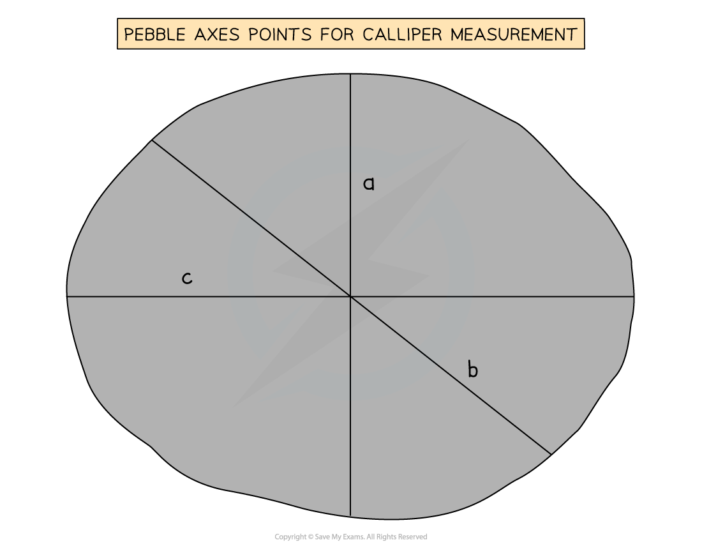

# Coastal Practical Skills

## Aims of Coastal Fieldwork

> **Spec point** — `spcpt_r5QW9cg7MqM2md2j`

## Aims of Coastal Fieldwork

- To undertake a coastal fieldwork enquiry there are a range of practical skills and methods that will be used
- These can be applied to any coastal fieldwork
- The fieldwork enquiry should be linked to **geographical theory **and example:

  - In the coastal fieldwork enquiry the theories of how coastlines vary in terms of their processes, landforms and/or the effectiveness of management strategies

### Aims and hypothesis

- The aims and hypotheses stem from **general questions** asked about the coast, such as:

  - Does geology affect the shape of a stretch of coastline and its landforms?
  - How and why is hard engineering more effective along a particular stretch of coastline?
  - How and why is soft engineering used along a stretch of coastline?
  - Does beach morphology change because of wave energy?
  - Does coastal protection along a stretch of beach consider stakeholder views?
- **Aims are focused** on a particular place, as you cannot measure everywhere
- Examples of an aim would be:

  - To explore the impact of coastal processes on Y beach
  - To investigate how wave energy along X beach changes beach morphology
  - To explore how geology affects the shape and landforms of W beach
- **Hypotheses are statements** that are tested through fieldwork
- Examples of a hypothesis would be:

  - Coastal management strategies used at beach Y have** **taken conflicting views into account
- A **null hypothesis **is a statement that **is opposite to a hypothesis**
- This ensures there is no bias when collecting the evidence

  - You are not ignoring evidence because it doesn't prove the statement
- If you cannot prove the statement, then the opposite must be true
- Examples of a null hypothesis would be:

  - Coastal management strategies used at beach Y have** not **taken conflicting views into account
- After the aims and hypothesis of the fieldwork have been established, the next steps include:

  - Select the sites – this will involve sampling
  - Decide on the equipment to be used
  - Consider health and safety issues – complete a risk assessment
  - Data collection methods to be used

> **Worked Example**
> **(i) Suggest one possible aim of a coastal environment investigation **
> 
> **(2 marks)**
> 
> **Final answer:** **Answer:**
> 
> - This needs to be an aim, not a hypothesis, so you should outline what the enquiry/investigation is attempting to achieve:
> 
>   - To investigate the influence of geology** (1)** on the shape of a coastline **(1)**
>   - To investigate the changes in beach profile** (1)** with increasing distance from the shoreline** (1)**
>   - An investigation into how erosion and deposition** (1)** have changed over time** (1)**
> 
> **(ii) Identify three reasons why a coastal environment investigation may not achieve the aim given in (i)   **
> 
> **(3 marks)**
> 
> **Final answer:** **Answers could include:**
> 
> - Data inaccurate** (1)**
> - Insufficient data collected **(1)**
> - Inaccurate data analysis** (1)**
> - Human errors in data recording **(1)**
> - Aim not practical** (1)**
> - Unsuitable sites selected** (1)**

### 

## Coastal Risk Assessment

> **Spec point** — `spcpt_5gW4Sqnpxjzw8BFx`

## Coastal Risk Assessment

- Any fieldwork will involve consideration of health and safety using a risk assessment
- Risks associated specifically with coastal fieldwork may include:

  - tide times
  - weather conditions
  - slippery rocks
  - polluted water
  - working in an unfamiliar place
  - misuse of equipment

> **Worked Example**
> **A group of students has investigated the changes in beach morphology.**
> 
> **State one risk that the students might identify in their risk assessment **
> 
> **(1 mark)**
> 
> **Final answer:** **Answer:**
> 
> Any one of the following would be acceptable
> 
> - Slip or fall **(1)**
> - Infection from dirty water **(1)**
> - Rockfall** (1)**
> - Unstable cliffs **(1)**
> - Weather conditions (heavy rain/sun) **(1)**
> - Times of high tide** (1)**
> 
> **Suggest one way the risk stated could be managed **
> 
> **(1 mark)**
> 
> **Answer:**** **This should follow from the answer above
> 
> - Sturdy/suitable footwear e.g. walking boots **(1)**
> - Wash hands/use antibacterial hand wash/cover cuts and wounds** (1)**
> - Do not work near rockfalls** (1)**
> - Do not work under cliffs after heavy rainfall **(1)**
> - Check the weather forecast before going out to collect fieldwork data **(1)**
> - Check tide times **(1)**

## Coastal Site Selection & Sampling

> **Spec point** — `spcpt_W64WqCNmnW3gxWGt`

## Coastal Site Selection & Sampling

- It is **not **practical or feasible to collect data along all parts of the coast, as there would be too much data
- To select coastal sites, getting a ***true sample*** reduces bias
- There may be situations where access to a stretch of the coast is limited due to a rockfall or unstable cliffs, etc.
- Therefore, an ***opportunistic*** approach to sampling needs to be taken
- This needs to be as close as possible to the site selected using sampling
- The most commonly used sampling strategies for a coastal enquiry are:

  - **Systematic** sampling of sites at regular intervals means that all parts of the stretch of coast are covered
  - **Random **– the use of random sampling means that all sites have an equal chance of being selected, which eliminates bias
  - **Stratified **– by dividing each sampling site into groups e.g. three sites from each sample section
- Site location can be recorded using GPS to give an accurate location using latitude and longitude
- Or through grid reference from an Ordnance Survey map

> **Worked Example**
> **Suggest which sampling method would be appropriate to use in a coastal environment investigation **
> 
> **(3 marks)**
> 
> **Final answer:** **Answer:**
> 
> - Systematic because measuring in an ordered and regular interval (every 5 metres etc.)** (1)** ensures no area of the coastline is missed** (1) **and it reduces bias **(1)**
> - Random because using a random number generator** (1)** means all sites have an equal chance of being selected** (1), **which means that there is no bias** (1)**

#### 

## Coastal Equipment

> **Spec point** — `spcpt_zj3w52QVFDF2zwy6`

## Coastal Equipment

- To complete the coast measurements a range of equipment is needed
- The equipment includes the following:

  - **Surveyor’s 25+ meter tapemeasure **– used to measure distances on a beach or between ranging poles when completing beach transects
  - **Compass** to measure direction
  - **Ranging poles** for beach transects
  - **Clinometer** – calculate the angle of a beach
  - **Callipers** – measuring pebble size
  - **Quadrat** – used to select sediment for sampling
  - **Clipboard** for holding recording sheets
  - **Recording sheets**
  - **Roundness or angularity charts**
  - **Pencil **for writing in data, particularly useful if the paper becomes damp
  - **Camera **to take photographs of sites and coastal features

> **Worked Example**
> **Identify a suitable  piece of equipment to measure a beach gradient **
> 
> **(1 mark)**
> 
> **       A. **Anemometer
> 
> **       B. **Quadrat
> 
> **       C. **Clinometer
> 
> **       D. **Stopwatch
> 
> **Final answer:** **Answer:**
> 
> - **C** **(1) **a clinometer measures the slope angle of a beach

### 

## Using Coastal Equipment in the Field

> **Spec point** — `spcpt_M9sF64k3h7KjQrQk`

## Using Coastal Equipment in the Field

### Data collection methods

- The data collection methods will depend on the **aims/hypothesis **of the fieldwork
- The starting point with most coastal fieldwork is a question on 'what is needed to answer the enquiry question?'
- Data collection should include both ***quantitative*** and ***qualitative*** methods
- The collection of **quantitative** data can be completed in several ways in a coastal study

### Beach profile

- Beach profiles use distance and angle measurements to identify the shape of the beach
- Follow a ***transect*** line from the edge of the sea to the end of the  beach
- Split the line into segments where the slope angle changes
- Each reading is taken from one break in a slope to the next break of the slope

  - Student A stands, at a safe distance from the edge of the sea, holding a ranging pole
  - Student B stands holding a second ranging pole, further up the beach where there is a break of slope
  - Measure the distance between the two ranging poles using a tape measure
  - Measure the angle between the matching markers on the ranging pole using a clinometer
  - Repeat the process at each slope break until you reach the top of the beach

### Sediment analysis

- Sediment analysis is used to examine how beach material is sorted across the width of a beach

  - This links to **longshore drift processes**
- Depending on the size of the sediment being measured, random, systematic and/or stratified sampling is used to take a sample of beach sediments (such as sand, gravel and pebbles)
- The sediment is measured at the beach using **callipers** to measure the axes of each pebble

*Pebble Axes Points for Calliper Measurement*

- The a-axis is the shortest axis
- The b-axis is the widest axis at right angles to the c-axis
- The c-axis is the longest axis

### Measuring pebble shape

- The easiest way to measure pebble shape is to classify the stone as either very angular, angular, sub-angular, sub-rounded, rounded or very rounded using a Power’s Scale of Roundness
- This is judged by eye
- Using a card with a concentric circle or a protractor, measure the minimum radius of curvature
- This is the sharpest corner on the c-axis

### Measuring longshore drift

- Choose 25 to 40 pebbles of various shapes and sizes from the beach
- Using waterproof paint, mark each pebble so you can identify them
- Spread the pebbles out in the swash zone, and place a marker to show the start point for the pebbles
- Using a stopwatch, wait for 20 minutes then search for as many pebbles as you can
- Measure how far each has travelled from the start point
- Some of the pebbles may have disappeared from the beach or gone off in a different direction, but it doesn't mean that your results are ‘wrong’
- Record what happened to each pebble (including ‘disappeared’)
- Repeat the process 3 times, or until you judge that the 'mean' for the distance travelled by a pebble indicates that you have taken an adequate sample

### Measuring groynes

- Use a tape measure and find the height of beach material on either side of a groyne
- Measure a minimum of three heights along the beach profile of each groyne
- Compare a series of groynes along the length of the beach

### Measuring rip-rap

- Rip-rap or rock armour data can be used to measure the effectiveness of coastal defence
- Use a measuring tape to measure the length, height and width of each boulder
- Measure the angle of the boulder and note if the widest face is facing straight into oncoming waves or at an angle

> **Worked Example**
> Study the following figure that shows coastal data collected by a group of students:
> 
> | **Site** | **Mean shingle size (mm)** |
> |---|---|
> | 1 | 21.1 |
> | 2 | 16.0 |
> | 3 | 14.1 |
> | 4 | 10.0 |
> | 5 | 30.1 |
> 
> - Calculate the mean shingle size for the five sites
> - Give your answer to one decimal place
> - You must show all your workings in the space below** (2)**
> 
> **Final answer:** **Answer:**
> 
> - Correct method of working, showing addition, and then division by 5 **(1) **and one mark for the correct mean, written to one decimal place, 18.3 **(1)**
> - The correct unit must also be shown, which is in mm

### Photographs and field sketches

- Photographs and field sketches are **qualitative** data
- Just as with any data collection and presentation they have strengths and weaknesses
- In a coastal environment enquiry, photographs and field sketches can be used to show landforms and particular features such as beach slope
- Photographs are also ideal for illustrating the data collection methods used

> **Worked Example**
> **During a geographical enquiry exploring changes along a stretch of coast, students completed annotated field sketches as part of their data collection.**
> 
> **Suggest two advantages of this technique **
> 
> **(4 marks)**
> 
> - **Answer:**
> 
>   - Students can get a quick view of the areas they are working on, recording key features **(1)** to support recall later **(1)**
>   - Students can highlight features** (1)** that they want to focus on as part of their study **(1)**

> **Exam Hint**
> Annotations and labels are not the same. A label is a simple descriptive point. For example, a spit. Whereas an annotation is a label with a more detailed description or an explanatory point. For example, 'spit' is an extended stretch of beach material projecting out to sea and joined to the mainland at one end
