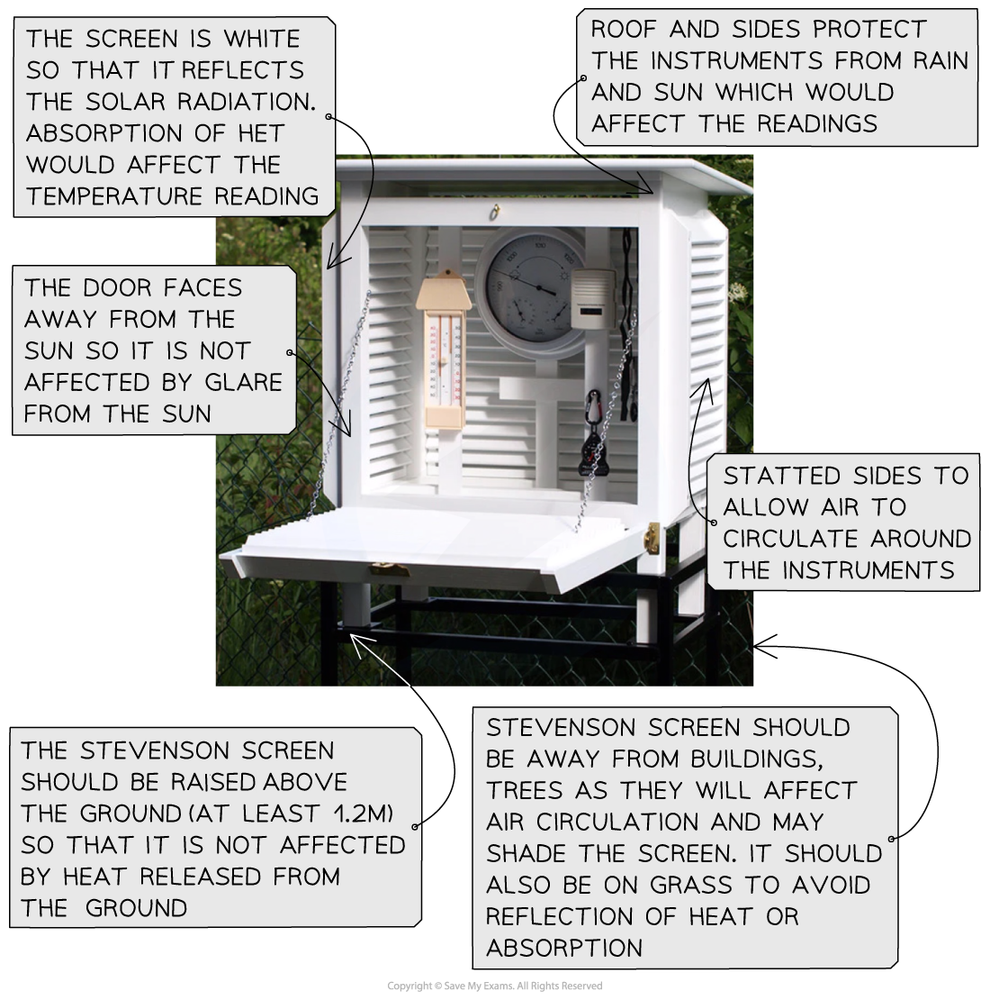
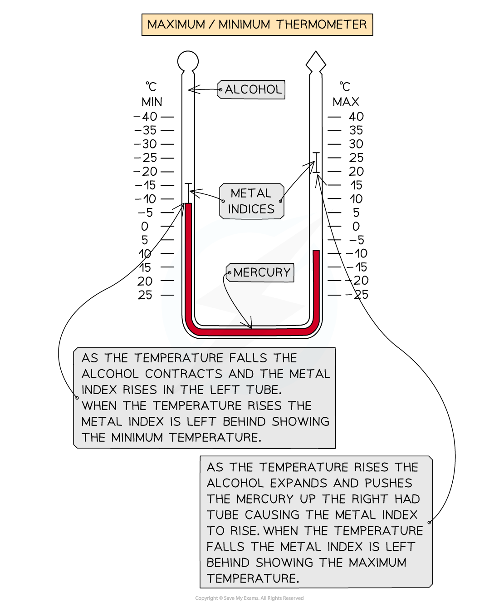

# Hazardous Practical Skills

## Hazardous Practical Skills

> **Spec point** — `spcpt_st6sZyQzXtpTCW9y`

## Hazardous environment fieldwork

- Fieldwork in a hazardous environment is based on the physical processes involved in an **extreme weather event**
- To undertake a weather fieldwork enquiry there are a range of practical skills and methods that are used
- These can be applied to any weather fieldwork
- The fieldwork enquiry should be linked to** geographical theory**

  - In a weather fieldwork enquiry, the theories of **microclimate** and the **passage of a depression** or tropical storm can be used

### Aims and hypothesis

- The aims and hypothesis come from questions asked about the weather, such as:

  - How does the weather change as a depression passes over an area?
  - How does the microclimate of an area vary?
  - What are the impacts of the built environment on microclimate?
- **Aims** look like this:

  - An investigation into the effect of school buildings on the microclimate
  - An investigation into the changing weather patterns during the passage of a depression

- **Hypothesis** would be a statement:

  - Temperatures decrease with distance from buildings
  - Precipitation is greatest when air pressure is lowest during the passage of a depression
- After the aims and hypothesis of the fieldwork have been established, the next steps include:

  - Selecting the sites – this will involve sampling
  - Deciding on the equipment to be used
  - Considering any health and safety issues - completing a [risk assessment](https://www.savemyexams.com/igcse/geography/edexcel/19/revision-notes/16-general-fieldwork-skills/16-1-the-geographical-enquiry/16-1-1-planning/)
  - Data collection method

> **Worked Example**
> **(i) Suggest one aim of a microclimate investigation**
> 
> **Final answer:** **Answer:**
> 
> - Any valid aim acceptable for **1 mark**
> - The 2nd mark requires the development of the aim:
> 
>   - measure weather conditions** (1 mark) **
>   - compare with another local site **(1 mark)**
>   - measure temperature … **(1 mark)**
>   - compare with Met Office station recordings for that area **(1 mark)**
> 
> **(ii) Identify three reasons why a microclimate investigation might not achieve the aim given in (i)**
> 
> **Final answer:** **Answer: **
> 
> - accuracy of data collected **(1 mark)**
> - sufficient data collected** (1 mark)**
> - careful data recording **(1 mark)**
> - accuracy of data collation (**1 mark**) and data presentation** (1 mark)**
> - reliable analysis and interpretation of findings **(1 mark)**
> - validity of conclusions reached **(1 mark)**
> - realism and practicality of aim **(1 mark)**
> - suitability of sites chosen** (1 mark)**

### Site selection and sampling

- It is not practical to include all weather measurements throughout the day or to take measurements at all sites
- To select sites, sampling should be used

  - Sampling will reduce bias
  - It will provide an overview of the whole
- There may be situations where access to the sample site may not be possible, meaning an ***opportunistic*** approach may need to be taken

  - The site should be as close as possible to the site selected using sampling
- The most commonly used sampling strategies for a weather enquiry are:

  - **Systematic **- sampling of sites at regular intervals along a transect line
  - **Random **- this means that all sites have an equal chance of being selected. A grid placed across a map of the school site would enable random sampling
  - **Stratified** - sampling sites which represent the whole

> **Worked Example**
> **A group of students have investigated the physical processes involved in an extreme weather event by recording a weather diary. The students use an anemometer to record wind speed every hour.**
> 
> **Identify the sampling method used**** **
> 
> **(1 mark)**
> 
> **     A. **Systematic
> 
> **     B. **Random
> 
> **     C.** Stratified
> 
> **     D. **Opportunistic
> 
> **Final answer:** **Answer: **
> 
> - **A**** (1 mark)** - Systematic (the measurements are taken at regular intervals)

> **Worked Example**
> **Outline three factors which should be considered when choosing a suitable sampling site for a microclimate enquiry (6 marks)**
> 
> **Final answer:** **Answer:**
> 
> - Different surroundings** (1 mark)** 2nd mark for this to be exemplified twice e.g. south-facing aspect** (1 mark)**; sheltered spot **(1 mark)**; open space **(1 mark)**
> - **1 mark** allowed for valid health and safety considerations, e.g. trespass **(1 mark)**; traffic** (1 mark)**
> - open space **(1 mark)** gives a more 'natural' reading for the area** (1 mark)**
> - trespass **(1 mark) **ensure permission acquired **(1 mark) **

### Equipment

- To complete weather measurements, a range of equipment is needed
- The equipment includes the following:

  - Equipment may be in a **Stevenson Screen **
  - **Thermometer **- temperature
  - **Hygrometer **- humidity
  - **Anemometer **- wind speed
  - **Barometer** - air pressure
  - **Wind vane **- wind direction
  - **Rain gauge **- precipitation amount
  - **Pencil **for writing data
  - **Camera** to take photographs of equipment/measurements

### Risk assessment

- Any fieldwork will involve consideration of health and safety using a [risk assessment](https://www.savemyexams.com/igcse/geography/edexcel/19/revision-notes/16-general-fieldwork-skills/16-1-the-geographical-enquiry/16-1-1-planning/)
- Risks specifically associated with weather fieldwork may include:

  - Weather conditions
  - Slipping on uneven ground
  - Working in an unfamiliar place
  - Misuse of equipment – mercury thermometers
  - Traffic

> **Worked Example**
> **A group of students investigated the physical processes involved in an extreme weather event by recording a weather diary.**
> 
> **(i) Identify one risk that the students may identify when undertaking a risk assessment for the investigation  **
> 
> **(1 mark)**
> 
> **Final answer:** **Answer: **
> 
> - (Falling over in) strong winds **(1 mark)**.
> - Exposure to sunburn** (1 mark)**
> - Slips/trips/bumps **(1 mark)**
> - An extreme weather event **(1 mark)**
> - Heavy rain/flooding **(1 mark)**
> 
> **(ii) State one way this risk could be managed **
> 
> **(1 mark)**
> 
> **Answer:**** ***(Staying indoors is not accepted and the answer must be specific to the answer given to (i))*
> 
> - Avoid exposed locations / out in the open** (1 mark)**
> - Collecting data once the storm has died down **(1 mark)**
> - Use secondary data** (1 mark)**
> - Walking with care** (1 mark)**
> - Working in groups **(1 mark)**
> - Wearing sunscreen suntan lotion **(1 mark)**
> - Staying away from a storm **(1 mark)**
> - Using a weather forecast **(1)**
> - Remote collection of weather data **(1 mark)**

## Using Equipment in the Field - hazards

> **Spec point** — `spcpt_FN6Dmy5QZyJYzVk4`

## Using equipment in the field - Hazardous environments

### Data collection methods

- The data collection methods depend on the **aims/hypothesis **of the fieldwork
- A weather diary and a microclimate study will both require the use of meteorological (weather) instruments to take measurements
- Data collection should include both ***quantitative*** and ***qualitative*** methods

#### Weather diary

- A weather diary is a record of weather conditions over a set period

#### Measuring the weather

- A digital weather station can be used to record the weather
- Alternatively, individual instruments can be used
- To ensure the accuracy of data, some of the instruments – thermometer, hygrometer and barometer – should be placed in a Stevenson screen

*Features of a Stevenson screen*

- **Temperature **

  - Measured using a **maximum and minimum thermometer**
  - These give the maximum and minimum readings over 24 hours

*Measurements on a maximum and minimum thermometer*

- **Air pressure**

  - Measured using a **barometer** in millibars
- **Humidity**

  - Measured using a **hygrometer **as a percentage
- **Wind speed **

  - Measured using an **anemometer** in km/h
- **Wind direction**

  - A **wind vane** is used to give the direction the wind is coming from
- **Rainfall**

  - A **rain gauge** measures the amount of rainfall in mm

> **Worked Example**
> **Study Figure 1 shows a geographer collecting weather data **
> 
> 
> 
> *Figure 1 - collecting weather data*
> 
> **Name piece of equipment X **
> 
> **(1 mark)**
> 
> **Final answer:** **Answer:**** **
> 
> - Stevenson screen **(1 mark)**
> 
> **Describe how a piece of equipment X is used in collecting weather data **
> 
> **(3 marks)**
> 
> **Answer:**** ***This should outline how the equipment is used:*
> 
> - Regular visits with log **(1 mark).** Open the front panel and record data **(1 mark). **Log current instrument readings** (1 mark) **
> - Housing for a variety of instruments** (1 mark). **Allows air temperature in shade, not sun-exposed temperature, to be recorded **(1 mark). **Safety and instrument protection **(1 mark)**

#### Photographs and field sketches

- Photographs and field sketches are qualitative data
- Just as with any data collection and presentation, they have strengths and weaknesses
- In a weather enquiry, photographs and field sketches can be used to show weather conditions and sample site locations
- Photographs are also useful for illustrating the data collection methods used

> **Worked Example**
> **To extend a weather study, students recorded wind speeds every hour using an anemometer.  Students were asked to use one other primary data method.**
> 
> **Explain one other primary data method  **
> 
> **(3 marks)**
> 
> **Answer:**** ***You will gain 1 mark for the identification of a primary data method and 2 further marks for explaining how this can be used.*
> 
> - Rain – the use of a rain gauge **(1 mark) **to collect data on mm of rainfall over some time** (1 mark)**. Data can be plotted to explore patterns **(1 mark)  **
> - Temperature – the use of a thermometer **(1 mark)** to measure temperature **(1 mark). **Plotted data against wind speed to explore patterns over some time** (1 mark) **
> - Air pressure – the use of a barometer **(1 mark)** to measure air pressure **(1 mark). **Plotted against wind speed to explore patterns over some time** (1 mark) **

> **Exam Hint**
> Annotations and labels are not the same. A label is a simple descriptive point. For example, 'shaded area'. Whereas an annotation is a label with a more detailed description or an explanatory point. For example, a south-facing classroom which receives more sun through the day will be warmer than a north-facing classroom.
