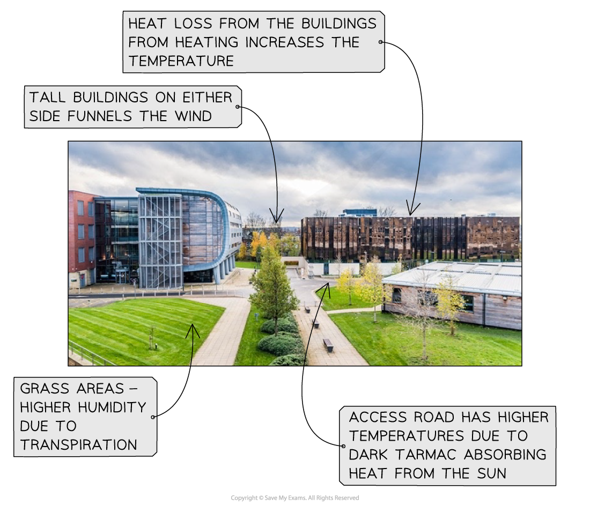

# Hazardous Enquiry Skills

## Hazardous Enquiry Skills - hazardous environments

> **Spec point** — `spcpt_xGVd7ZTcrPvFWGqV`

## The fieldwork report - hazardous environments

### Weather enquiry data presentation

- Data presentation can take many forms

### Primary data

- Much of the primary data collected in a weather enquiry will be presented in the form of graphs:

  - Different graphs are suitable for particular data sets
  - Each graph type may have strengths and limitations
- Suitable graphs include:

  - **Line graphs** for changes in temperature spatially or over time
  - **Bar graphs** for precipitation, wind speed
  - **Rose graph** for wind direction and speed
  - **Scattergraphs** to show the relationship between factors such as air pressure and precipitation
- Data presentation may also include maps:

  - Sample site location
  - ***Isoline*** maps to show temperature and precipitation

> **Worked Example**
> **Using the data in Figure 1a, complete Figure 1b below for measurements 1 and 4 **
> 
> **(2 marks)**
> 
> **Figure 1a Wind Speed Measurements Gathered by Students**
> 
> 
> 
> 
> 
> *Figure 1b graph to show wind speed measurements*
> 
> **Final answer:** **Answer:**
> 
> 
> 
> *Completed figure 1b, a graph showing wind speed measurements*
> 
> **Guidance**
> 
> - *The first bar needs to be just above the 50mph line (each small square is 1mph). *
> - *The second bar must be on the line. *
> - *The bars do not need to be shaded but should be the same width as the other bars.*
> 
> **Mark an x in the box on Figure 1b which represents the anomalous wind speed result **
> 
> **(1 mark)**
> 
> **Answer:**
> 
> - Number 5 **(1 mark)** is the *anomalous* result, as it does not fit the pattern of the other measurements
> 
> **Suggest one explanation for this anomaly **
> 
> **(2 marks)**
> 
> **Final answer:** **Answer: **
> 
> - Human error with the equipment used to measure wind speed **(1 mark), **which meant that the wind speed recording was incorrect **(1 mark)**
> 
> OR
> 
> - **A **measurement was taken in a sheltered area** (1 mark), **which meant that the wind speed recording was much lower **(1 mark)**
> 
> OR
> 
> - Variation in wind speed over time/readings were not all taken at the same time **(1 mark), **which led to a much lower result for site 5 **(1 mark)**

> **Exam Hint**
> For the exam, you will not be asked to draw an entire graph. However, it is common to be asked to complete an unfinished graph using the data provided. You may also be asked to identify anomalous results or to draw a best-fit line on a scattergraph.
> 
> - Take your time to ensure that you have marked the data onto the graph accurately
> - Use the same style as the data which has already been put on the graph
> 
>   - Bars on a bar graph should be the same width
>   - If the dots on a graph are connected by a line, you should do the same

### Secondary data

- Any fieldwork should include secondary data as well as primary data
- In a weather enquiry, suitable secondary data may include:

  - Weather data from the **Meteorological Office (Met Office)**
  - Newspaper articles/websites about the weather event
  - Ordnance Survey maps to identify sample sites
  - Aerial photographs

> **Worked Example**
> **Describe two sources of secondary information that might be useful when planning a microclimate investigation **
> 
> **(4 marks)**
> 
> **Final answer:** **Answer: **
> 
> - The first mark is awarded for the identification of a secondary source
> 
>   - OS map **(1)**; local Met Office station records **(1)**; local area weather forecast **(1)**; compass directions **(1)**; historic weather diaries** (1)**; newspaper reports for area **(1)**
> - The second mark can be given where the purpose of the source is made clear:
> 
>   - the OS map **(1)** gives altitude of site** (1), **the compass directions **(1)** gives aspect of site** (1)**
> - For max marks at least one named source needed (e.g. Met Office, Ordnance Survey, Environment Agency, Severn Trent Water, Google Maps)

## Analysing & Interpreting Data - hazardous environments

> **Spec point** — `spcpt_fPgKctCS3YfbMCvs`

## Analysing & interpreting data - hazardous environments

- Once data has been collected and presented, it needs to be analysed
- The data which is collected regarding weather features such as temperature and precipitation is quantitative and will be analysed using statistical methods
- One of the main statistical methods that may be used is the **mean **where mean precipitation, wind speed or rainfall needs to be calculated

> **Worked Example**
> **Study Figure 1. It shows sample data about wind speed. Calculate the mean wind speed for the five samples. **
> 
> **Give your answer to one decimal place.**
> 
> **You must show all your workings in the space below. **
> 
> **(2 marks)**
> 
> | Sample | Wind Speed |
> |---|---|
> | 1 | 50.1 |
> | 2 | 35.1 |
> | 3 | 45.1 |
> | 4 | 40.0 |
> | 5 | 10.0 |
> 
> **Figure 1 - Wind Speed Data Collected by a Group of Students**
> 
> **Final answer:** **Answer: **
> 
> - Add all the values together:
> 
> $50.1+35.1+45.1+40.0+10.0=180.3$
> 
> - Divide the total by 5, which is the number of values in the data set:
> 
> $\frac{180.3}{5}=36.06$ **(1 mark)**
> 
> - To one decimal place, as requested in the question:
> 
> $36.1$** (1 mark)**

> **Exam Hint**
> Calculation of the mean is a popular exam question. You will usually be asked to do the following:
> 
> - Show your calculations by writing them out in full
> 
>   - This is worth 1 mark
> - Answer to one decimal place. You must round up or down.
> 
>   - If the number after the first digit following the decimal point is 5 or higher, you need to round up – 10.15 would become 10.2
>   - If the number after the first digit following the decimal point is 4 or lower, you need to round down – 10.13 would become 10.1

### Analysing photographs and field sketches

- The use of photographs and field sketches is a **qualitative** analysis
- Photographs can be used in a weather investigation to analyse several features:

  - Different aspects of microclimate
  - Weather conditions during and after a weather event
  - Data collection techniques

* Annotated photograph - microclimate of a university campus*

**              **

> **Worked Example**
> **You have studied hazardous environments for your geographical enquiry**
> 
> **Evaluate how successful your chosen data analysis methods were in answering your geographical enquiry question **
> 
> **(8 marks)**
> 
> **Final answer:** **Answer:**
> 
> - Your answer needs to make a judgement about how successful your data analysis was in enabling you to reach a conclusion
> - You must include examples from your enquiry. You need to demonstrate evidence of:
> 
>   - Different skills and techniques being used for data collection
>   - Different skills and techniques being used for the analysis of the data
>   - Your conclusions
> - Issues with equipment
> 
>   - Were there any equipment errors? This could be faulty equipment or issues with reading the measurements correctly
>   - How did these errors affect your ability to answer the enquiry question?
> - Issues with the enquiry design
> 
>   - Were the data collection/sampling methods appropriate
>   - Were more sample sites needed?
>   - Would a different sampling technique have been more effective?
>   - Should the data have been collected using a different method?
>   - Was additional or different equipment needed?
> - How did these affect your ability to answer the enquiry question?
> 
> - Issues with analysis methods
> 
>   - Were the analysis methods, such as the mean and best-fit lines,  appropriate?
>   - Were there any alternative methods that could have been used?
>   - How did your use of these affect your ability to answer the enquiry question?
> - At the end of your answer you must make a judgement about the success of your data analysis techniques
> - Your evaluation needs to be in-depth and directly linked to your enquiry
> - There must be recognition of where data analysis was less successful due to the enquiry design or technique used
> - Are the outcomes reliable – can the study be repeated and obtain the same results?

### Conclusion

- Once the data has been analysed, conclusions can be reached
- The conclusion should state whether the **hypothesis** has been proven or disproved
- Identify and explain **anomalies** such as:

  - Increased wind speed at a particular location where it would be expected to lower
  - Increased temperature at a particular location where it would be expected to be lower
- Anomalies may occur due to a natural cause or maybe the result of incorrect recording or human error when reading the equipment

### Evaluation

- The weather enquiry's last step is evaluation, where you assess the investigation's success and what you would change if you did it again, for example:

  - Next time I would take measurements over a longer period of time to ensure the reliability of data...
  - My equipment failed, and I will make sure to bring a spare next time ...
  - I think my investigation went well, and I would like to repeat it at a different time of year to see whether it impacts the microclimate

> **Exam Hint**
> The 8-mark fieldwork question is often an evaluation of your enquiry or unfamiliar fieldwork. The evaluation could be about data collection, analysis or your conclusions. The key factors you should remember to include in your answer are:
> 
> - What went well - how do you know that your results were accurate and therefore valid?
> - Is the enquiry reliable? Could it be repeated, and the same results would be achieved?
> - What could have been improved?
> - What would you do if you had to repeat the enquiry?
