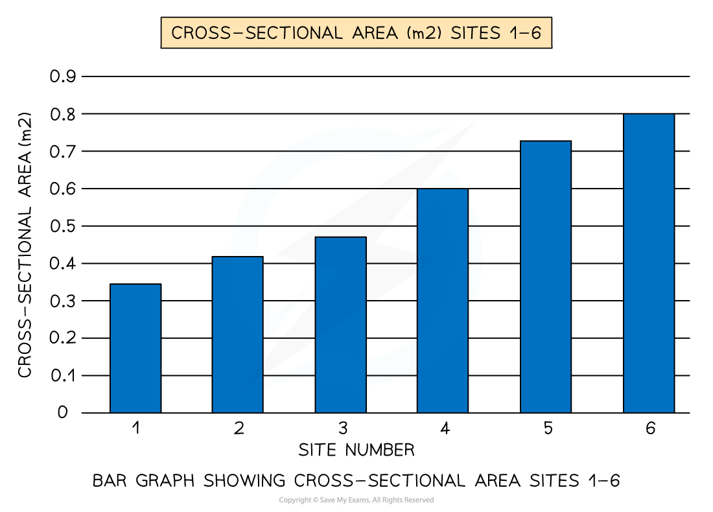
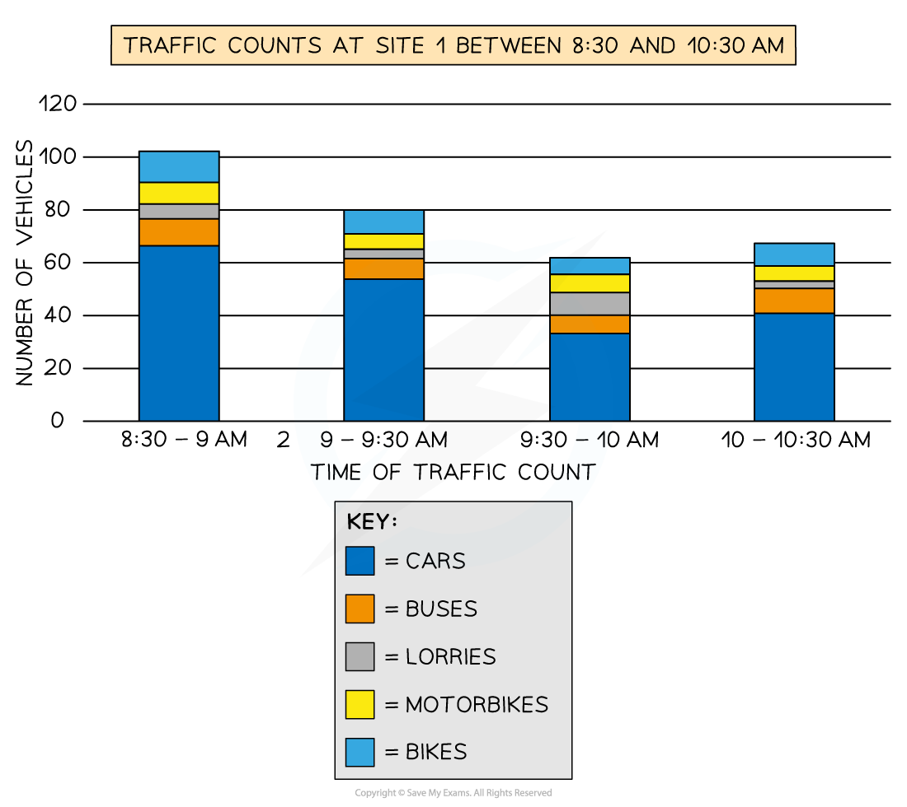
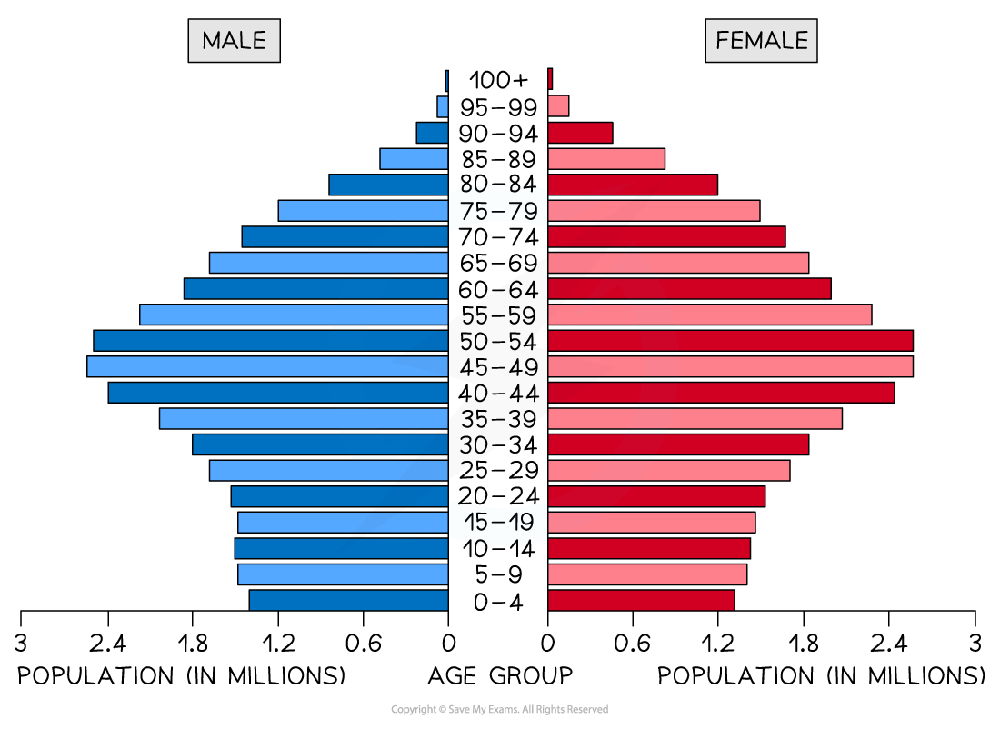
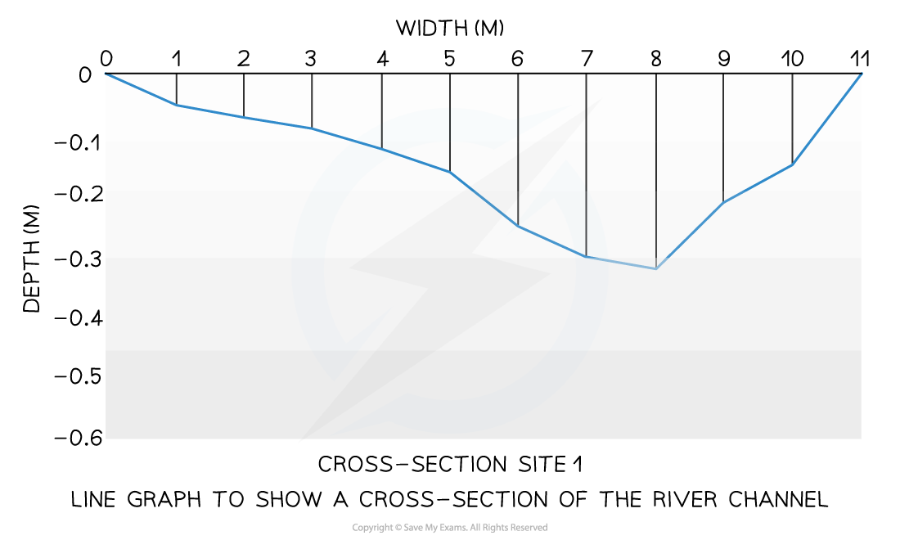
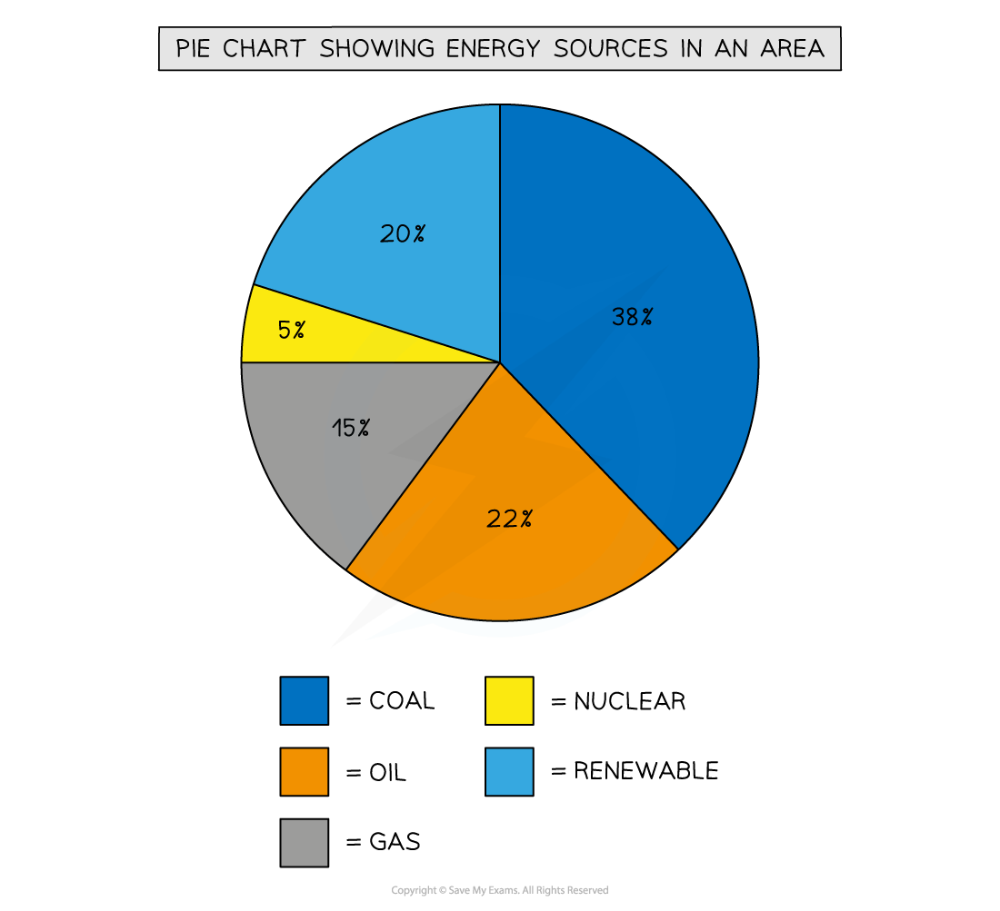
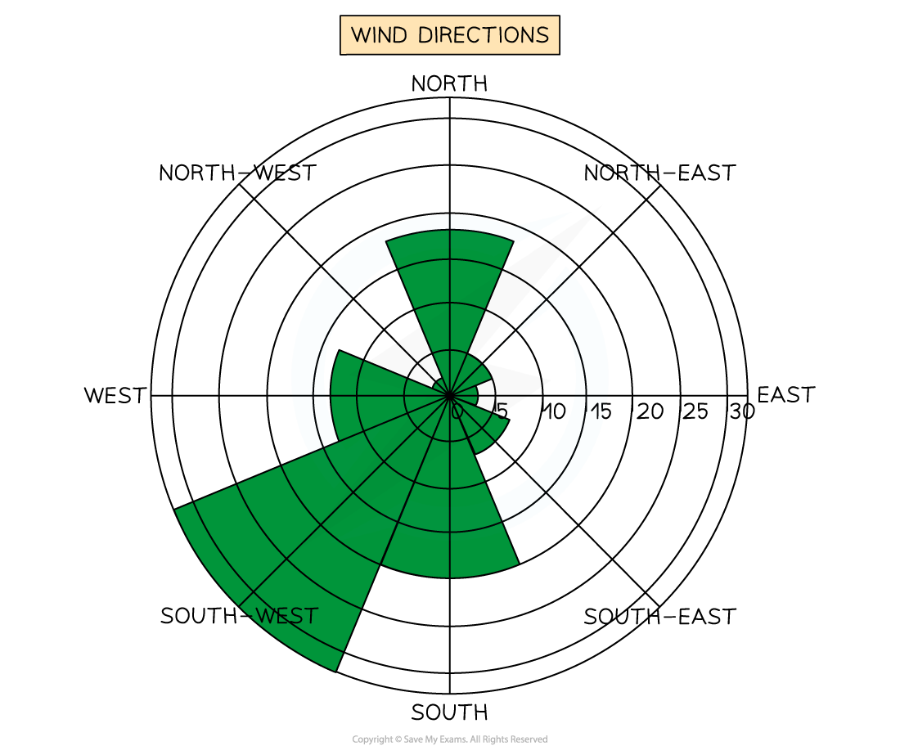
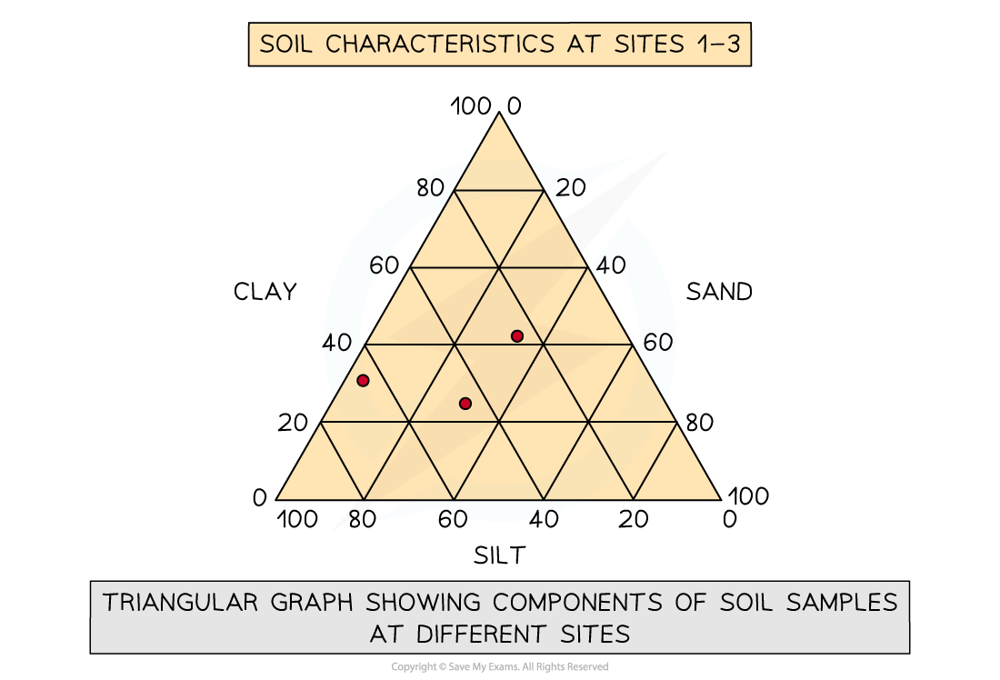
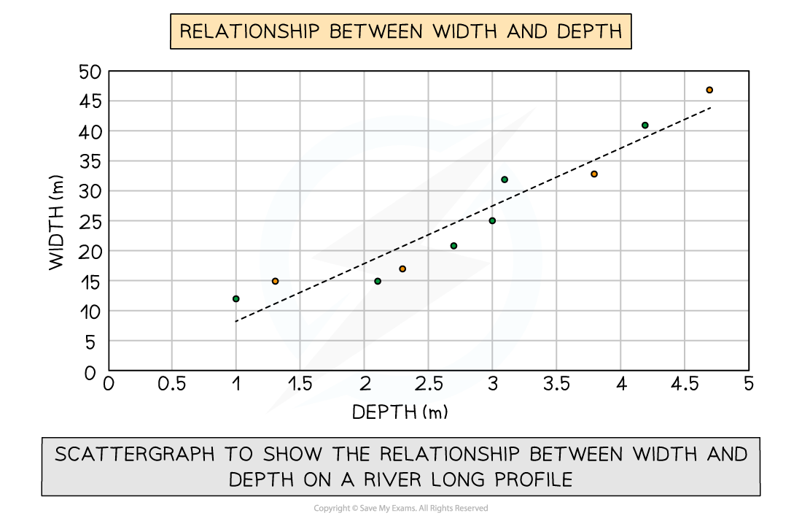
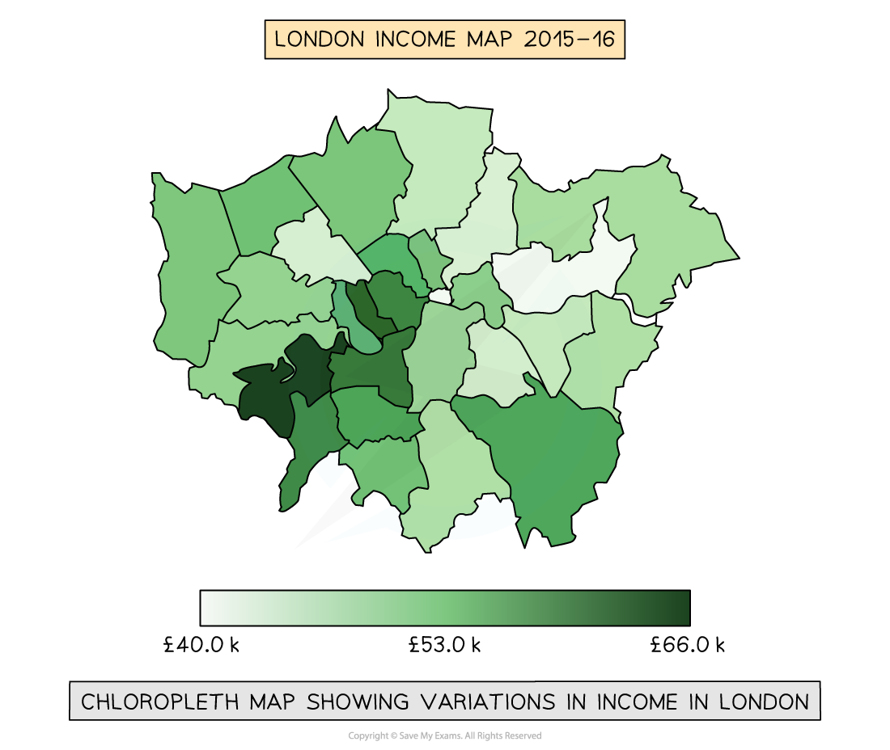
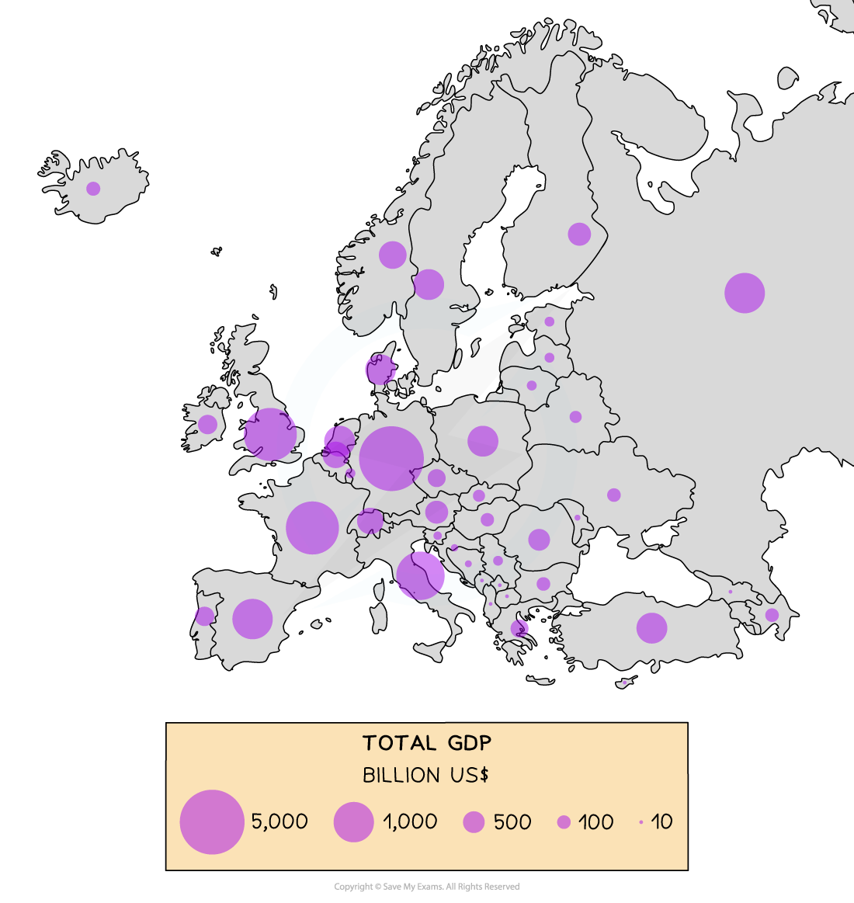

# Data Presentation

## Data Presentation

> **Spec point** — `spcpt_6jWGzCpVyBjmf7Jg`

## Data presentation

### Data presentation

- There are different types of data:

  - **Quantitative** and **qualitative**
  - ***Continuous*** and ***discrete***
- There are many ways in which data can be presented

  - Graphs
  - Annotated photographs
  - Field sketches
  - Maps
  - Diagrams
- The types of data presentation used will depend on the data collected

### Graphical skills

- Much of the data collected will be presented in the form of graphs of some form

  - Each type of graph is suitable for particular data sets
  - The graphs also may have advantages and disadvantages

### Bar graphs

- One of the simplest methods to display discrete data
- Bar graphs are useful for:

  - Comparing classes or groups of data
  - Changes over time

| Strengths | - Summarises a large set of data - Easy to interpret and construct - Shows trends clearly |
|---|---|
| Limitations | - Requires additional information - Does not show causes, effects or patterns - Can only be used with discrete data |

*Bar Graph Showing Cross-Sectional Area Sites 1-6*

### Compound or Divided Bar Chart

- The bars are subdivided to show the information with all bars totaling 100%
- The main use of a divided bar chart is to compare numeric values between levels of a variable such as time

### Population Pyramid

- A type of histogram
- Used to show the age-sex of a population
- Can be used to show the structure of an area/country
- Patterns are easy to identify

### Line Graphs

- One of the simplest ways to display continuous data
- Both axes are numerical and continuous
- Used to show changes over time or space

| Strengths | - Shows trends and patterns clearly - Quicker and easier to construct than a bar graph - Easy to interpret - Requires little written explanation |
|---|---|
| Limitations | - Does not show causes or effects - Can be misleading if the scales on the axis are altered - If there are multiple lines on a graph it can be confusing |

- A river cross-section is a particular form of line graph because it is not continuous data but the plots can be joined to show the shape of the river channel

*Line Graph to show a Cross-section of the River Channel*

### Pie Chart

- Used to show proportions, the area of the circle segment represents the proportion
- A pie chart can also be drawn as a proportional circle
- Pie charts can be located on maps to show variations at different sample sites

| Strengths | - Clearly shows the proportion of the whole - Easy to compare different components - Easy to label - Information can be highlighted by separating segments |
|---|---|
| Limitations | - Do not show changes over time - Difficult to understand without clear labelling - Hard to compare two sets of data - Can only be used for a small number of categories otherwise lots of segments become confusing |

*Pie Chart Showing Energy Sources in an area*

### Rose Diagrams

- Use multidirectional axes to plot data with bars
- Compass points are used for the axes' direction
- Can be used for data such as wind direction, noise or light levels

*Wind Direction Shown on a Rose Diagram*

### Triangular Graphs

- Have axes on three sides all of which go from 0-100
- Used to display data which can be divided into three
- The data must be in percentages
- Can be used to plot data such as soil content, employment in economic activities

*Triangular Graph Showing Components of Soil Samples at Different Sites*

#### Scatter graph

- Points should not be connected
- The best-fit line can be added to show the relations
- Used to show the relationship between two variables

  - In a river study, they are used to show the relationship between different river characteristics such as the relationship between the width and depth of the river channel

| Strengths | - Clearly shows data correlation - Shows the spread of data - Makes it easy to identify anomalies and outliers |
|---|---|
| Limitations | - Data points cannot be labelled - Too many data points can make it difficult to read - Can only show the relationship between two sets of data |

*Scatter graph to show the Relationship Between Width and Depth on a River Long Profile*

> **Exam Hint**
> In the exam, you will not be asked to draw an entire graph. However, it is common to be asked to complete an unfinished graph using the data provided. You may also be asked to identify anomalous results or to draw the best fit line on a scatter graph.
> 
> - Take your time to ensure that you have marked the data on the graph accurately
> - Use the same style as the data which has already been put on the graph
> 
>   - Bars on a bar graph should be the same width
>   - If the dots on a graph are connected by a line you should do the same

### Choropleth Map

- Maps which are shaded according to a pre-arranged key
- Each shade represents a range of values
- It is common for one colour in different shades to be used
- Can be used for a range of data such as annual precipitation, population density, income levels, etc...

| Strengths | - The clear visual impression of the changes over space - Shows a large amount of data - Groupings are flexible |
|---|---|
| Limitations | - Variations within the value set are not visible - Distinguishing between shades can be difficult - Makes it seem as if there is an abrupt change in the boundary |

*Choropleth Map Showing Variations in Income in London*

### Proportional Symbols Map

- The symbols on the map are drawn in proportion to the variable represented
- Usually, a circle or square is used but it could be an image
- Can be used to show a range of data, for example, population, wind farms and electricity they generate, traffic or pedestrian flows

| Strengths | - Illustrates the differences between many places - Easy to read - Data is specific to particular locations |
|---|---|
| Limitations | - Not easy to calculate the actual value - Time-consuming to construct - Positioning on a map may be difficult, particularly with larger symbols |

*Proportional Circles Map Showing GDP (Billion US$) across Europe*

> **Exam Hint**
> In the exam, you may be asked why a particular graphical technique is appropriate. You should ensure that you know the advantages and disadvantages of the different data presentation methods.

### Photographs

- Photographs can be taken to show different aspects of sample sites
- These can be annotated as part of the fieldwork analysis

| Strengths | - An accurate record of the time - Can represent things more clearly than numerical data - Can be used to show data-collection techniques - Can be used next to historical photographs to show changes over time - Helps recall key features |
|---|---|
| Limitations | - Not all photographs are relevant - Can be subjective and biased as the student selects what is photographed - Photographs sometimes contain too much information - They are two dimensional so judging depth is difficult |

### Field Sketches

- Should include location/site number, title and compass direction
- Includes the key features at a site

| Strengths | - Things can be left out of the sketch if they are not relevant to the enquiry - Smaller important areas can be more detailed - Gives a broad overview of the features - Helps recall of key features |
|---|---|
| Limitations | - Important details may be missed - The scale in the sketch may be inaccurate - The sketch may contain inaccuracies which affect the analysis for example more litter than there actually was at the site |

### Maps

- An essential part of any fieldwork enquiry is to show the location of features and sample sites
- Maps can also be used to show relevant features such as amenities around the sample sites

| Strengths | - Size and scale of features/site can be accurately measured - Key to show features around the sample sites - Allows distribution of features to be shown accurately |
|---|---|
| Limitations | - The map may be out of date - Maps cannot show changes over time - Bias may be introduced by highlighting certain features |
