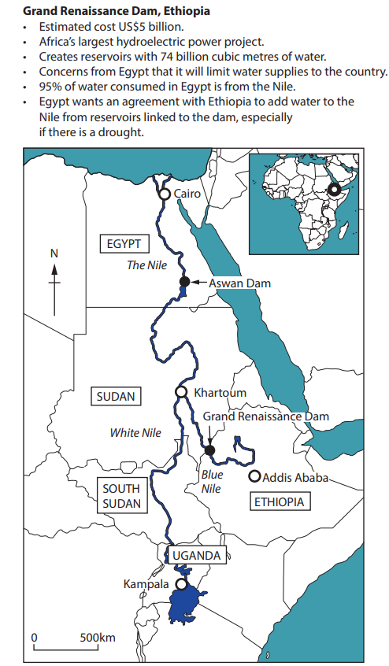

# How to Answer an 8 Mark Question

## How to Answer an 8 Mark Question

> **Spec point** — `spcpt_DXvywP5zZT8m9GK9`

## How to answer an 8 mark question

### 8 mark questions

- **Levelled response questions** are the part of the final exams that many students find the most challenging
- The mark you achieve is based on the **quality of your response** to the question rather than marks being awarded for specific points
- Remember the examiners just want to see that you can** apply **your knowledge and understanding to a specific question
- The following guide will help you to express your knowledge and understanding in ways which will enable you to achieve the highest marks
- The 8-mark questions are in both papers 1 and 2 at the end of each section
- You are required to complete six 8-mark questions in total across both papers
- There are **three levels** which can be awarded in a levelled response question. These are outlined below:

#### Level 1  (1-3 marks)

- Answer attempts to apply understanding but understanding and connections are flawed.  An unbalanced or incomplete argument. Judgements are supported by **limited evidence**. (AO3)
- Uses **some geographical skills** to obtain information with **limited relevance** and **accuracy,** which supports a few aspects of the argument. (AO4)

#### Level 2  (4-6 marks)

Uses geographical skills to obtain accurate information that supports some aspects of the argument. (AO4)

- **Applies understanding** to deconstruct information and provide **some logical connections** between concepts. An imbalanced argument but not entirely coherently, leads to** judgements **that are supported by **evidence occasionally**. (AO3)
- Uses geographical skills to obtain** accurate information** that **supports some aspects of the argument**. (AO4)

#### Level 3  (7-8 marks)

- **Applies understanding **to deconstruct information and provide** logical connections **between concepts throughout. A **balanced, well-developed argument**, leads to judgements that are **supported by evidence throughout**. (AO3)
- Uses geographical skills to obtain **accurate information** that **supports all aspects of the argument**. (AO4)

### Steps to answer the question

#### Step 1

- Regardless of the topic, the type of question that you will need to answer will be broadly the same

  - You will be asked to:
  
    - study source(s) of data
    - **analyse **the information
  - To analyse you need to examine the data source(s) methodically and in detail, you then need to explain and interpret it

'*Study Figure 1c in the Resource Booklet.*

*Analyse the importance of this dam (****Grand Renaissance Dam****) for managing the demand and supply of water.'*

*OR*

*Study Figure 1c in the Resource Booklet.*

*Analyse the reasons for the changes in the percentage of people employed in the secondary sector.*

#### Step 2

- Highlight the keywords.

*Study Figure 1c in the Resource Booklet.*

**Analyse*** the ***importance*** of this dam for managing the ***demand and supply*** of water.'*

- In this example, you must focus on the management of both the demand and the supply of water
- You need to assess how important the dam is in achieving both management of supply and demand

#### Step 3

- Plan the information you are going to include
- This can be a short list of bullet points
- For example;

  - A brief definition explanation of what a dam is
- Describe how the dam is used to manage both the demand and supply of water

  - Dams allow control water discharge downstream
  - This can reduce flooding
  - The storage of water in the reservoir, allowing the supply of water to areas in water deficit
  - Impact when a river crosses an international boundary such as where the Blue Nile goes from Ethiopia to Sudan and then Egypt as shown in Figure 1c

#### Step 4

- Write your answer

  - To achieve 8 marks you need to write at least 2 or 3 detailed statements using the Figure and **place-specific details **from the data source(s)
  - Do not make general statements
  - Be specific for example:

*        ‘’Figure 1c shows the location of the Grand Renaissance Dam in Ethiopia holding back 74 billion cubic metres of water demonstrating its importance for water supply.'*

- Ensure that you include place-specific details from the Figure

### Model answer

#### Question

Study Figure 1c.

Analyse the importance of this dam for managing the demand and supply of water.

*Figure 1c*

#### Answer

Dams are used to control water discharge downstream. This can help to reduce flooding and manage water supply.

Figure 1c shows the location of the Grand Renaissance Dam (GRD) in Ethiopia which holds back 74 billion cubic meters of water. The dam and reservoir allow Ethiopia to control the flow of water. This is an advantage when it is required to control flooding downstream and/or increase water security in Ethiopia, particularly during periods of drought. It ensures that farmers in Ethiopia can irrigate crops and that people have access to water for drinking.

Although the dam has advantages it has been controversial because as shown in Figure 1c, 95% of Egypt's water comes from the Nile. There are concerns that due to the GRD Egypt will lack control over its water supplies. This may affect people's livelihoods because farmers will not be able to irrigate their crops. There are also concerns in Sudan that releasing water may overwhelm rivers with smaller capacities because the discharge will increase so rapidly, leading to flash flooding.

It is clear that dams are important to countries in managing the demand and supply of water. However, because they control water supplies where rivers cross international boundaries they also have the potential to cause conflict between countries.
