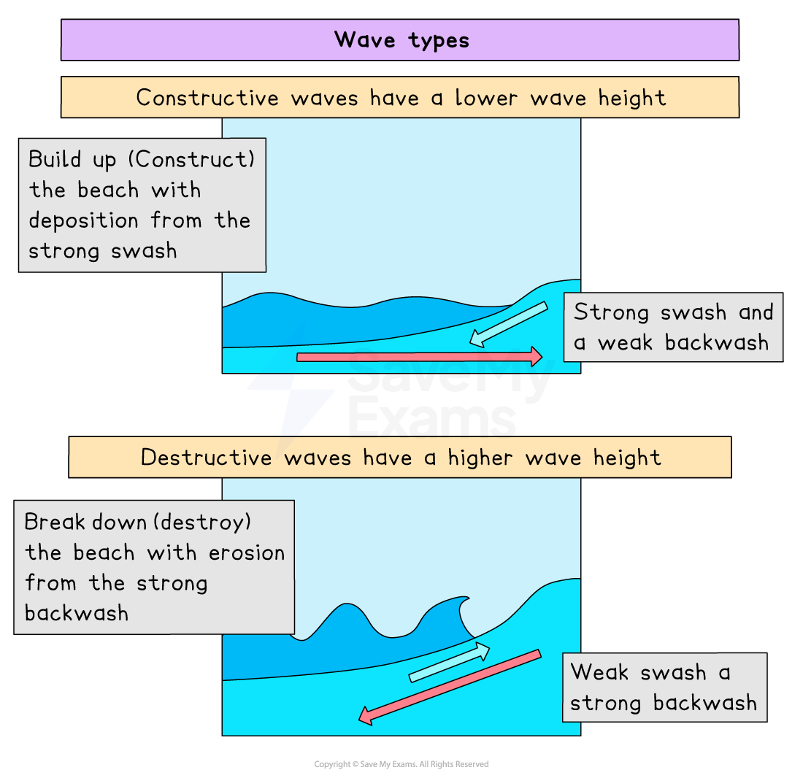
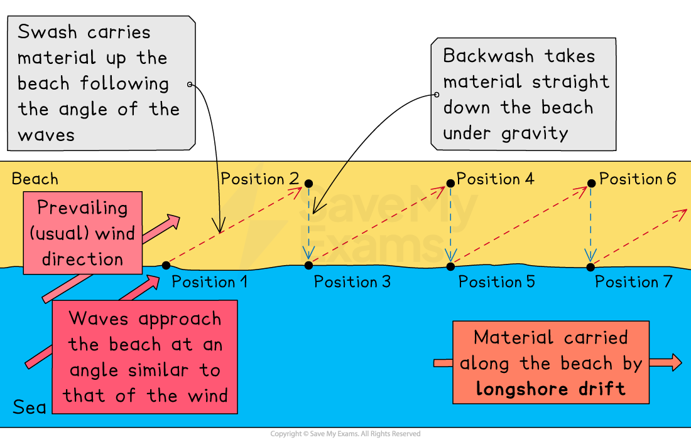
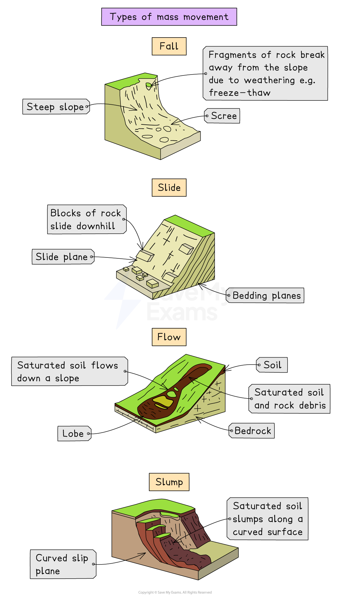

# Coastal Processes

## Wave Action & Erosion

> **Spec point** — `spcpt_WBf5NHrtrGBVxzHF`

## Wave action & erosion

- Coasts are the meeting point of land and sea
- They are an **open system** with inputs (sediment), transfers (longshore drift), stores (beach) and outputs (water)
- Coastal processes are divided into two parts:

  - **Marine** processes: **offshore** (water-based)
  - **Terrestrial** processes: **onshore** (land-based)
- These processes are then sub-divided into:

  - Wave action
  - Erosion
  - Transportation
  - Weathering
  - Mass movement
- It is these activities that are responsible for producing distinctive landforms found on the coast

### Wave action

- Waves are** marine processes**

  - They erode, transport and deposit material
- Waves are formed by winds blowing over the surface of the sea
- The height and strength of a wave are dependent on three factors:

  - the ***fetch***** **
  - the amount of time the wind blows
  - the strength of the wind
- The greater the strength, time and fetch of the wind, the larger the wave
- As a wave approaches the coast, it enters shallower water; friction from the seabed causes the wave to lean forward and eventually crest and break onto the beach
- The movement of water up the beach is called the **swash**, and the return movement is the **backwash**

### Types of waves

- There are two types of waves:

  - **Destructive** waves erode the beach
  - **Constructive** waves are beach builders

#### Constructive waves

- Strong swash
- Weak backwash
- Long wavelength
- Low wave height
- Low frequency (6-8 waves a minute)
- Gently sloping beaches

#### Destructive waves

- Weak swash
- Strong backwash
- Short wavelength
- High wave height
- High frequency (10-12 a minute)
- Steep beaches

*Diagram showing constructive and destructive waves*

> **Exam Hint**
> Make sure you are familiar with how waves form and their different characteristics. You may be asked to identify the type of wave from a list of characteristics, referring to the wavelength, height, and strength of swash and backwash.

> **Worked Example**
> **Which statement below best describes the characteristics of a destructive wave? ****(1)**
> 
> **      A.  **Long wavelength & weak backwash
> 
> **      B.  **Short wavelength & weak backwash
> 
> **     C.** Short wavelength & strong backwash
> 
> **     D. **long wavelength & strong backwash
> 
> **Final answer:** **Answer**
> 
> - The correct answer is C **[1]**
> 
>   - A destructive wave has a short wave-length, high-frequency rate, steep wave gradient & a strong backwash
> - The alternative answers are incorrect because:
> 
>   - A is a constructive wave
>   - B and D are neither constructive nor destructive

### Erosion

- Destructive waves erode the coastline in four ways:

  - **Hydraulic action** is the sheer force of the waves hitting the coast
  - **Attrition **occurs when material carried in the waves bumps against each other and becomes smaller and smoother. This does not erode the coast but forms the sand and shingle
  - **Corrosion **is when seawater is slightly acidic and gradually dissolves some types of coastal rock (e.g. limestone)
  - **Abrasion **occurs when waves pick up material and hurl it at the coast

> **Exam Hint**
> Make sure you know the difference between the four types of erosion, particularly between **abrasion (corrosion)** and **attrition**. Many students confuse these two terms.
> 
> A tip for you is to think of abrasion as rubbing with sandpaper, or maybe you have grazed your knees or elbows when you fell off your bike/skateboard.  Those grazes were abrasions on your knees/elbows, etc.

### Rates of erosion

- The rates of erosion on the coast are affected by three factors:

  - Energy
  - Materials
  - Shore geometry

#### Energy

- The greater the **energy** available, the **more erosion** takes place
- More energy is available when:

  - waves are steep, destructive waves
  - waves breaking onshore
  - there are strong tidal currents
  - *rip currents* occur
  - there are higher winds

#### Materials

- The type and amount of materials at the coast affect the rate of erosion

  - Large amounts of material increase abrasion
  - When more material comes into the system than leaves the system, this leads to the formation of larger beaches
  - Large beaches absorb wave energy reducing erosion
  - More resistant rocks erode more slowly than less resistant rocks

#### Shore geometry

- Higher, steeper waves are created  by a steep seabed; these lead to more erosion
- Bars offshore lead to waves breaking, reducing their energy when they reach the shore

## Deposition & Transportation

> **Spec point** — `spcpt_jwVwddvkZdmVjWZD`

## Transportation & deposition

### Transportation

- Material at the coast arrives from:

  - Eroded cliffs
  - Longshore drift
  - Constructive waves
  - River discharge
- In the water, material is moved through:

  - **Traction **is when large heavy material is dragged along the sea floor
  - **Saltation **occurs when smaller material bounces along the sea floor
  - **Suspension** is the fine material held in the water
  - **Solution **is dissolved material carried in the water

#### Longshore drift

- Longshore drift is the **main process **of **deposition** and **transportation **along the coast
- The** prevailing wind **pushes the waves at an angle to the beach
- As the waves break, the *swash *carries material up the beach at the same angle
- The ***backwash*** then carries the material down the beach at right angles (90°)
- The process repeats, transporting material along the beach in a **zig-zag movement**

*Diagram showing the process of longshore drift*

### Deposition

- Deposition occurs when:

  - wave energy decreases
  - there is increased friction between the water and the seabed
  - large amounts of sediment are being carried by the water
  - the water encounters obstacles causing the waves to break

> **Worked Example**
> **Describe and explain the process of longshore drift**
> 
> **[4 marks]**
> 
> - Identify the *command words* and *link *to the key term
> - Command words are '**describe and explain**' – say what you see and why
> - Your focus is on '**longshore drift**' – what is it?
> - **Answer:**
> 
> Longshore drift is the process where the waves transport material **[1]**, such as sand, along the beach in the direction of the prevailing wind**. [1] **The swash moves material up the beach at an angle **[1], **as the waves approach in a similar direction to the wind. The material then moves back down the beach at 90° due to gravity** [1]**; the result is the backwash. This movement continues along the beach in a zig-zag motion** **in the direction of the prevailing wind. **[1]**

> **Exam Hint**
> You can gain full marks using well-annotated diagrams to support your answer. Just as you like having a visual prompt, it helps the examiner to see that you do know the answer. Sometimes a diagram is easier than actually writing it all out. After all, a picture paints a thousand words!

## Weathering

> **Spec point** — `spcpt_HXpcyKCzqRM3rXbF`

## Weathering

### Weathering

- Weathering is the breakdown of rock ***in-situ***

  - It does not involve the movement of material, making it different from **erosion**
- ***Sub-aerial*** **weathering **describes coastal processes that are not linked to the action of the sea
- Weathering weakens cliffs and makes them more vulnerable to erosion

#### Types of weathering

- There are three types of sub-aerial weathering:

  - Mechanical
  - Chemical
  - Biological
- **Mechanica**l weathering physically breaks up rock:

  - **Freeze-thaw or frost-shattering**
  
    - Water gets into cracks and joints in the rock
    - When the water freezes it expands and the cracks open a little wider
    - Over time, pieces of rock split off the rock face, whilst big boulders are broken into smaller rocks and gravel
  - **Salt weathering **
  
    - Water in cracks evaporates leaving salt crystals
    - The salt crystals expand and the cracks become larger
    - Over time, pieces of rock split off the rock face, whilst big boulders are broken into smaller rocks and gravel
- **Chemical** weathering occurs when rocks are broken down by a chemical process:

  - Rainwater is slightly acidic through absorbing carbon dioxide from the atmosphere
  - This reacts with minerals in the rock, creating new material
  - Rock type affects the rate of weathering; e.g. limestone chemically weathers faster than granite
  - The warmer the temperature, the faster the chemical reaction
- **Biological** weathering takes place when rocks are worn away by living organisms:

  - Trees and other plants can grow within the cracks in a rock formation
  
    - As the roots grow bigger, they push open cracks in the rocks, making them wider and deeper
    - Over time, the growing tree eventually forces the rock apart
  - Tiny organisms like bacteria, algae and moss can grow on rocks
  
    - These produce chemicals that break down the surface layer of the rock
  - Burrowing animals, such as rabbits, disturb the ground
  
    - This destabilises the rock above the burrow
    - Increasing pressure on any cracks
    - Eventually, pieces fall off the rock

## Mass Movement

> **Spec point** — `spcpt_GRBVxKSdMHNQKwPS`

## Mass movement

### Mass movement

- The **downhill movement **of material under the influence of gravity
- ***Throughflow*** and ***overland flow*** caused by heavy rain can also make cliffs more unstable and increase the likelihood of mass movement
- It includes landslides, slumping and rockfalls

#### What influences the type of movement?

- The angle of slope (steeper is faster)
- Nature of ***regolith***
- Amount and type of vegetation
- Water
- Type and structure of rock
- Human activity
- Climate

#### Types of movement

- **Soil Creep:**

  - Speed is below 1 cm per year
  - Common in humid climates
  - When soil expands, individual particles are lifted up at right angles to the slope
  - Soil also expands when it freezes, gets wet or is heated up in the sun
  - When the soil shrinks again, the particles fall straight back down
  - Soil creep takes a long time because the soil moves only a millimetre to a few centimetres at a time

- **Flow:**

  - It occurs on slopes between 5° and 15°
  - Usually after the soil has become saturated with a flow of water across the surface
  - Vegetation can be flattened and carried away with the soil
  - Speeds range from 1 to 15km per year

- **Slide:**

  - A movement of material '***en masse***' which remains together until hitting the bottom of a slope

- **Fall:**

  - Slopes are steep and movement is rapid
  - Caused by a number of reasons:
  
    - Extreme weathering—freeze-thaw action—can loosen rocks that become unstable and collapse
    - Rainfall: too much rain will soften the surface, leading to the collapse of the slope
    - Earthquakes can dislodge unstable rocks
    - Hot weather can dry out soil, causing it to shrink and allowing rocks to fall

- **Slump:**

  - Usually found on weaker rock types (i.e. clay) that become saturated and heavy
  - This is common at the coast and is also known as **rotational slip**
  - It involves a large area of land moving down the slope in one piece
  - Due to the nature of the slip, it leaves behind a curved surface

*Types of mass movement*

> **Worked Example**
> Outline **two **ways that sub-aerial processes can affect the shape of a cliff.
> 
> **[4 marks]**
> 
> - There will be 2 marks available for each point
> - 1 mark for the processes
> - 1 mark for the explanation
> 
> - **Answer:**
> 
> 1. One sub-aerial process is freeze-thaw weathering **[1]**, where temperatures need to go above and below freezing 0° C. Any water trapped in cracks of a rock freezes and expands, exerting pressure on the crack. When temperatures rise, the water melts, pressure is released, and the crack contracts. Repeated cycles eventually break the rock apart. Therefore, there will be more freeze-thaw occurring in winter than in summer, resulting in more weathering of the cliff face.  This means that the cliff is weakened and can then be eroded more easily by the waves.  **[1]**
> 2. Chemical weathering **[1] **is another sub-aerial process, and the rock type will decide on how quickly the rock will dissolve. Rainwater and seawater are both slightly acidic. Less resistant rock, such as limestone, will react with the acid in the water faster than granite. Therefore, a cliff made of softer, less resistant rock will weather faster than a cliff made of harder, more resistant rock.** [1]**
> 
> - Remember that there are three sub-aerial processes that you can use to answer this question
> 
>   - Freeze-thaw, chemical and biological
> - You need to explain how each process works and then link that to how it would change the shape of a cliff
