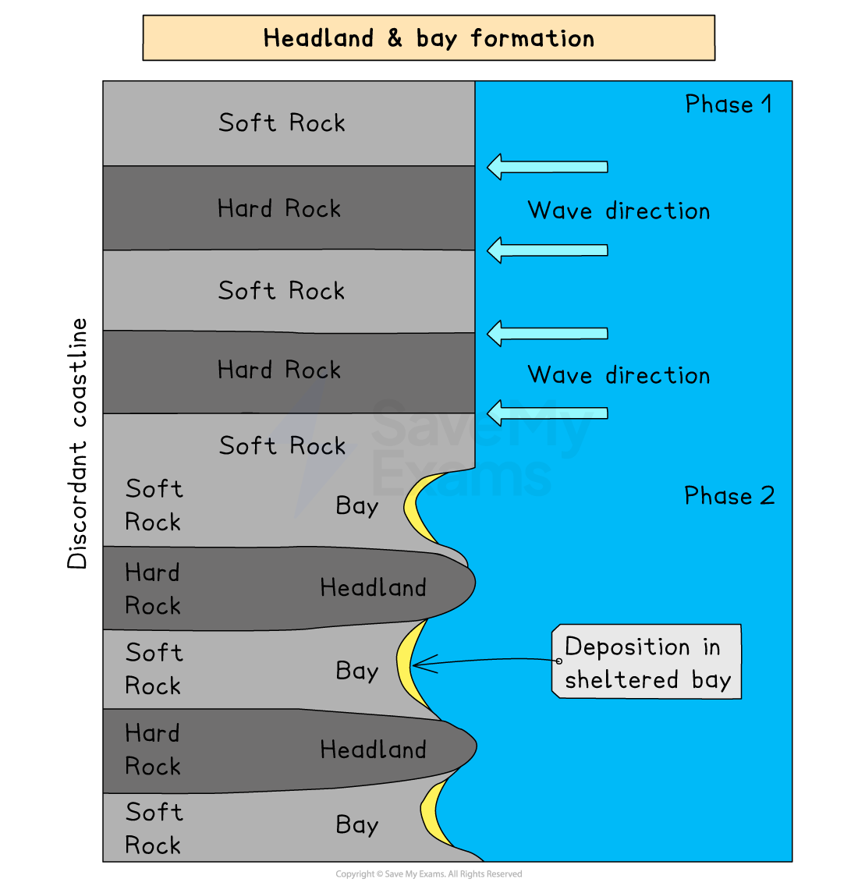
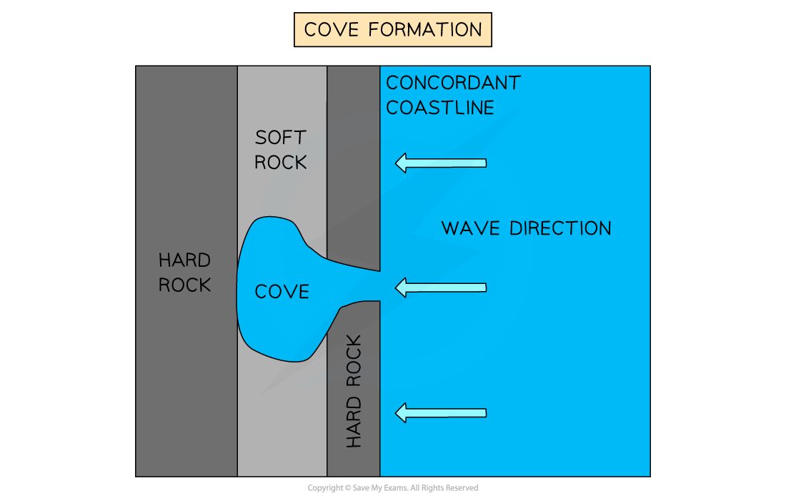
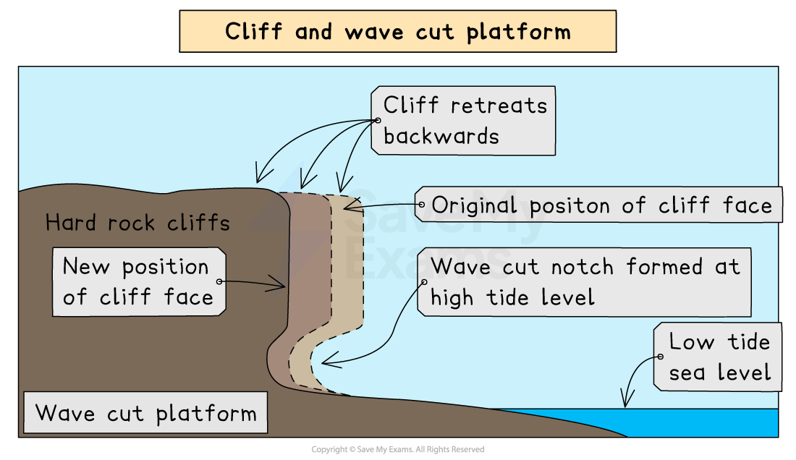
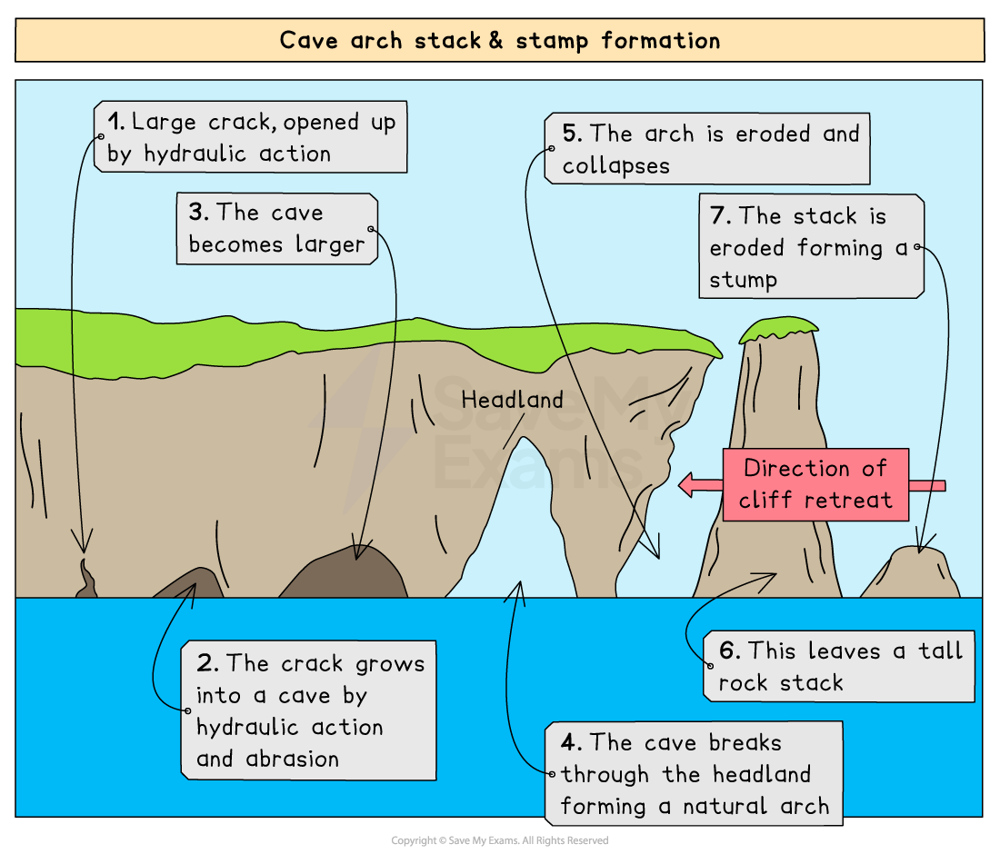
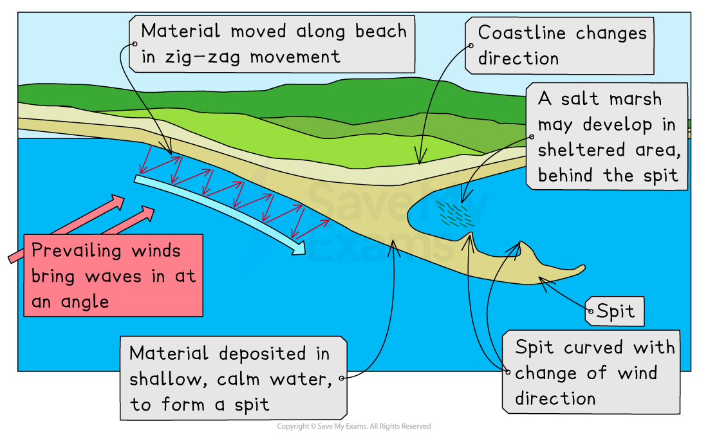
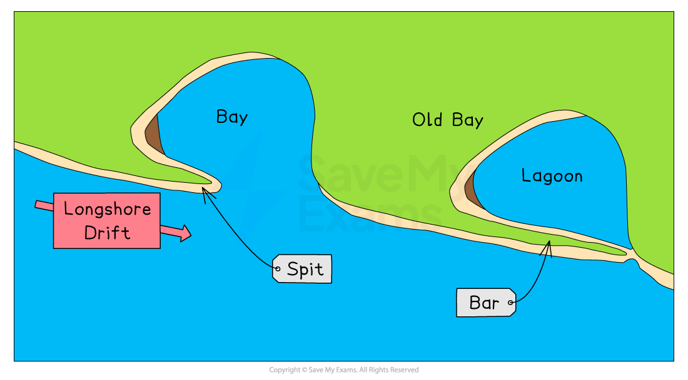
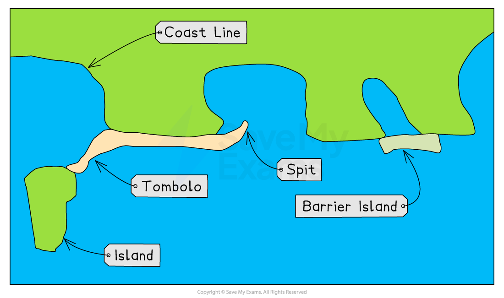

# Coastal Landforms

## Erosional Landforms of the Coast

> **Spec point** — `spcpt_2VVrZSGRP2r2fQ5j`

## Erosional landforms

### Headland and bay

- Found in areas of alternating bands of **resistant** (hard) and **less resistant** (soft) rocks running **perpendicular **to oncoming waves (**discordant **coastline)
- Initially, less resistant rock (e.g. clay) is eroded back, forming a **bay**

  - A bay is an inlet of the sea where the land curves inwards, usually with a beach
- The more resistant rock (e.g. limestone) is left protruding out to sea as a **headland**

*The formation of  headlands and bays*

### Cove

- A cove forms where the coastline has bands of resistant and less resistant rock running **parallel **to the oncoming waves (**concordant **coastline)

  - There is usually a band of resistant rock facing the oncoming waves, with a band of softer rock behind
- Wave processes of [abrasion](https://www.savemyexams.com/igcse/geography/edexcel/19/revision-notes/2-coastal-environments/2-1-coastal-processes-and-landforms/2-1-1-coastal-processes/), **corrosion** and **hydraulic action** will exploit **faults** in the resistant rock and erode through to the softer rock
- Further wave action will erode the softer rock quickly, which will leave behind a circular cove with a narrow entrance to the sea
- *Wave refraction *within the cove spreads out the erosion in all directions, creating the typical horseshoe shape

  - **Lulworth Cove** in Dorset, UK, is a good example of a cove

*The formation of coves*

### Cliffs and wave-cut platforms

- Cliffs are steep rock faces
- They are shaped through **erosion** and **weathering** processes
- Less resistant rock erodes quickly and will form sloping cliff faces
- Steeper cliffs are formed where there is harder rock faces the sea
- A **wave-cut platform** is a wide, gently sloped surface found at the foot of a cliff:

  - As the sea attacks the base of a cliff between the high and low water mark, a **wave-cut notch** is formed
  - **Abrasion,** **corrosion** and **hydraulic action** further extend the notch back into the cliff
  - The **undercutting** of the cliff leads to instability and collapse of the cliff
  - The backwash of the waves, carries away the eroded material, leaving behind a **wave-cut platform**
  - The process repeats and the cliff continues to retreat, leading to a coastal retreat

*The formation of cliffs and wave-cut platforms*

### Cave, arch, stack and stump

- Stack formation occurs on a headland due to **wave action** and **sub-aerial weathering**
- Any weaknesses/cracks in the headland are exploited by erosional processes of **hydraulic action**, **abrasion** and **corrosion**

  - As the **crack **begins to widen, abrasion will begin to wear away at the forming **cave**
  - The cave will become larger and eventually break through the headland to form an **arch**
  - The base of the arch continually becomes wider and thinner through erosion below and weathering from above
  - Eventually, the roof of the arch collapses, leaving behind an isolated column of rock called a **stack**
  - The stack is **undercut **at the base by wave action and sub-aerial weathering above until it collapses to form a **stump**

*Illustration showing the stages of stack formation*

## Depositional Landforms of the Coast

> **Spec point** — `spcpt_HXBt3nvhzfpFCrWs`

## Depositional landforms

### Beach

- Beaches form in **sheltered areas** such as bays
- Deposition occurs through [constructive wave movement](https://www.savemyexams.com/igcse/geography/edexcel/19/revision-notes/2-coastal-environments/2-1-coastal-processes-and-landforms/2-1-1-coastal-processes/), where the ***swash*** is stronger than the ***backwash***
- Beach formation usually occurs in the summer months when the weather is calmer
- Sometimes sand from offshore bars can blow onto the shore by strong winds
- Blown sand can create **sand dunes** at the ***backshore*** of a beach

### Spit

- A spit is an extended stretch of sand or shingle that extends out to sea from the shore
- Spits occur:

  - when there is a change in the shape of the coastline
  - **OR**
  - when the mouth of a river prevents a spit from forming across the **estuary**

- A spit may or may not have a 'hooked' end, depending on opposing winds and currents
- A good example is **Spurn Point**, which stretches for three and a half miles across the **Humber Estuary** in the northeast of England

#### Stages of spit formation

- Sediment is transported by ***longshore drift***
- Where the coastline changes direction, a shallow, sheltered area allows for **deposition of sediment**
- Due to **increased friction**, more deposition occurs
- Eventually, a spit slowly builds up to sea level and extends in length
- If the wind changes direction, then the wave pattern alters and results in a hooked end
- The area behind the spit becomes sheltered
- ***Silts*** are deposited here to form **salt marshes** or **mud flats**

*Illustration showing spit formation*

#### Bar

- A **bar **of sand is formed (**sandbar**) when longshore drift continues to grow a spit  across a bay, and joins two headlands together
- Sandbars can also form **offshore **due to the action of breaking waves from a beach

*Illustration showing bar formation*

#### Lagoon

- A **lagoon** is where a small body of water is cut off from the sea
- They may form behind a bar or tombolo
- Lagoons do not last forever and may fill with sediment and form new land

#### Tombolo

- A **tombolo **is formed when longshore drift continues to grow a spit that joins the mainland to an island
- Chesil Beach in Dorset is a tombolo, as the mainland is joined to the Isle of Portland

#### Barrier Island

- **Barrier islands** form **parallel** to the coast
- The main difference between a bar and a barrier island is that a bar joins two headlands, whereas a barrier island is open at one or both ends

*Illustration showing the formation of a tombolo and barrier island*

> **Exam Hint**
> You may be asked to draw and label a diagram showing how depositional landforms (beaches, spits, etc.) are formed. You need to be able to show how sediment is transported along the coast by waves. Practise drawing and labelling these diagrams so you can reproduce any of them for the exam. Marks will be awarded for the accuracy and completeness of your labelling and drawing.
