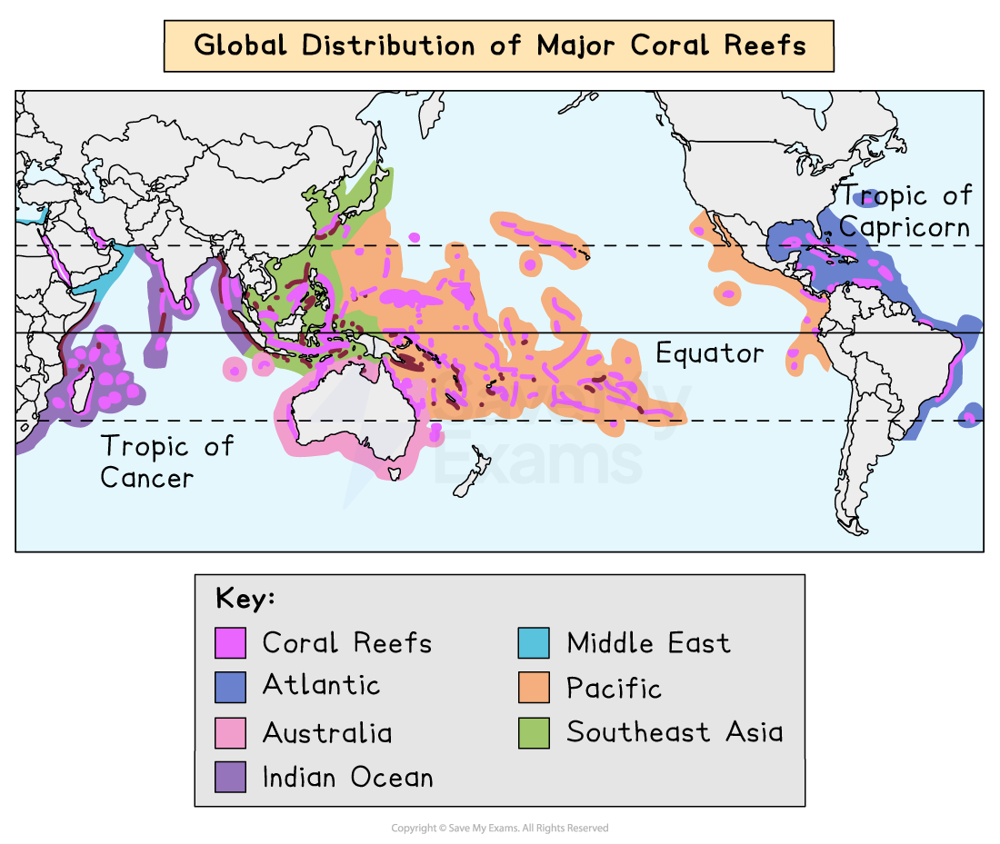
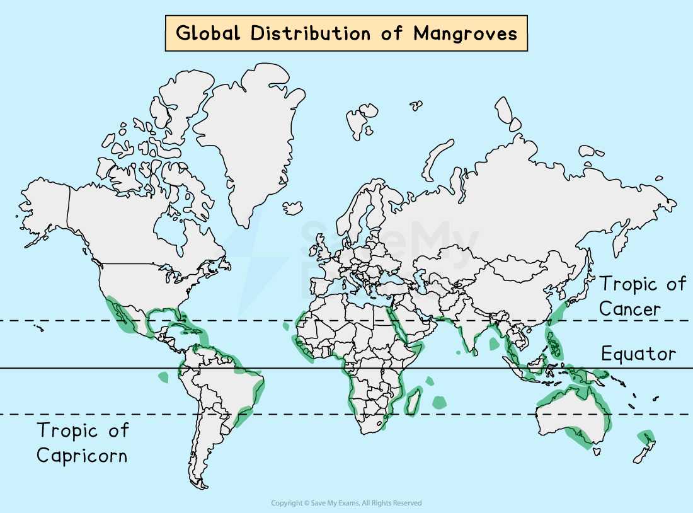
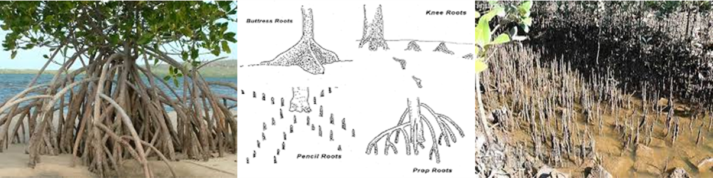
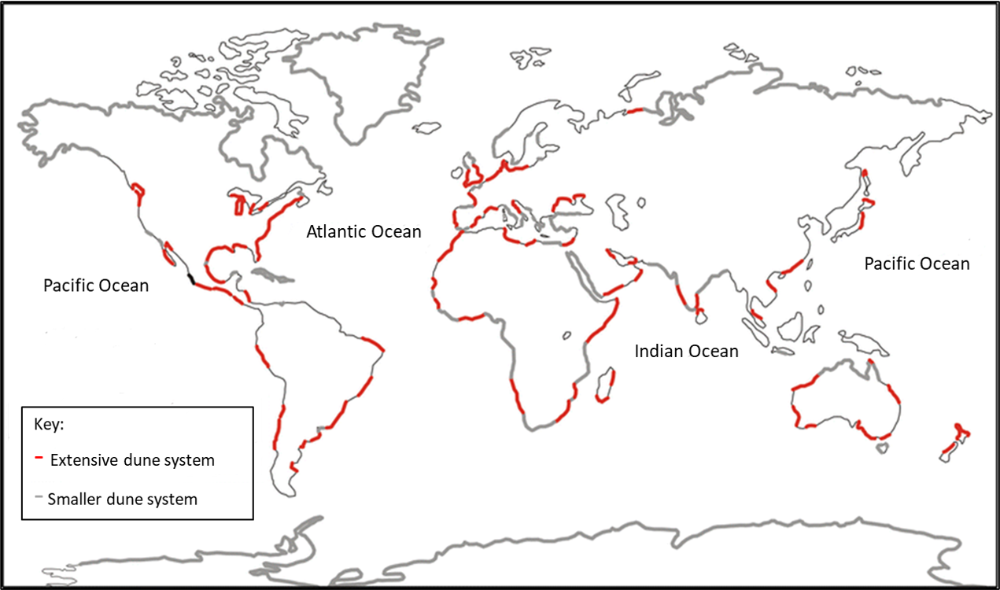
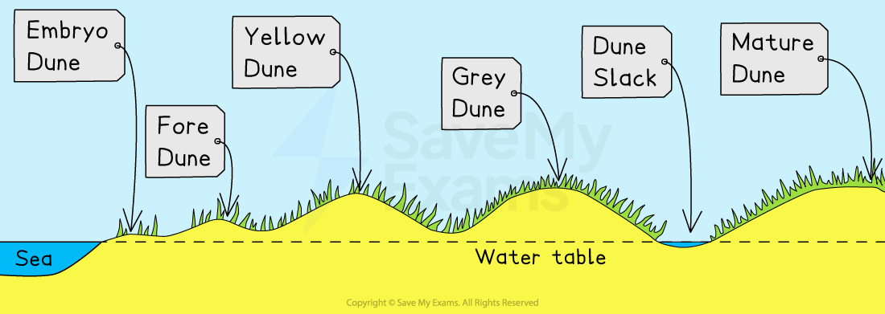
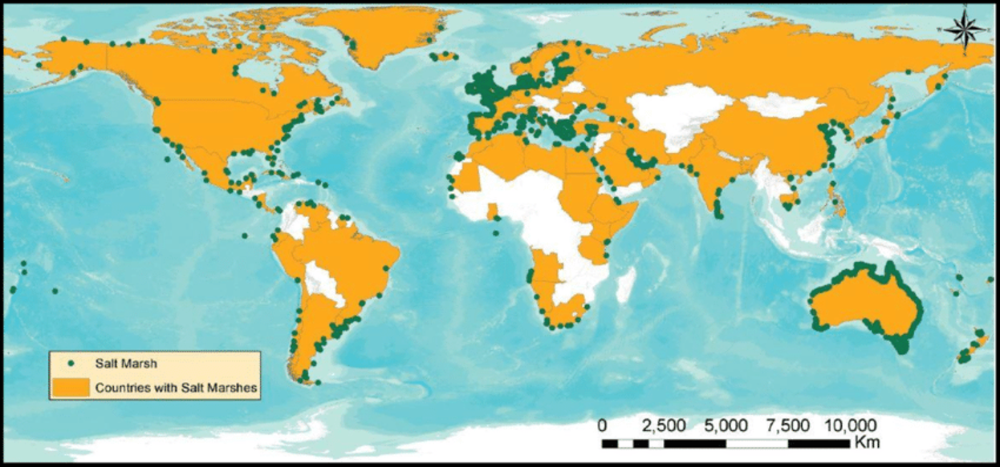

# Coastal Ecosystems of the World

## Distribution & Features of Coral Reefs

> **Spec point** — `spcpt_fwPg9tCc5p8XTxJF`

## Distribution & features of coral reefs

### Distribution of coral reefs

- Coral reefs are large deposits of **calcium carbonate** built entirely of living organisms called ***coral polyps***
- Corals are scattered throughout the tropical and subtropical Western Atlantic and Indo-Pacific oceans, generally within **30°N and 30°S latitudes**
- **Western Atlantic reefs** include these areas:

  - Bermuda
  - the Bahamas
  - the Caribbean Islands
  - Belize
  - Florida
  - Gulf of Mexico
- The Indo-Pacific ocean region extends from the Red Sea and the Persian Gulf through the Indian and Pacific Oceans to the western coast of Panama
- Corals grow on rocky outcrops in some areas of the Gulf of California
- The Great Barrier Reef in northern Australia is renowned for its great biodiversity and size and can be seen from space
- The **distribution** of coral reefs is controlled by four factors:

  - **Temperature**
  - **Light**
  - **Water depth**
  - ***Salinity***

*Map showing global distribution of coral reefs*

### What are the features of coral reefs?

#### Temperature

- Corals cannot tolerate water temperatures below 18°C but grow best at 23°C – 29°C
- Some can stand temperatures as high as 40° C for short periods
- This is why coral reefs normally grow between the Tropic of Capricorn and the Tropic of Cancer

#### Light

- Corals need light for ***photosynthesis*** due to the algae, called ***zooxanthellae***, that live in their tissue

#### Water

- Corals are generally found at **depths of less than 25m** where sunlight can penetrate
- The water must also be **clear **and **clean** to allow for optimum photosynthesis to occur

#### Salinity

- Since corals are marine animals, they need salty water to survive, ranging from 32 to 42% saltwater

#### Local factors

- At a local level, other factors will affect development:

  - **Wave action – corals** need well-oxygenated, clean water and wave action provides this
  - **Exposure to air – although** corals need oxygenated water, they cannot be exposed to air for too long or they will die
  - **Sediment — all** corals need clear, clean water. Any sediment in the water will block normal feeding patterns by reducing the availability of light, affecting the photosynthesis of the microscopic algae '**zooxanthellae**' living in polyp tissue. The corals provide algae with a home and compounds for photosynthesis. In return, the algae produce food, and oxygen and help remove wastes

#### Biodiversity

- Coral reefs support high levels of *biodiversity*
- The coral reefs provide habitats for over 25% of the world's marine species

### Types of coral reefs

- There are three main types of coral reefs:

  - **Fringing Reefs – these** are reefs that form around a landmass
  - **Barrier Reefs – these** are found parallel to the shore but are separated by a channel of water
  
    - The Great Barrier Reef in the Coral Sea, off the coast of Queensland, Australia, is a good example of a barrier reef.
    - It is the world's largest coral reef system, with over 2,900 individual reefs and 600 islands that stretch for over 2,300 kilometres and can be seen from space
  - **Atolls **are **horseshoe-shaped** rings, consisting of a coral rim that encircles a lagoon

## Distribution & Features of Mangroves

> **Spec point** — `spcpt_x8VgJBTpT7Vm2mtM`

## Distribution & features of mangroves

### Distribution of mangroves

- Both mangroves and coral reefs are found in warm tropical waters
- Unlike the sensitive coral reefs, mangroves are highly adapted to changing conditions
- This has made them the most successful ecosystems on Earth covering approximately 25% of tropical coastlines

*Map showing the global Distribution of Mangroves*

- Mangroves originate from Southeast Asia and spread across the globe
- They are mainly found in warm tropical waters and coastal swamps within 30° N and S of the equator

  - Some mangroves have adapted to more temperate conditions and have colonized as far south as New Zealand's North Island
- Mangroves grow in the ***intertidal zone*** of the coast
- South-East Asia has mangroves with the highest **biodiversity** in the world

### Characteristics of mangroves

- Mangroves are trees that grow along the coastline
- They sit in water between 0.5 and 2.5 metres high
- The trees range in size from small shrubs to trees over 60m high
- They need high levels of humidity (75 - 80%) and rainfall per annum (1500 - 3000 mm)
- The ideal temperature for mangrove growth is around 27° C but they are adapting to more temperate climates

#### Mangrove root system

- They have numerous tangled roots that grow above ground and form dense ***thickets***
- The mangrove root system is complex, with a filtration system to keep salt out
- Some have snorkel-like roots that stick out of the mud to help them take in air
- Others use 'prop' roots or 'buttresses' to keep their trunks upright in the soft sediment at the tidal edge

***Prop Roots        Mangrove Root Systems               Snorkel Roots***

- It is the roots that trap mud, sand and silt which eventually builds up the intertidal zone into the new land

#### Colonisation of new intertidal areas

- At the same time, the mangrove is colonising new intertidal areas
- The fruits and seedlings of mangroves can float and can travel many kilometres on ocean currents
- As they drift with the incoming tide, they become lodged in the mud and begin to grow, colonizing new areas

## Distribution & Features of Sand Dunes

> **Spec point** — `spcpt_gTyNNVyM9MKwDBnS`

## Distribution & features of sand dunes

### Distribution of sand dunes

- Coastal sand dunes are found all over the world
- They are the accumulation of sand, shaped into mounds and ridges by the wind
- Sand dunes are located at the back of a beach, above the maximum reach of the tide

*Global Distribution of Coastal Sand Dune Systems*

- Coastal sand dunes develop best when:

  - There is a wide beach and large quantities of sand
  - The prevailing wind is ***onshore***
  - There is a large ***tidal range*** to allow time for the sand to dry
  - There are suitable locations for the sand to accumulate

### Characteristics of sand dunes

- Sand dunes can be small ridges or large hills usually found at the back of a beach
- They can extend backwards for many miles as well as along the beach
- They are an important ecosystem supporting unique ***flora and fauna*** that have adapted to live within the dune system
- Dunes are vulnerable to erosion by natural processes and human activity:

  - It is common to see vulnerable sections of dunes fenced off to prevent public access, or for paths to be laid to prevent people from eroding the dunes further

#### Formation of a sand dune

- Wind-blown sand is deposited against an obstruction – pebble or driftwood
- As more sand particles are caught, the dunes grow in size, forming rows at right angles to the prevailing wind
- Over time, the ridges of the dunes will be **colonized **and** fixed** by vegetation in a process called ***succession***
- The first plants (**pioneer species)** have to deal with:

  - Salinity
  - Lack of moisture as sand drains quickly (highly permeable)
  - Wind
  - Temporary submergence by wind-blown sand
  - Rising sea levels

*Illustration of coastal sand dune succession*

- **Embryo Dunes**

  - Wind-blown dried sand is trapped by debris and deposition begins
  - **Pioneer species** such as **Lyme Grass** and **Sea Couch Grass** begin to colonise
  - There is little soil content and high pH levels (alkaline)
  - Embryo dunes  are very fragile and reach a maximum height of 1 metre
- **Fore Dunes**

  - The embryo dunes bring some protection against the prevailing wind
  - This allows other species of plant to grow, such as** Marram Grass**
  - Marram grass begins to stabilise the dune with its root system
  - These plants add organic matter to the dunes, making them more hospitable for plants that later grow
  - A ***microclimate*** forms in the ***dune slack***
  - Maximum height is 5 metres
- **Yellow Dunes**

  - These are initially yellow but darken as organic material adds humus to the soil
  - Marram grass still dominates the vegetation, but more delicate flowering plants and insects are found in the **dune slacks**
  - 20% of the dune is exposed, down from 80%
  - Height does not exceed 8 metres
- **Grey Dunes **

  - Grey dunes are more stable, with less than 10% of exposed sand and have a good range of biodiversity
  - Soil acidity and water content increase as more humus is added
  - Shrubs and bushes begin to appear
  - Height is between 8 and 10 metres
- **Mature Dunes**

  - As the name suggests, these are the oldest and most stable of the dunes
  - They are found several hundred metres or more from the shoreline
  - The soil can support a variety of flora and fauna, such as oak trees and alders (**climax vegetation**)
  - This is the final stage in succession, which is known as the **climax community stage**

## Distribution & Features of Salt Marshes

> **Spec point** — `spcpt_Sxf9YBwPdjQmNNQr`

## Distribution & features of salt marshes

### Distribution of salt marshes

- Salt marshes are found all over the world in temperate climates
- Like mangroves, they are an ecosystem of the **intertidal zone **
- They are typically very flat, with numerous channels running through them
- They form in:

  - Coastal areas that are **well sheltered**, such as inlets and estuaries where fine sediments can be deposited
  - Areas behind **spits** and artificial sea defences where tidal waters can flow gently and deposit fine sediments
  - They form in ***brackish water***

*Global Distribution of Salt Marshes*

### Features of salt marshes

- Salt marshes are communities of nonwoody, **salt-tolerant **plants
- They begin as tidal mudflats, gaining height as more sediment is deposited
- This builds up to and above the level, and frequency of tidal flooding, ensuring that the soil never dries out and remains muddy and sticky
- Pioneer species of ***halophyte*** plants begin to colonise
- As these plants die and add nutrients to the soil, sediment builds up

  - This makes the conditions more favourable and other species start to develop.
- The process of the development of vegetation, over time, is known as **succession**. In a salt marsh, this is known as a ***halosere***
- The lower marshes are flooded daily by the rising tide.
- They are good coastal defences in some areas, acting as a natural buffer against coastal erosion and flooding
- However, in many areas, they have been reclaimed for agriculture or development, and are threatened by human activities

> **Exam Hint**
> Make sure you can explain factors that influence the distribution of these four ecosystems. They are a popular exam question.

> **Worked Example**
> **Explain one physical factor that influences the distribution of mangrove ecosystems**
> 
> ** (3 Marks)**
> 
> - You would gain 1 mark for identifying a way:
> 
>   - Temperature, light, water depth, salinity, wind direction, level of shelter
> - Then 2 marks for development and further explanation
> 
> - **Answer**
> 
>   - Coastal mangroves need a high temperature of around 27°C; otherwise, they will not grow, although some mangroves have adapted to more temperate conditions, such as New Zealand
>   - Mangroves need shallow water between 0.5 and 2.5 metres in depth, but can survive where the tidal ranges go slightly above or below this level
>   - Mangroves need high levels of humidity between 75 and 80% to enable them to grow
>   - Coastal mangroves need a high level of rainfall, between 1500 and 3000 mm per annum; this can be gained from rainfall or moisture in the air, making tropical climates ideal
