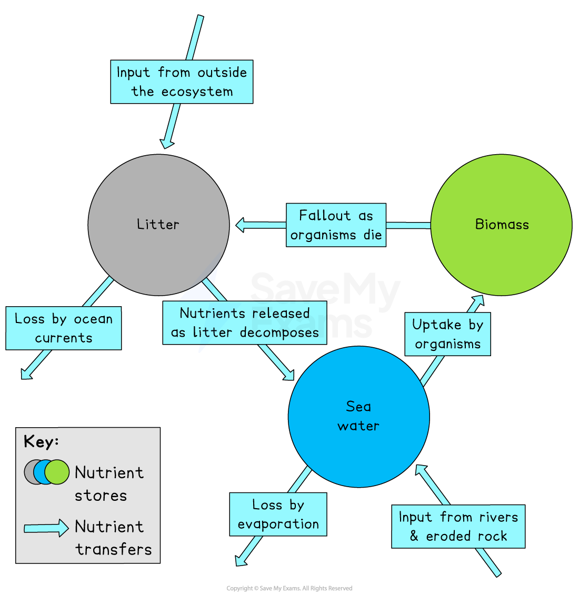

# Characteristics of Coastal Ecosystem

## Characteristics of Coral Reef Ecosystems

> **Spec point** — `spcpt_qqJJtYF2BMrjHtC4`

## Characteristics of coral reef ecosystems

- An ecosystem is a community of interacting ***biotic*** organisms and ***abiotic*** factors
- All ecosystems, whether on land or in water function in the same way
- All survive by **nutrient cycling** around three stores

  - ***Biomass***
  - ***Litter***
  - Sea Water

*Nutrient cycle of a coastal ecosystem *

### Nutrient cycle of coastal ecosystems

#### Mangroves

- **Nutrient store **– mud/sand
- **Biomass store **– plants and animals
- **Litter **– dead plants and animals
- **Degrades **in water
- **Transfers **– water

#### Sand dunes

- **Nutrient store **– mud/sand
- **Biomass store **– plants and animals
- **Litter **– dead plants and animals
- **Degrades **in water
- **Transfers **– land

#### Salt Marsh

- **Nutrient store **– mud/sand
- **Biomass store **– plants and animals
- **Litter **– dead plants and animals
- **Degrades **in water
- **Transfers **– land

#### Coral

- **Nutrient store **– sea water, rivers entering the sea, on-shore currents
- **Biomass store **– coral polyps, seaweed, fish, crustaceans and invertebrates
- **Litter **– dead coral polyps, seaweed, fish, crustaceans and invertebrates
- **Degrades **in seawater
- **Transfers **– tidal and ocean currents

> **Exam Hint**
> Please ensure you have a clear understanding of nutrient cycling in these ecosystems, especially the distinction between abiotic and biotic factors. Examiners might ask you to name one or both of these factors from a list.

### Biotic components of a coral reef

- A coral reef is a well-organised food web comprised of:

  - producers
  - consumers
  - scavengers
  - decomposers

#### Producers

- **Producers **in a coral reef include seaweed, seagrass, and ***phytoplankton***. ***zooxanthellae*** are also producers that provide the nutrients from photosynthesis to coral

#### Consumers

- **Consumers **are organisms that eat other organisms to gain energy.

  - There are three main types of consumers in a food web: **primary**, **secondary**, and **tertiary**
  
    - Primary consumers only eat producers – the green sea turtles graze on seagrass
    - Secondary consumers eat primary consumers – stingrays, octopuses, squid, and larger fish, for example
    - Tertiary consumers, also called **apex predators, **are carnivores that do not prey upon themselves.  These consumers help maintain the balance of the ecosystem -  sharks, dolphins, tuna, barracuda, etc.

#### Scavengers

- **Scavengers** feed on dead and decaying plants and animals – crabs and lobsters scavenge for food

#### Decomposers

- **Decomposers **bring nutrients back into the ecosystem to support another cycle – examples include bacteria, sea cucumbers, and fungi

### Abiotic features of a coral reef

- **Corals need a certain amount of sunlight to survive**

  - Too little light and the zooxanthellae will not be able to photosynthesise and produce food for corals
  - Too much light may cause corals to expel zooxanthellae, causing **bleaching **
- **Depth**: As corals need light, they are typically found at approximately 25 meters
- **Water temperature:**  Corals thrive in the warm waters of the tropics. They prefer a temperature range of 23-25°C but will survive at lower and higher temperatures for short periods
- **Salinity**: Corals need salty water
- **Air**: Can survive out of water for very short periods
- **Water**: Corals need clean, clear water

## Characteristics of Mangrove Ecosystems

> **Spec point** — `spcpt_BjDgFhP3Mndv6N6J`

## Characteristics of mangrove ecosystems

### Biotic components of a mangrove

#### Producers

- Mangroves are the **producers **of their own ecosystem

  - Many organisms feed on the ***detritus*** created from falling leaves
  - Phytoplankton can float on the surface of the water and algae grow on the mangroves' roots

#### Consumers

- **Primary consumers** are usually the decomposers (e.g. the mangrove tree crab). Small fish, crabs, clams, and shrimp feed off of the detritus. Very few consumers directly feed on the mangroves
- **Secondary consumers** are the larger predatory fish, turtles, and crabs
- **Tertiary consumers **include birds (e.g. herons and ospreys), eels, saltwater crocodiles, tigers, and humans

#### Scavengers

- **Scavengers **include shrimp, crabs mussels and mullet

#### Decomposers

- **Decomposers** include worms, bacteria and fungi

### Abiotic features of mangroves

- **Temperature**: Mangroves typically grow in areas where the temperature does not drop below 19°C
- **Oxygen**: Just like other plants, mangroves need oxygen to survive. Complex root systems allow the mangroves to receive the oxygen they need by sticking out of the water
- **Salinity: **Mangroves have adapted to live in salt water, with some removing excess salt through their leaves
- **Soil:** Mangroves can grow within the intertidal zone of a coast. The soils are made up of sand, silt, and mud
- **Wave energy: **Mangrove vegetation cannot develop on exposed coasts with a lot of wave energy or currents that move sediments, which would stop seeds from colonising
- **Ocean currents: **These distribute mangrove seeds and help keep the areas full of trees

## Characteristics of Sand Dune Ecosystems

> **Spec point** — `spcpt_M59wwYs4NCh9J9VH`

## Characteristics of sand dune ecosystems

### Biotic components of sand dunes

#### Producers

- **Producers **that provide the initial beach fuel for dunes include:

  - phytoplankton, microscopic algae (green scum found on a beach), detached seaweeds (such as kelp and seagrass), and blown-in seeds.
  - These support the growth of pioneer species such as couch grass and lyme grass. As succession continues, multiple species of vegetation begin to colonise – marram grass, gorse, sea buckthorn, heathers, red fescue, etc.

#### Consumers

- **Primary consumers: **beetles, butterflies, moths, bees, wasps, flies, rabbits, etc.
- **Secondary consumers: **sand lizards, snakes, spiders, frogs, bats, etc.
- **Tertiary consumers: **seagulls, waders, hawks, swans, bats, etc.

#### Scavengers

- **Scavengers: **crabs, beetles, flies, wasps, crows, rats, etc.

#### Decomposers

- **Decomposers: **flies, fungi, bacteria, weevils, etc.

### Abiotic features of sand dunes

- **Wind – **an onshore prevailing wind is needed to blow the dried sand into ridges
- **Tidal range – **needs to be large to allow sand to dry
- **Water – **a mix of fresh and saline to support pioneer species
- **Sand – **large quantities needed
- **Beach – **needs to be wide
- **Obstacles – **needed for sand to accumulate behind

## Characteristics of Salt Marsh Ecosystems

> **Spec point** — `spcpt_bf2K78wFfHrCwkYt`

## Characteristics of salt marsh ecosystems

### Biotic components of salt marshes

#### Producers

- **Producers – **algae**,** seaweed, rushes, samphire, cord grass, salt marsh hay etc.

#### Consumers

- **Primary consumers – **fish, insects, mussels, crabs, bees, oysters, shrimp, etc.
- **Secondary consumers – **fish, mice, frogs, herons, lizards, sandpipers, bats, etc.
- **Tertiary consumers – **harriers, sea eagles, gulls, etc.

#### Scavengers

- **Scavengers – **snails, rats, crows, flies, crabs, etc.

#### Decomposers

- **Decomposers – **fungi, bacteria, worms, etc.

### Abiotic features of salt marshes

- **Waves – **sheltered away from the open sea & destructive waves, usually behind a spit or in sheltered bays
- **Water – **brackish (mix of fresh and salty)
- **Tidal Range **- this is large with occasional flooding. Mudflats need to be exposed to colonise
- **Mud – **sediment needed to build up mud flats
- **Elevation –** needs variation in height to build up mud flats and stabilise marshes

> **Worked Example**
> Explain two factors affecting the distribution of coral reef ecosystems.
> 
> **(4 Marks)**
> 
> - **Answer:**
> - You need to state 2 reasons why coral reefs grow where they do or why they might stop growing there
> 
>   - Need temps of 23-28 degrees **(1)**so only found in the tropics **(1)**
>   - Light is needed for coral to grow **(1), **as they only grow in areas of shallow water where the light can penetrate** (1)**
>   - Global warming **(1)** leading to sea-level rise **(1)**
>   - Human impact **(1)**for example climate change causing the temperature of water to change/coral bleaching** (1)**
>   - Pollution from tourist activity** (1)** damages cora**l (1)**
>   - Any other appropriate response
