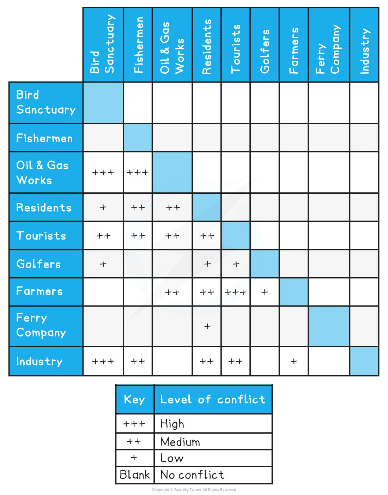

# Conflict at the Coast

## Conflict Between Development & Conservation

> **Spec point** — `spcpt_FrgXvmzR7s3PC97r`

## Conflict between development & conservation

- Careful management of coastal regions is necessary for ***sustainability***
- Coastal environments have multiple uses:

  - **Development **such as homes, shops, roads, etc.
  - **Nature reserves**
  - **Industry** such as ports, fishing and aquaculture
  - **Tourism**
  - **Agriculture**
- These different activities bring people and ecosystems together
- This leads to **competition for space**
- Conflict arises when coastal development is given a higher priority than coastal conservation

> **Exam Hint**
> Make sure you consider all the options here. Conflict resolution can be achieved by a mix of strategies, but achieving this is not always straightforward. Therefore, you need to be able to consider the issues that may arise.

## Conflict Between Coastal Users

> **Spec point** — `spcpt_tV294mBtkN3cggcH`

## Conflict between coastal users

- Coastal users and wildlife are referred to as ***stakeholders***
- Each stakeholder has a different priority or need

  - **Wildlife** want an unpolluted, safe and quiet environment
  - **Local residents **want jobs, clean beaches, affordable housing and schools
  - **Tourists **want beaches, hotels, B&Bs, entertainment, holiday homes, and marinas
  - **Employers** want building space, offices, and factories
  - **Developers **want areas by the sea for tourists—hotels, duplexes, golf courses
  - **Fishermen** want harbours, unpolluted waters, and ease of access to the sea
  - **Farmers **want well-drained land, sheltered from prevailing winds
  - **Government and Councils** want to build offshore wind farms and coastal defences
  - **Transport companies** want good road networks, well-connected ports and terminals

### Relationship between stakeholders and coastal zone issues

- The different needs of stakeholders often conflict as they compete for the same resources

#### Agriculture

- There are several consequences of increased agriculture in coastal areas including:

  - Fertiliser and pesticide overuse
  - Increased livestock density
  - Overwater abstraction
  - Animal waste disposal
  - ***Land reclamation***
- The likely outcomes of this land use are:

  - species and habitat loss
  - ***eutrophication***
  - water pollution
  - ***coastal squeeze***

#### Urbanisation and transport

- Increased populations in coastal areas lead to:

  - change of land use (car parks, ports etc.)
  - waste disposal
  - fuel spillages
  - change of land use
  - water abstraction
  - sewage disposal
- These consequences can lead to:

  - increased flooding
  - congestion
  - pollution
  - loss of habitats
  - increase weeds and invasive species

### Tourism and recreation

- Tourism and recreation activities are increasing in coastal areas, which leads to:

  - the building of harbours and marinas
  - waste disposal
  - fuel spillages
  - change of land use
  - water abstraction
  - sewage disposal
- The consequences of this include:

  - congestion
  - pollution (noise, light, visual and smell)
  - loss of habitats
  - loss of species
  - litter
  - fuel spills

#### Fisheries and aquaculture

- Fisheries and aquaculture lead to:

  - the building of ports and fish processing facilities
  - road networks
  - increased transport
  - fish farm pollution
  - water abstraction
- The consequences of this include:

  - overfishing
  - pollution on beaches
  - habitat damage
  - pollution (water, smell, visual and noise) pollution
  - increased seagull activity

#### Industry

- The increase in industry in the coastal zone leads to:

  - land-use change
  - change in tidal range
  - power stations (nuclear and gas)
  - natural resource extraction
  - road networks
  - cooling water/abstraction
  - waste pollution (chemical, biological, nuclear, etc.)
- The consequences of this include:

  - thermal pollution
  - habitat destruction, change and loss
  - water eutrophication
  - water pollution
  - visual eyesore

### Conflict matrix

- The level of conflict varies depending on who and what the needs are
- This can be shown in a conflict matrix

*Conflict Matrix *

> **Exam Hint**
> A conflict matrix is just one way to display information & is subjective in its response. You may not agree with the above levels of conflict, that is fine, so long as you can justify why you disagree or agree.
