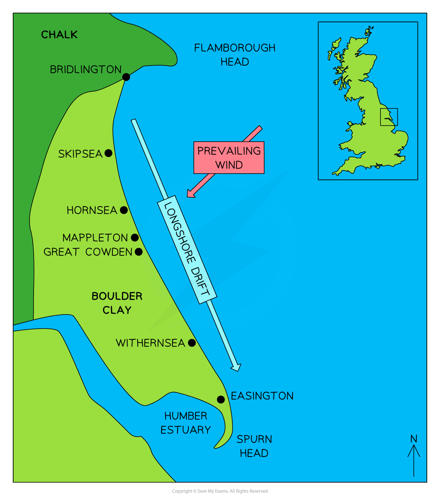

# Coastal Management

## Coastal Strategies

> **Spec point** — `spcpt_f4kwQp5QZgf22J5z`

## Coastal strategies

- Management of coastal regions is performed by identifying ***coastal cells***
- This breaks a long coastline into manageable sections and helps identify two related risks:

  - The risk of erosion and land retreat
  - The risk of flooding
- Identification  of the risks allows resources to be allocated effectively to reduce the impacts
- The '***cost-benefit***' is easier to calculate using coastal cells

## Shoreline Management Plans

> **Spec point** — `spcpt_djyKdQPmfP6d4Vnc`

## Shoreline management plans

- **Shoreline Management Plans (SMP)** set out an approach to managing a coastline from flooding and erosional risk

  - The plans aim to reduce the risk to people, settlements, agricultural land and natural environments (salt marshes etc.)
- There are **four **approaches available for coastal management, with differing costs and consequences:

  - Hold the line
  - Advance the line
  - Managed realignment
  - Do nothing

### Hold the line

- Long-term approach and the most costly
- Build and maintain coastal defences so the current position of the shoreline remains the same
- Hard engineering is the most dominant method used, with soft engineering used to support

### Advance

- Build new defences to extend the existing shoreline
- Involves land reclamation
- Hard and soft engineering is used

### Managed realignment

- The coastline is allowed to move naturally
- Processes are monitored and directed when and where necessary
- The most natural approach to coastal defence
- Mostly soft engineering with some hard engineering to support

### Do nothing

- The cheapest method, but the most controversial of the options
- The coast is allowed to erode and retreat landward
- No investment is made in protecting the coastline or defending against flooding, regardless of any previous intervention

### Which approach to coastal management?

- Decisions about which approach to apply are complex and depend on:

  - the **economic value** of the resources that would be protected, e.g. land, homes, etc.
  - **engineering solutions** – it might not be possible to 'hold the line' for moving landforms such as spits, or unstable cliffs
  - **cultural and ecological value** of land – historic sites and areas of unusual diversity
  - **community pressure** – local campaigns to protect the region
  - social value of communities – long-standing, historic communities

## Hard Engineering Methods

> **Spec point** — `spcpt_9Zsnhnsz9XR5cknq`

## Hard engineering methods

- Hard engineering involves building some form of sea defence, usually from concrete, wood or rock
- Structures are expensive to build and need to be maintained
- Defences work against the power of the waves
- Each type of defence has its strengths and weaknesses
- Protecting one area can impact regions further along the coast, which results in faster erosion and flooding
- Hard engineering is used when settlements and expensive installations (power stations, etc.) are at risk – the economic benefit is greater than the costs of building structures

### Hard engineering strategies

#### Seawall

- A wall, usually concrete, and curved outwards to deflect the power of the waves

| Advantages | Disadvantages |
|---|---|
| - Most effective at preventing both erosion and flooding (if the wall is high enough) | - Very expensive to build and maintain - It can be damaged if the material is not maintained in front of the wall - Restricts access to the beach - Unsightly to look at |

#### Groynes

- Wood, rock or steel piling built at right angles to the shore
- Groynes trap beach material being moved by longshore drift

| Advantages | Disadvantages |
|---|---|
| - Slows down beach erosion - Creates wider beaches - Cheap in comparison to other hard engineering methods | - Stops material moving down the coast, where the material may have been building up and protecting the base of a cliff elsewhere - Starves other beaches of sand. Wood groynes need maintenance to prevent wood rot - Makes walking along the shoreline difficult |

#### Rip-rap

- Large boulders which are piled up to protect a stretch of coast

| Advantages | Disadvantages |
|---|---|
| - Cheaper method of construction - Works to absorb wave energy from the base of cliffs and sea walls | - Boulders can be eroded or dislodged during heavy storm - Heavy and expensive to transport |

#### Gabions

- Wire cages filled with stone, concrete, sand, etc.

| Advantages | Disadvantages |
|---|---|
| - Cheapest form of coastal defence - Cages absorb wave energy - Can be stacked at the base of a seawall or cliffs | - Wire cages can break and they need to be securely tied down - Not as efficient as other coastal defence |

#### Revetments

- Sloping wooden or concrete fence with an open plank structure

| Advantages | Disadvantages |
|---|---|
| - Work to break the force of the waves - Traps beach material behind them - Set at the base of cliffs or in front of the sea wall - Cheaper than sea walls but not as effective | - Not effective in stormy conditions - Can make beach inaccessible for people - Regular maintenance is necessary - Visually unattractive |

#### Off-shore barriers

- Large concrete blocks, rocks and boulders are sunk offshore
- These alter wave direction and dissipate wave energy

| Advantages | Disadvantages |
|---|---|
| - Effective at breaking wave energy before reaching the shore - Beach material is built up - Low maintenance - Maintains natural beach appearance | - Expensive to build - Can be removed in heavy storms - Can be unattractive - Prevents surfing, sailing and fishing |

## Soft Engineering Methods

> **Spec point** — `spcpt_FNBkrVNxGPsbbF6z`

## Soft Engineering Methods

- Soft engineering **works with natural processes **rather than against them
- Usually cheaper and do not damage the appearance of the coast
- They are considered to be a more sustainable approach to coastal protection

  - However, they are often not as effective as hard engineering methods

### Beach replenishment

- Pumping or dumping sand and shingle back onto a beach to replace eroded material

| Advantages | Disadvantages |
|---|---|
| - Beaches absorb wave energy - Widens beachfront | - It has to be repeated regularly, which is expensive - Can impact sediment transportation down the coast |

### Fences, hedging and replacing vegetation

- These help to stabilise sand dunes or beaches
- Additional vegetation or fencing also reduces wind erosion

| Advantages | Disadvantages |
|---|---|
| - Cheap method to protect against flooding and erosion | - It's hard to protect larger areas of coastline cliffs |

### Cliff regrading

- The angle of a cliff is reduced to reduce mass movement

| Advantages | Disadvantages |
|---|---|
| - Prevents sudden loss of large sections of cliff - Regrading can also slow down wave-cut notching at the base of cliffs as wave energy is slowed | - Does not stop cliff erosion |

### Managed retreat

- Existing coastal defences are abandoned, allowing the sea to flood inland until it reaches higher land or a new line of defences

| Advantages | Disadvantages |
|---|---|
| - No expensive construction costs - Creates new habitats such as salt marshes | - Disruptive to people where land and homes are lost - The cost of relocation can be expensive - Compensation to people and businesses may not be paid |

- There are conflicting views about using a particular type of engineering for coastal defence
- Most coastal managers aim to use a range of methods depending on the value of what is being protected
- This method is known as** Integrated Coastal Zone Management (ICZM)**
- ICMZ aims to use a combination of methods to meet as many ***stakeholder*** needs as possible

## Case Study - The Holderness Coast

> **Spec point** — `spcpt_N7VSDPwxxFNk97gf`

## Case Study – The Holderness Coast

- The Holderness Coastline is located on the East Coast of Yorkshire and runs for 61 km
- It stretches from **Flamborough Head **in the north down to **Spurn Head**, where it meets the **Humber Estuary** in the south
- It is the **fastest-eroding coastline** in Europe at 2 m per year

*Map showing the Holderness Coast*

- The cliffs are made of** soft boulder clay** and **chalk **deposited during the last ice age

  - This makes them easily eroded by hydraulic action and abrasion during storm events
- **Longshore drift** is the **dominant** **process **along the coast

  - This creates** narrow beaches**, which give less protection from erosion as wave power is not reduced
- The coastline directly faces the North Sea, which gives destructive waves a **long fetch** ** **(travel long distances)

  - This increases wave energy and therefore high erosive energy when they reach the shore

#### Management of the Holderness Coast

- **Bridlington **is protected by a 4.7 km long sea wall
- **Gabions **have been built at Skipsea
- **Hornsea's **cliffs are formed from soft boulder clay

  - As a popular tourist destination, **management** is aimed at protecting hotels, and arcades and creating a sandy beach
  - Hornsea has spent money on repairing its wooden groynes at a cost of £5.2 million
  - It also has a concrete seawall
  - Recently, a stone and steel gabion along with a concrete revetment have been built south of Hornsea, helping to protect the caravan park
- **Riprap**, at a cost of £2 million, and **groynes and beach nourishment at Mappleton** have produced a sandy beach and protect the town
- **Withernsea **has a **sea wall, groynes, riprap and beach nourishment** to widen the beach and reduce wave energy
- Approximately, 2.25% of all UK gas comes through the gas terminal at **Easington** and £4.5 million was spent on **riprap**, but the **scheme protects the terminal and not the village**
- **Spurn Head** is protected with **groynes **and** rock armour**

#### Conflicts

- Careful management of coastal regions is necessary to ensure ***sustainability***
- **Conflict** arises when coastal development is seen as being given a higher priority than overall coastal conservation
- **Management **along the Holderness Coast has been **successful in part**, with the village of Mappleton and the B1242 road no longer at risk from erosion
- Due to the use of groynes at Mappleton, sediment has been prevented from moving south, which has increased erosion at **Great Cowden **
- Erosion has destroyed farms, along with the loss of 100 chalets at the Golden Sands Holiday Park
- **Locals **have **disagreed **about where sea defences are located, especially if community land is not protected
- Some sea defences **negatively impact tourism **and reduce the amount of money coming into the area
- Spurn Head is at risk of **losing habitats** due to a lack of sediment to maintain the spit
- Overall, **maintaining **coastal defences is **expensive **and the **cost **may be** too great** to continue defending an area that is **eroding quickly** and will **continue **to **erode**
