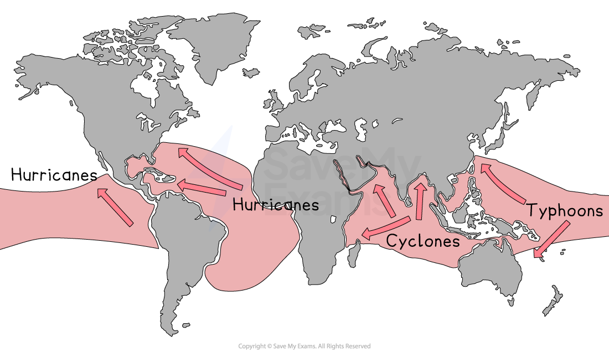
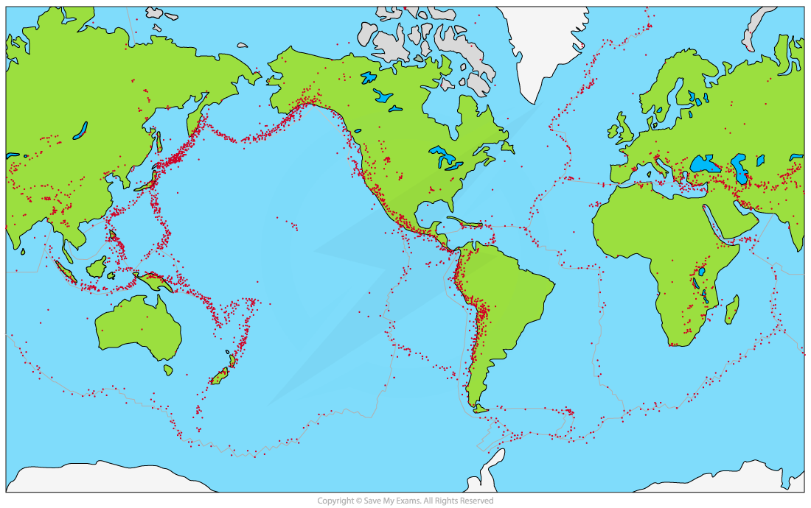
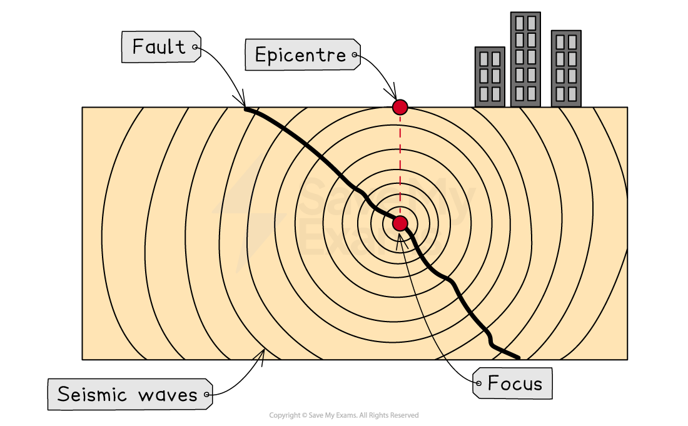
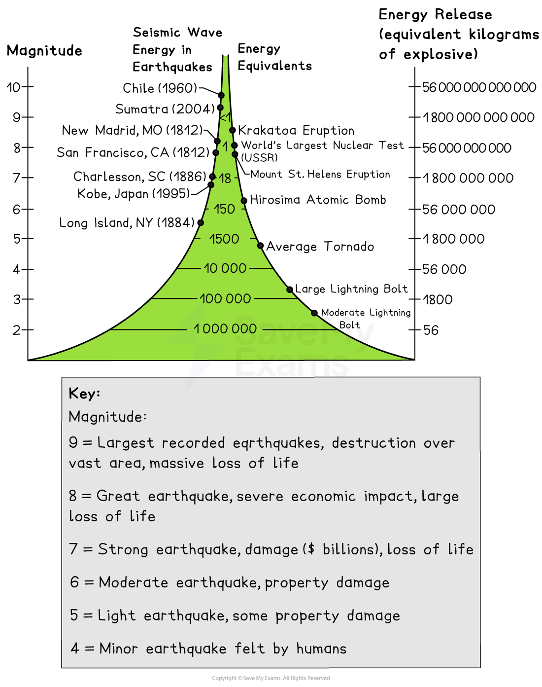
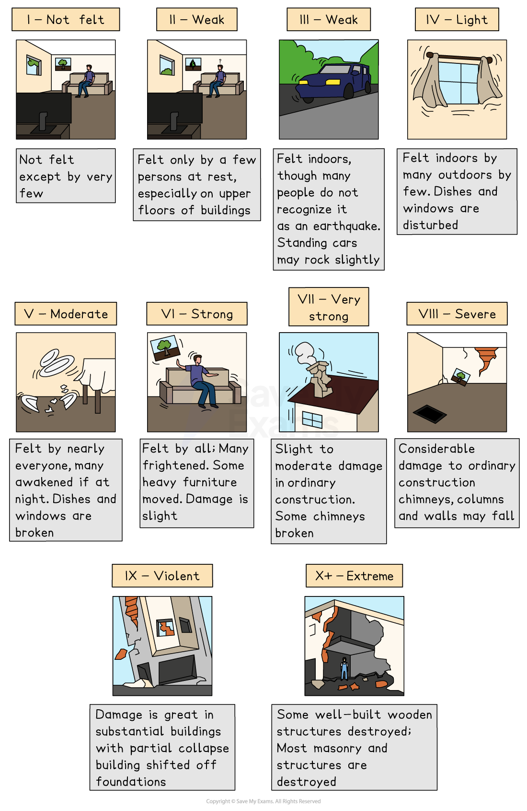
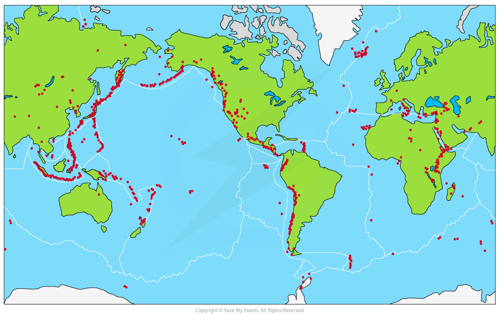
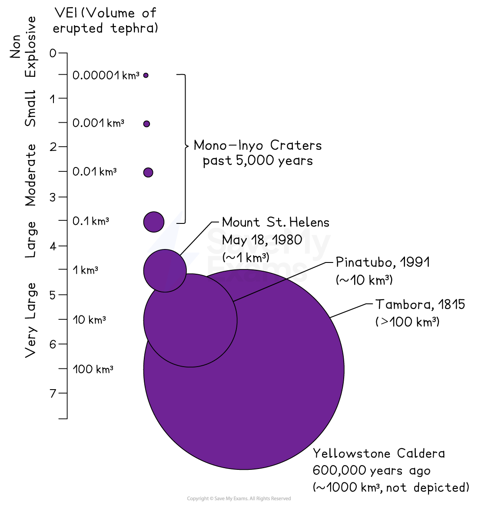

# Types of Hazards

## Anatomy of Natural Hazards

> **Spec point** — `spcpt_GPYcyXjjDTvpzzPT`

## Anatomy of natural hazards

### Natural hazards

- A** hazard** is an event which has the potential to cause harm to the environment, people or the economy
- A **natural hazard** is an event caused by environmental processes
- A** disaster** occurs when harm actually occurs to the environment, people or the economy
- Natural hazards can be categorised by their causes

  - **Tectonic and geological **hazards include:
  
    - earthquakes, volcanic eruptions, landslides and tsunami
  - **Climate and meteorological **hazards include:
  
    - Drought
    - Blizzard/snowstorm/sandstorm
    - Heatwave
    - Tornado/cyclone
    - Wildfire/forest fire
    - Extreme rainfall/flash flood caused by extreme rainfall
    - Severe storm/thunderstorm
  - **Biological** hazards include:
  
    - pests and diseases
- Natural events only become hazards and disasters due to their impact on people, the environment or the economy
- Natural hazards can also be categorised in a range of other ways:

  - **Magnitude** - the strength/power of the event
  - **Frequency **- how often the event occurs
  - **Size** - the area covered by the hazard
  - **Duration** - the time a hazard event lasts
  - **Location** - where a hazard event occurs
- Hazard** risk r**efers to the likelihood of an event causing harm to people, the environment or the economy
- Different locations have different levels of **vulnerability**

  - This refers to location features which affect how susceptible an area is to a hazard event

### Tropical cyclones

- Tropical cyclones are rotating, low-pressure systems (below 950mb)
- They are known as** hurricanes, cyclones** and** typhoons** in different areas of the world
- Characteristics include:

  - **heavy rainfall**
  - **high wind speeds **(over 119 kmph)
  - **high waves and storm surges**
- Measuring between 100-1000km across the rotating clouds surround a central, calm **eye**
- The magnitude of tropical cyclones is measured on the **Saffir-Simpson Scale** from 1 to 5
- They develop in tropical regions between 5o and 30o north and south of the equator

*Map showing the global distribution of tropical cyclones*

### Earthquakes

- An earthquake is a  sudden, violent shaking of the ground
- Earthquakes occur at all types of ***plate boundaries***
- Earthquakes are the result of pressure building when **tectonic plates** move

*Map showing global earthquake distribution*

- The **epicentre** is the point on the Earth's surface directly above the focus
- The **focus** is the point at which the earthquake starts below the Earth's surface

*Features of an earthquake*

#### Measuring earthquake magnitude

- The **magnitude** (strength/power) of earthquakes is measured on either the **Richter Scale** or the **Moment Magnitude Scale**

*Measuring earthquake magnitude*

- The damage caused by earthquakes is measured on the **Mercalli Scale**

*The Mercalli Scale*

### Volcanoes

- Volcanoes form when **magma** erupts onto the Earth's surface as **lava**
- Most volcanoes occur at ***constructive (divergent)*** and ***destructive (convergent)*** plate boundaries
- The majority of active volcanoes are located around the rim of the Pacific Ocean called the **'Ring of Fire'**

*Map showing global volcano distribution*

- Hotspots occur away from plate boundaries and are plumes/columns of magma which escape through the Earth's crust

#### Measuring eruption magnitude

- The magnitude of a volcanic eruption is measured on the **Volcanic Explosivity Index (VEI)**

*The volcanic explosivity index (VEI)*

> **Exam Hint**
> When describing the distribution of hazards from a map, ask yourself the following questions;
> 
> - What is the general pattern?
> - Does the pattern relate to anything else for example the location of plate boundaries?
> - Are they near the equator or further away?
> - Are they inland or coastal?
> 
> Use map features to help with your description - place names, compass rose, latitude and longitude
