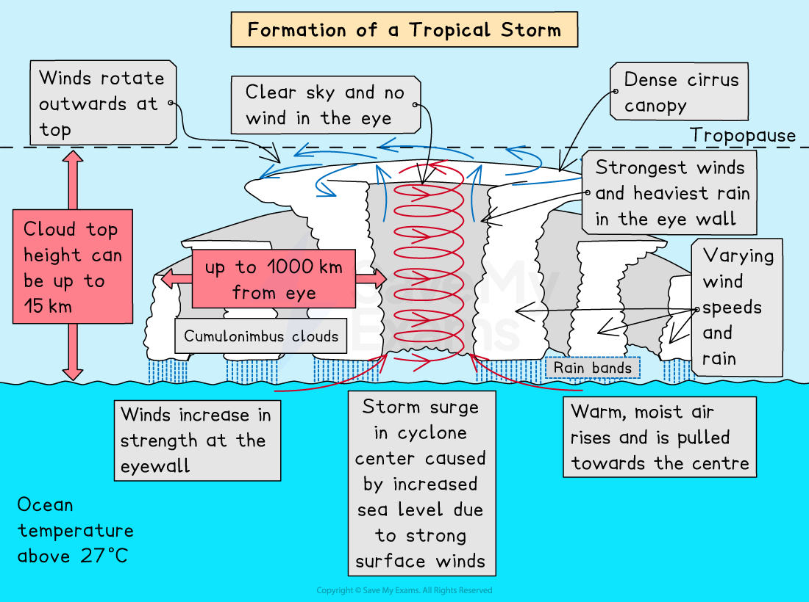

# Tropical Cyclones

## Causes of Tropical Cyclone Hazards

> **Spec point** — `spcpt_bnnjsNf69cB2pGpD`

## Causes of tropical cyclone hazards

- Tropical cyclones are **low-pressure **areas (less than 950mb)
- Tropical cyclones require specific conditions to form:

  - Sea surface temperatures over **27°C **
  - Between 5° and 30° north and south of the equator
  - Low ***wind shear***
  - A deep layer of humid air

### Stages of tropical cyclone formation

- In the right conditions, a tropical cyclone can form rapidly
- The formation follows several stages:

  - Warm, moist air rapidly rises, forming an area of low pressure
  - Air from high-pressure areas rushes in to take the place of the** rising air**
  - This air then rises, forming a continuous flow of rising air
  - As the air rises, it cools and condenses. This releases heat energy which helps to power the tropical cyclone
  - Air at the top of the storm goes outwards away from the centre of the storm
  - The ***Coriolis force*** causes the rising air to spiral around the centre
  - Some of the air sinks in the middle of the storm forming the **cloudless, calm eye**
  - The tropical cyclone moves **westwards** from its source
  - When a tropical cyclone makes landfall or moves over an area of cold water, it no longer has a supply of warm, moist air and it loses speed and temperature. Rainfall and winds decrease

### Features of tropical cyclone

- Tropical cyclones have several features, including:

  - **Heavy rainfall**
  - **High wind speeds** (over 119 km/h)
  - **Storm surges **
  - **Calm eye**
  - **Highest winds** and **heaviest rain **in the** wall of the eye**
  - **Diameter up to 1000 km **

*The formation of a tropical cyclone*

> **Worked Example**
> **Explain the formation of a tropical cyclone **
> 
> **(4 Marks)**
> 
> - Identify the command word
> - The command word is 'explain'
> - The focus of the question is 'the formation of a tropical cyclone'
> - Questions such as this are easiest to complete if you view them as a series of steps
> 
> - **Answer:**
> 
>   - Warm seawater (27°C or over) around the tropics **(1)**
>   - There are high levels of evaporation and condensation of water vapour from warm water leading to cumulonimbus cloud formation** (1)**
>   - The high levels of evaporation and condensation of water vapour provide energy for strong winds **(1)**
>   - Strong Coriolis Force close to the equator makes winds spin and moves them away from the equator **(1)**
>   - The tropical cyclones move westwards due to east-west winds in the tropics and strengthen as they move over warm waters **(1)**
>   - The tropical cyclone dissipates when it reaches land or outside the tropics as the supply of warm, moist air is cut off **(1)**

> **Exam Hint**
> Remember conditions such as warm oceans and the Coriolis Force exist at all times but tropical cyclones do not form all the time. It is the combination of all the right conditions coming together which leads to tropical cyclone formation.
