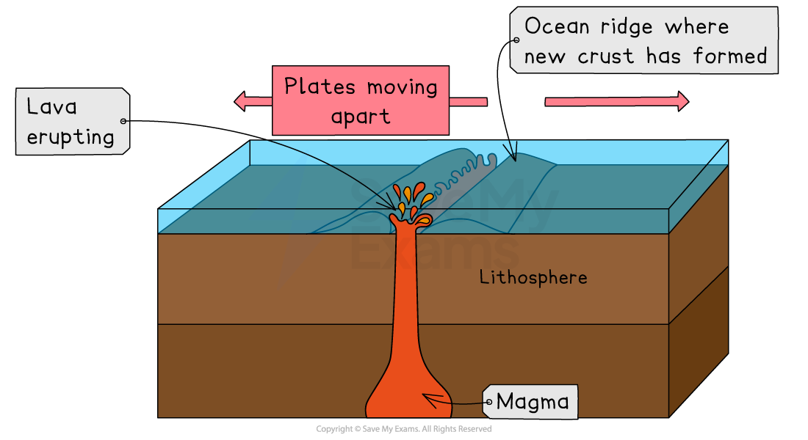
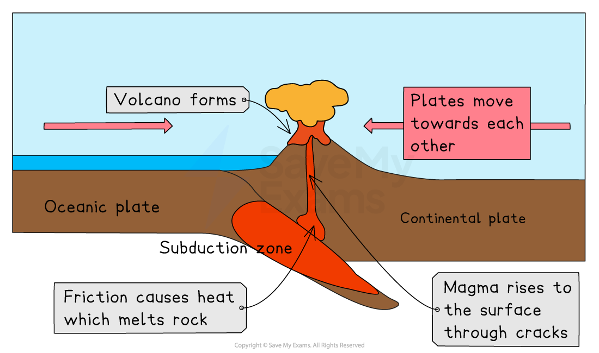
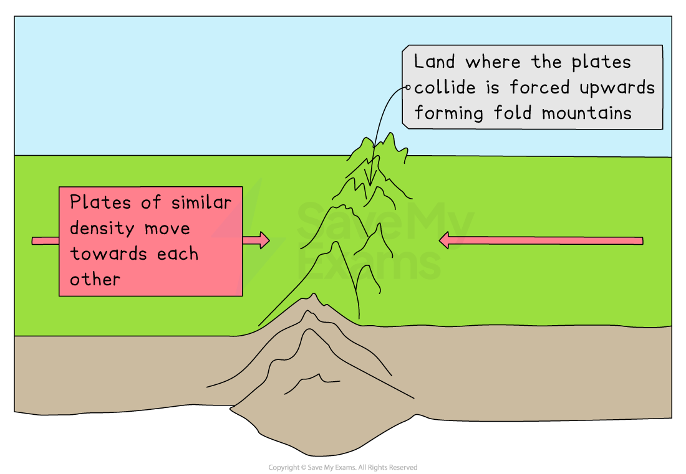
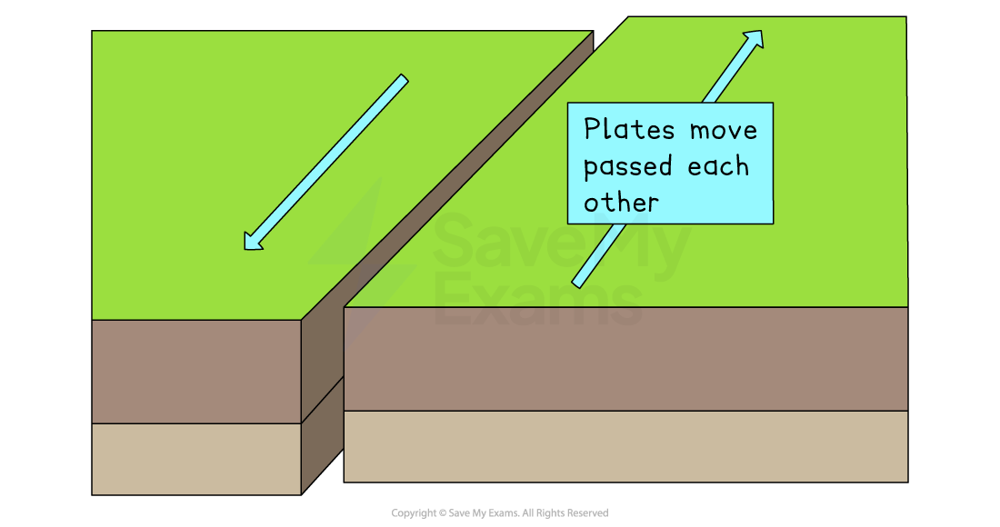
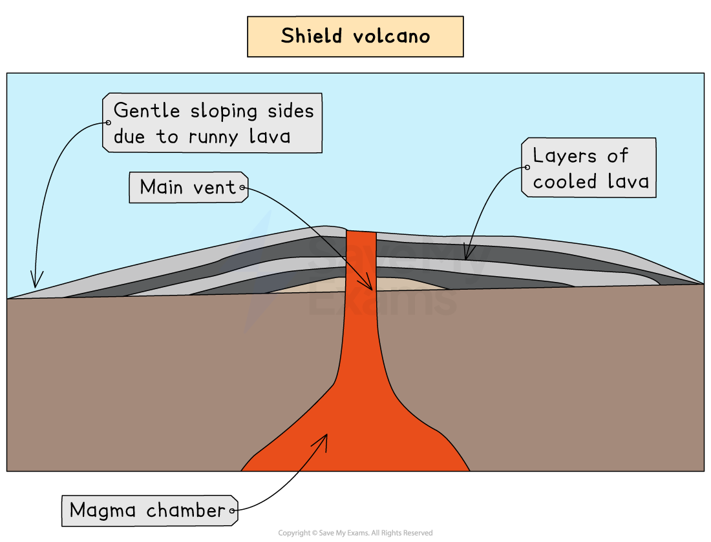
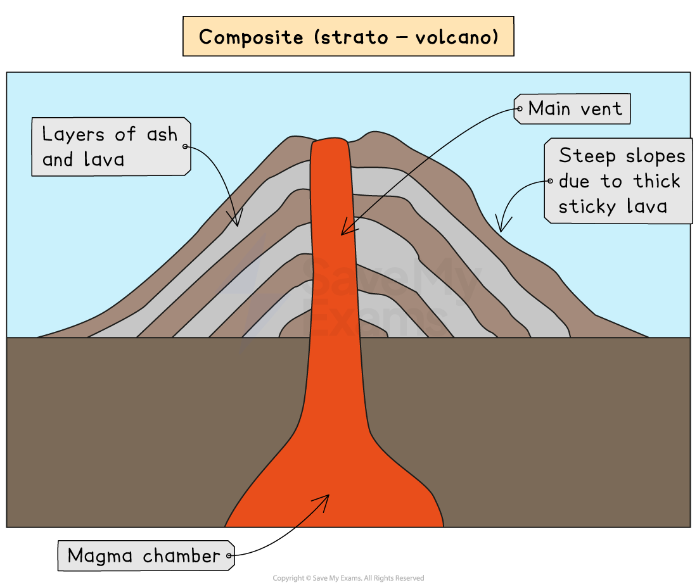
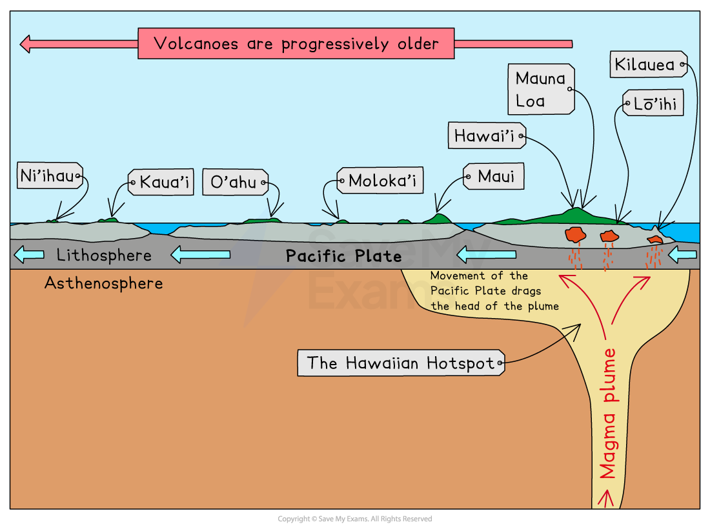

# Tectonic Hazards

## Plate Boundaries

> **Spec point** — `spcpt_fHkc7FyMHyKZTRym`

## Plate boundaries

### Types of plate boundary

- Volcanic eruptions and earthquakes most commonly occur at or near plate boundaries
- There are four main types of plate boundaries:

  - **Constructive (divergent)**
  - **Destructive (convergent)**
  - **Collision**
  - **Conservative (transform)**

### Constructive (divergent) plate boundary

- At the constructive boundary, the plates are moving apart
- The **Mid-Atlantic Ridge** is an example of a constructive plate boundary
- Both volcanic eruptions and earthquakes can occur at this type of plate boundary

*Constructive (Divergent) plate boundary*

### Destructive (convergent) plate boundary

- At a destructive (convergent) plate boundary, the plates are moving together
- The denser, heavier **oceanic plate** ***subducts*** under the lighter, **less dense continental plate**
- The boundary between the **Nazca plate **and the **South American **plate is an example
- Both volcanic eruptions and earthquakes occur at this type of plate boundary

*Destructive (Convergent) Plate Boundary*

### Collision boundary

- At a collision boundary, two plates of similar density move towards each other
- Neither is dense enough to subduct, so the land is pushed upwards
- This process forms **fold mountains** such as the** Himalayas**
- Earthquakes are the main hazard at this type of plate boundary

*Collision Boundary*

### Conservative (transform) boundary

- At a conservative (transform) boundary, the plates move past each other in opposite directions or in the same direction at different speeds
- Earthquakes are the only hazard at this type of boundary

*Conservative (Transform) Boundary*

> **Exam Hint**
> Draw each of the plate boundaries and add annotations to outline the processes. This will help you to remember what happens at each one.

## Causes of Volcanic Hazards

> **Spec point** — `spcpt_tm86XHKzSxPFtcqT`

## Causes of volcanic hazards

- Volcanoes occur at **constructive (divergent)**, **destructive (convergent)** plate boundaries and **hot spots**
- Volcanoes do not occur at **collision** boundaries or **conservative (transform)** boundaries

### Volcanoes at constructive boundaries

- At a constructive (divergent) boundary, the tectonic plates are moving away from each other:

  - Constructive plate boundaries often occur under the sea/ocean
  - The lava escapes through the gap left as the plates move apart
  - The lava cools and hardens, forming a new crust
- At constructive plate boundaries, the lava tends to be runny and eruptions are less explosive
- These types of eruption form **shield volcanoes,** which have gently sloping sides

*Characteristics of a shield volcano*

### Volcanoes at destructive boundaries

- At a destructive (convergent) boundary, the tectonic plates are moving towards each other:

  - The heavier, denser oceanic plate **subducts** under the lighter continental plate
  - In the subduction zone, the two plates come together, causing **friction**
  - Friction causes heat and the plate material melts, forming magma
  - The magma rises to the surface through cracks in the crust
  - The cooling lava and ash build up, forming a volcano
- At destructive plate boundaries, the lava tends to be sticky and produces explosive eruptions
- These eruptions tend to form **composite or stratovolcanoes **

*Characteristics of a composite (strato-volcano)*

### Volcanoes at hot spots

- At a **hot spot,** the tectonic plate passes over a **plume of magma:**

  - The magma rises to the surface through cracks in the crust
  - As the magma erupts and cools, this builds up
  
    - Eventually, due to the buildup of cooled lava, this may rise above the surface of the water, forming an island
  - As the tectonic plate moves slowly over the magma plume, a line of islands may form, e.g. Hawaii

*Hot spot and island formation*

### Volcano primary and secondary hazards

- Volcanic eruptions only become hazards when they affect people
- The hazards from the volcanic eruption itself are primary hazards:

  - Ash
  - ***Pyroclastic flow***
  - Lava flow
  - Gas emissions
  - Volcanic bombs
- The hazards created that happen as a result of the primary hazards are secondary hazards:

  - ***Lahars***
  - ***Acidification***
  - Landslides
  - Climate change
  - Fires
  - Floods

## Causes of Earthquake Hazards

> **Spec point** — `spcpt_MTg5QVt88Y9zDs5d`

## Causes of earthquake hazards

### Earthquakes & plate boundaries

- Earthquakes can occur anywhere, but mostly occur at or near plate boundaries
- Earthquakes happen at all plate boundaries - **constructive (divergent), destructive (convergent), collision** and **conservative (transform)**

- At a **constructive (divergent) **plate boundary, earthquakes tend to be weaker as the plates are moving apart
- At **destructive (convergent)**, **collision** and **conservative (transform)** plate boundaries, earthquakes tend to be stronger

### Earthquakes: primary & secondary hazards

- The primary hazard of an earthquake is the ground shaking. All other hazards then follow on from this as secondary hazards
- Secondary hazards can include:

  - Collapse of buildings and other structures
  - Landslides
  - Gas leaks
  - Fires
  - ***Soil liquefaction***
  - ***Subsidence***
  - Mudflows
  - Tsunami

### Earthquake sequence

- The sequence of an earthquake is the same regardless of the boundary at which it happens:

  - As the tectonic plates move, they can get stuck
  - Pressure builds as the plates continue to try to move
  - Eventually, the plates jolt free, and the pressure is released as energy
  - The point at which the earthquake starts is the **focus**
  - The **epicentre **is the point directly above the focus on the Earth's surface
  - The energy passes through the Earth's crust as waves, which are the earthquake
- Earthquakes can happen as a result of human activity, such as drilling into the crust or mining

> **Exam Hint**
> When describing the processes leading to an earthquake, volcanic eruption or tropical cyclone, it is helpful to write the formation down as a sequence of steps. This will make the processes easier to remember.
