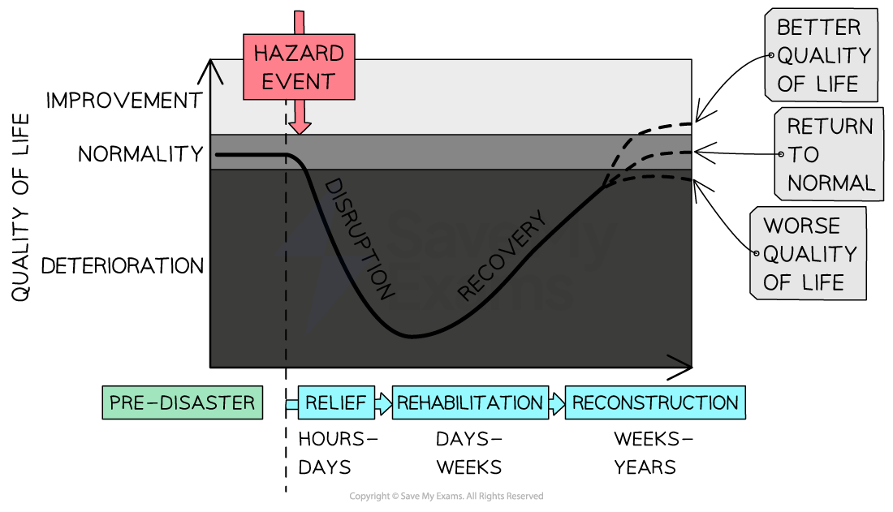

# Response to Earthquakes

## Short-term Response & Relief

> **Spec point** — `spcpt_tv7GJGfcq6WhQC6N`

## Short-term response & relief

- The emergency response is the actions taken immediately after a hazard event such as an earthquake:

  - Searching collapsed buildings to rescue people who are trapped
  - Providing medical assistance
  - Distribution of food and water
  - Ensuring that people have shelter
  - Clearing rubble and other debris
- This response has to be coordinated as many ***NGOs*** and government organisations, including the armed forces, may be involved
- The stages of hazard response can be seen in Park's **hazard response curve**

*Park's hazard response curve*

## Case Studies: Nepal & Japan

> **Spec point** — `spcpt_DVvVkXvDZ2tPyKJc`

## Case Studies: Nepal & Japan

> **Case Study**
> ### Nepal  - A developing country
> 
> - The short-term response was criticised for being too slow:
> 
>   - The **epicentre** was not reached by rescue workers for 24 hours
>   - Evacuations of the critically wounded took 5 days
> - Over **US\$1 billion** in international aid from India and China
> - The **Asian Development Bank (ADB) **provided a US\$3 million grant for immediate relief efforts
> - Three Chinook helicopters; 100 search and rescue; medical workers
> - Use of GIS to coordinate the response
> - Many NGOs sent aid workers, food, water and medical supplies
> - Tent cities in Kathmandu provided shelter for people made homeless
> - Nepalese army sent to worst-hit areas
> - Inflatable field hospitals set up to treat the injured

> **Case Study**
> ### Japan - A Developed Country
> 
> - **Self Defence Forces **sent in immediately to organise food, water, shelter and medicines
> - Within 48 hours a member of parliament was designated to coordinate the relief effort
> - UK sent search and rescue teams
> - NGOs provided shelter, food, water and medical aid
> - A state of emergency was declared at the **Fukushima nuclear power plant**
> - **Japanese Meteorological Agency (JMA)** issued warnings just before the more damaging S waves - this gave people a chance to get out of buildings
> - A **tsunami warning** was issued giving people 20 minutes to get to safety
> - Trained emergency crews and the army were on site rapidly
> - Temporary shelters were set up in schools and other public buildings

> **Exam Hint**
> Remember that although there is a short-term response in all countries where there is a natural hazard event, the response will be slower and often less well organised in developing countries. This delay often increases deaths and recovery time.
