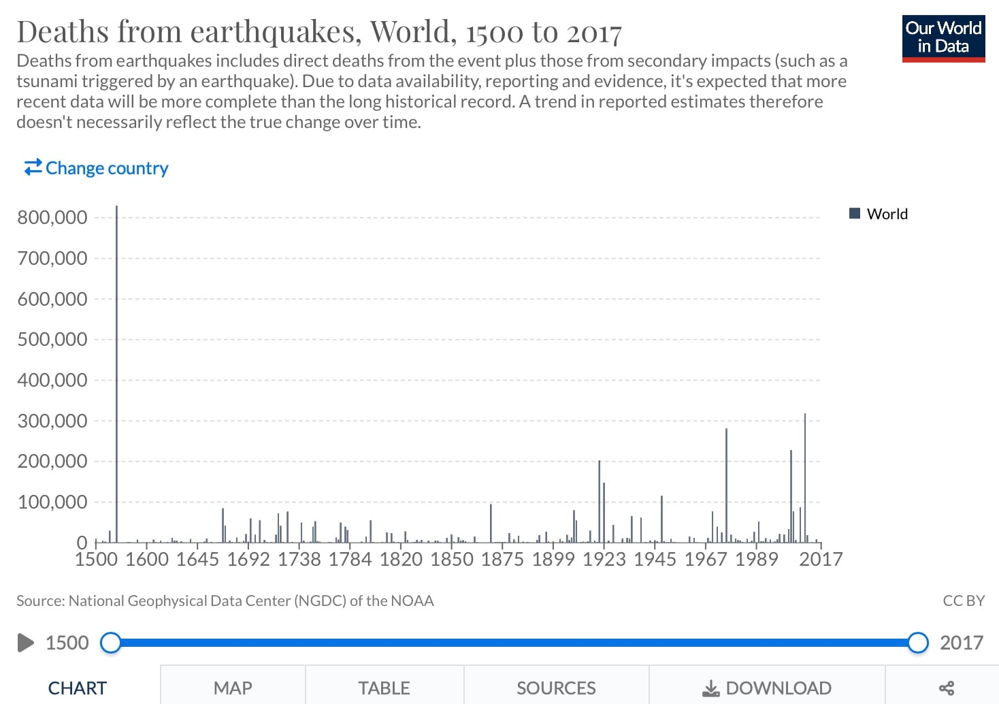

# Planning Long Term

## Risk Assessments & Hazard Mapping

> **Spec point** — `spcpt_jScrS3vHC4cRQDk9`

## Risk assessments & hazard mapping

### Long term planning

- Occurs after the hazard event
- Long-term planning looks back at the event and evaluates what could be done to reduce the impact of any future hazard events:

  - Was **emergency aid** distributed effectively?
  - Are there areas which are at particular risk should they be protected more or be moved?
  - Could **warning systems** be improved?
  - Are people educated about the risks and do they know what to do during the event to protect themselves?
  - Can **building codes **and planning be improved to reduce the number of buildings which collapse
- **Risk assessment** and **hazard mapping** are both part of the long-term planning process

### Risk assessment

- **Risk** is the probability that a hazard event will have harmful consequences
- The more **vulnerable** a population is the greater the risk that a hazard event will cause deaths, injuries, damage to buildings and impact the economy
- Globally the number of deaths from earthquakes has increased

  - Increasing populations and urban areas means that more people are living in areas at risk

### Hazard mapping and GIS

- Hazard mapping and GIS have several advantages including that they:

  - map the areas where earthquakes are most likely to occur
  - enable planning of where important services and infrastructure should be located -** *****land use zoning***
  - identify the ***correlation*** between risk and vulnerability

> **Exam Hint**
> In the exam, you may be asked to look at GIS or hazard maps. The key things to identify are
> 
> - Which areas are most at risk?
> - How can they help organisations and governments plan?
> 
>   - Identify the main roads into areas for emergency aid
>   - To inform land use zoning so hospitals etc... are not built in vulnerable areas
>   - To coordinate all the agencies involved when there is a hazard event
>   - To identify if there is a link between vulnerability and risk

## Rebuilding Programmes

> **Spec point** — `spcpt_DbwHqfTBNQq2zKvC`

## Rebuilding programmes

- In an earthquake, it is the collapsing buildings which cause the most injuries and deaths
- Earthquakes cannot be prevented, so reducing the damage to buildings is key to minimising the impacts. This can be achieved by:

  - Reducing the number of buildings in high-risk areas
  - Building **earthquake-resistant buildings**
- Large-scale rebuilding is often required after an earthquake event
- Existing buildings and structures, such as bridges, can be ***retrofitted*** to make them safer in future events

## Case Studies: Nepal & Japan

> **Spec point** — `spcpt_pdtBnd6qkdMnVRQx`

## Case Studies: Nepal & Japan

> **Case Study**
> ### Nepal - A developing country
> 
> - The **Asian Development Bank** provided **US\$200 million** for rehabilitation
> - A **government task force** was created to plan and deal with future earthquakes
> - An international donor meeting in June 2015 led to **US\$4.4 billion** being pledged (only a small portion has currently been paid to Nepal)
> - **National Reconstruction Authority** was formed by the government. Part of the role is ensuring that funding is distributed to help people rebuild their houses
> - **Disaster Management Act** passed by the government
> - Improved building code with increased awareness of the code within communities
> - ***Stonemason*** training courses to ensure that new buildings are earthquake-resistance
> - Increased education and practice of earthquake drill

> **Case Study**
> ### Japan - A developed country
> 
> - **Building Back Better **- considers building codes, town planning and infrastructure
> - New tsunami walls have been constructed 25-30m high
> - A new** US\$31 million** warning system launched in 2013

> **Exam Hint**
> Developed countries often have less to change in their long-term planning because their preparation for the hazard is better. However, the costs of any disaster are often greater than in a developing country. This is because the buildings, roads and infrastructure that are damaged are more expensive.
