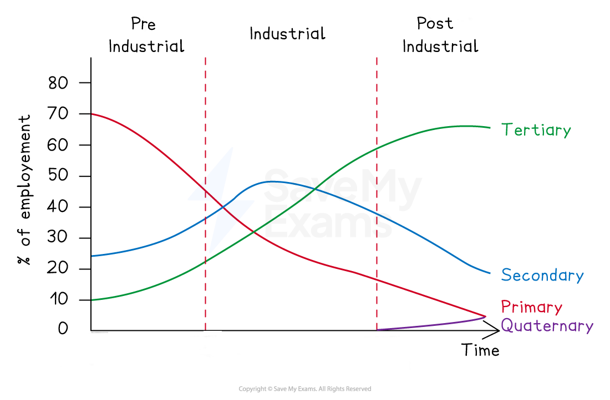

# Classification of Economic Sectors & Employment

## The Four Economic Sectors

> **Spec point** — `spcpt_xtKzzV6GxNr6nJJw`

## The four economic sectors

- An economic activity is the production, purchase or sale of **goods** and **services**
- Economic activities can be grouped into four sectors:

  - **Primary activities **are the growth or extraction of raw materials - farming, fishing, mining and forestry
  - **Secondary activities **are when materials are processed to produce a finished product, for example, car manufacture, food processing
  - **Tertiary activities** involve the provision of a service, including retail, transport, schools, healthcare, etc.
  - **Quaternary activities **include the provision of specialist information/knowledge, such as research and development, information technology, etc.

> **Worked Example**
> **Identify what is meant by an economic sector**
> 
> **(1 Mark)**
> 
> **        A.** The chain of production in manufacturing
> 
> **        B. **An economic shift in employment
> 
> **        C.** A classification of types of employment
> 
> **        D. **A classification of employment structures
> 
> - **Answer:**
> 
>   - **C  ****(1)**** **-   a classification system for types of employment
>   - The other answers are not related to employment sectors, which are the four groups - primary, secondary, tertiary and quaternary

> **Exam Hint**
> Remember, the economic sectors can also be used to group **employment** types. For example, a farmer is employed in the primary sector, whereas a teacher is employed in the tertiary sector.

## Changes over Time

> **Spec point** — `spcpt_9x65chkK593zKtdZ`

## Changes over time

- Economic sectors are an indicator of a country's** economic development**
- This can be either:

  - The amount each sector contributes to the ***Gross Domestic Product*** (GDP)
  - The percentage of the population they employ
- The proportions of each economic sector's GDP contribution and percentage employment changes over time

#### Pre-industrial

- In countries in the ***pre-industrial***** **period, the **primary sector** is dominant
- The **secondary** and **tertiary sectors **steadily increase

  - As countries develop, the reliance on the primary sector for GDP and employment **rapidly decreases**

#### Industrial

- During the **industrial** period,  the amount of GDP and employment in the **secondary **sector** increases **to become dominant and then decreases

  - The primary sector continues to decrease
  - The tertiary sector increases
- Developed countries such as the UK, Germany and France began to move out of this stage in the 1960s

  - **Newly industrialised** (emerging) nations such as China and India began to move into this stage at that time

#### Post-industrial

- In the **post-industrial** phase, the tertiary and quaternary sectors increase whilst the secondary and primary sectors decrease

  - The tertiary sector dominates employment and GDP in the post-industrial period
  - Countries such as Germany and the UK are currently in the post-industrial phase

### Clark-Fisher model

- The Clark-Fisher model illustrates how employment in each economic sector changes as countries develop

*The Clark-Fisher Model*

### Causes of changes over time

- There are several reasons for the change in percentages employed in each sector:

  - Increasing ***mechanisation*** in agriculture led to a decrease in the number of jobs available
  - People move to urban areas to find jobs in the secondary and tertiary sectors
  - Increasing mechanisation and global changes then lead to a decrease in secondary employment in some countries  - this is known as **deindustrialisation**
  - Technological improvements lead to an increase in tertiary and quaternary employment

> **Exam Hint**
> You should be able to look at a pie chart or graph of the economic sectors and work out a country's stage of development.
> 
> - A developing country will be dominated by primary economic activities
> - An emerging country is likely to have fairly equal amounts of each type of economic sector employment
> - A developed country will be dominated by tertiary economic activities.
