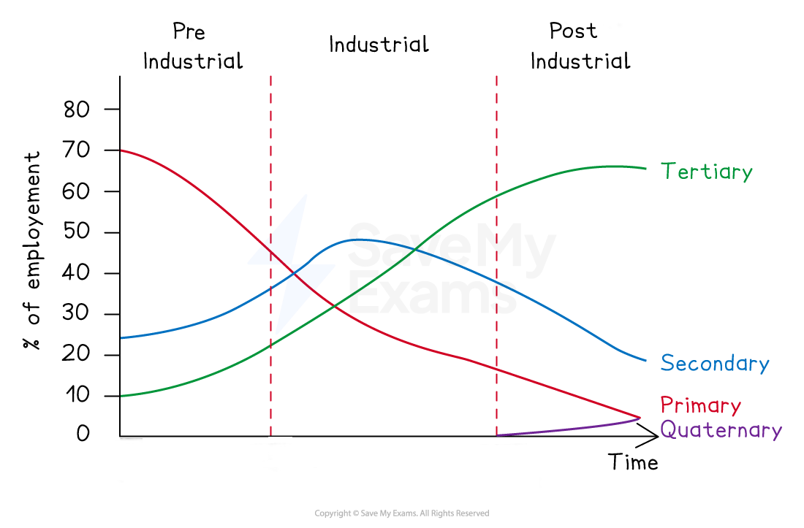
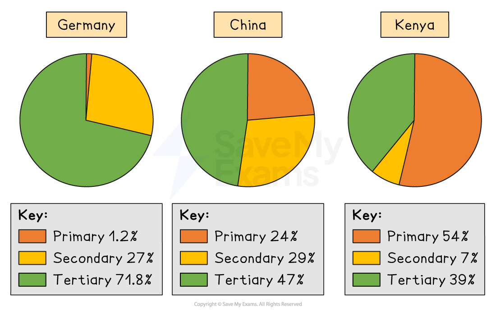

# Changes in Economic Sectors

## Causes of change in employment

> **Spec point** — `spcpt_DH88XSQdYjQjJpmg` · Reasons for the changes in the numbers of people employed in each economic sector, including the availability of raw materials, globalisation, mechanisation, demographic changes and government policies.

## Causes of change in employment

- As countries develop, the number of people employed in each economic sector changes

  - This can be seen in the **Clark-Fisher Model **or pie charts

*Clarke-Fisher Model *

### How levels of development affect employment in different sectors

- In developing countries, such as Kenya, more people are employed in the **primary sector **because:

  - A significant percentage of the rural population are **subsistence** farmers
  - The countries depend on **exporting** **raw materials** to developed and emerging countries to gain income

- In emerging countries, such as China, more people are employed in **secondary economic activities**
- This is because:

  - Factories are located in emerging countries due to **lower costs **
  - More **raw materials** may be available in these countries
  - **Government policies** aim to attract companies to locate there
- In developed countries, such as the UK, more people are employed in **tertiary sector activities**:

  - Education levels are higher, so people want tertiary sector jobs, which are, on average, higher paid than secondary and primary jobs
  - **Deindustrialisation** means there are fewer jobs in secondary economic activities
  - **Mechanisation** means there are fewer jobs in primary and secondary economic activities
  - There is a higher demand for services because people have more *disposable income*

*Employment by economic sector*

### Summary of the causes of changing employment in economic sectors

- The main factors which affect the number of people employed in the different economic sectors include:

  - Availability of raw materials
  - ***Globalisation***
  - Technology
  - ***Demographic*** changes
  - Government policies

### Availability of raw materials

- Raw materials may have run out or be economically ***unviable*** to obtain
- Crop production and livestock may be reduced due to drought, flood, pests/disease or soil erosion
- Improvements in technology may reduce the amounts of raw materials needed

### Globalisation

- **Transnational corporations (TNCs)** have factories and offices in many countries
- Lower costs tend to be in **developing** and **emerging** countries
- The internet and improved communication mean that service activities such as call centres can be located anywhere in the world
- Industries such as textiles and steel manufacturing are increasingly located in emerging countries

### Technology

- There are fewer jobs in farming, mining and many factories due to **mechanisation**
- The **Internet** means companies can manage factories and offices located in many different countries
- Improvements in transport have reduced the ***friction of distance***

### Demographic change

- An increasing population means that there is a greater demand for products and services
- People have more **disposable income** to spend on leisure and other services
- The demand for goods and services is affected by the age structure of the population
- An increasing population means there are more workers available

### Government policies

- Government policies target particular economic activities to locate in their country using :

  - Tax incentives
  - infrastructure improvements (new railways, airports)
  - grants/cheap rent
- International treaties impact what countries can trade
- In communist countries, governments have much more control over industry types and location

> **Exam Hint**
> For **3-mark 'suggest' or 'explain' questions** regarding changes in employment sectors (such as the secondary sector):
> 
> - **Identify the change first:** Start by identifying a specific change in employment that is explicitly shown in the provided resource
> - **Use "double development":** these questions can be challenging because they require you to develop your ideas twice to earn full marks.
> 
>   - For example, identify a decrease in a sector, link it to a broader geographical concept (like a global shift in manufacturing), and then further develop the point by suggesting where the employment has moved.
