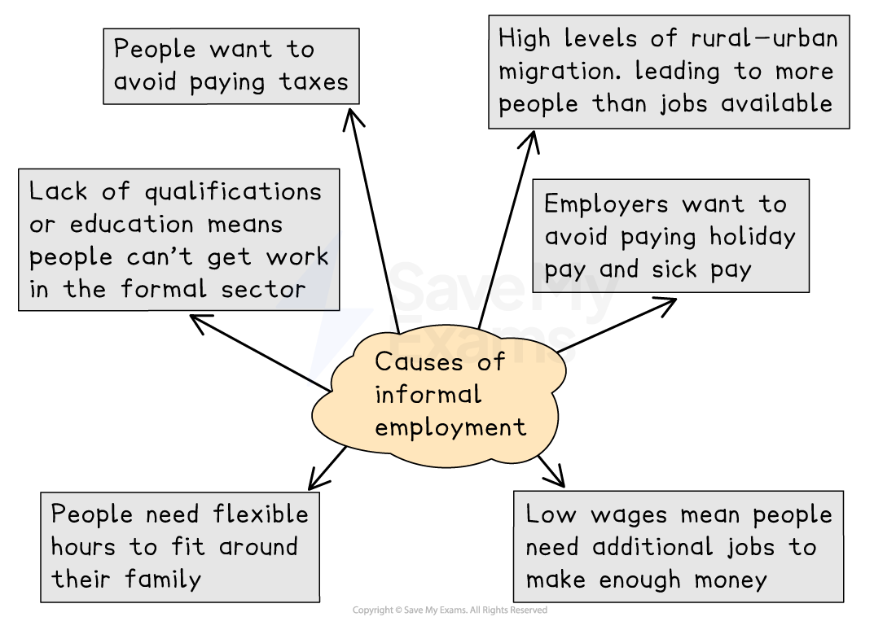

# Informal Employment

## Causes of Informal Employment

> **Spec point** — `spcpt_PBxFzxnXKtG5FvcS`

## Causes of Informal Employment

- **Informal employment **is any employment which is unregulated and unofficial
- It is estimated that more than 60% of the world's employed population work in informal employment
- As much as 93% of informal employment is in developing and emerging countries

  - Levels of* underemployment* and unemployment are high in these areas
- Most informal employment is work in the** tertiary sector**
- Examples of jobs in the informal economy include:

  - shoe shining
  - rubbish collecting
  - selling fruit or other products on the street
  - ***para-transit*** - including rickshaws and tuk-tuks
- There are several causes of informal employment

*Causes of Informal Employment*

## Impacts of Informal Employment

> **Spec point** — `spcpt_smgDJ3wbVSDgwYJN`

## Impacts of Informal Employment

- People working in the informal economy:

  - Have no healthcare benefits
  - Are often exposed to health or safety risks
  - Have no contracts or guaranteed pay
  - Have no holiday or sick pay
- **Paratransit** often causes congestion and if motorised they cause additional pollution
- Lack of regulations means workers are often exploited by employers
- Many children working in informal employment do not get the opportunity to go to school
- Children may be exposed to health risks, drugs, violence and crime
- Governments collect less in tax because the jobs are not official

## Case Study: Informal Employment in Dhaka

> **Spec point** — `spcpt_bFZQ9cMFYsW5Pjzm`

## Case Study: Informal Employment in Dhaka

> **Case Study**
> - Dhaka is the capital of Bangladesh
> - It is a ***megacity*** with a population of 22.5 million people
> - Approximately 400,000 people migrate to Dhaka each year
> - Estimates suggest that over 75% of the population is engaged in informal employment:
> 
>   - 500,000 rickshaw drivers
>   - 80,000 waste-related workers
>   - Workers in small workshops
>   - Casual workers in restaurants and hotels
>   - Day labourers in construction
> - Informal employment also includes children with over 690,000 children in Dhaka involved in informal employment
> - Many of Dhaka's informal workers live in ***informal settlements***
> 
> ### Characteristics of Dhaka's Informal Sector
> 
> - Low pay
> - Long working hours
> - Temporary or part-time work
> - ***Underemployment***
> - No benefits such as holiday pay or sick pay
> - Poor and unhealthy working conditions
> - Health and safety risks
> - No training
> - Exploitation by employers
> - No legal protection

> **Worked Example**
> **Study Figure 1, which shows examples of informal employment in India**
> 
> 
> 
> **Figure 1 – Examples of Informal Employment in India**
> 
> **Explain one piece of evidence that there is informal employment in this city**
> 
> ** (2 Marks)**
> 
> - **Answer**
> - There is a man selling goods from a cart** (1) **because he doesn't have a shop to sell his goods from **(1)**
> 
> **                OR**
> 
> - There is a motorised rickshaw, or tuk-tuk** (1);** these are not part of the public transport system** (1)**

> **Exam Hint**
> Remember underemployment and unemployment are not the same. Underemployment is when a person has work but is not working as many hours as they want to. Unemployment is when a person is not working.
