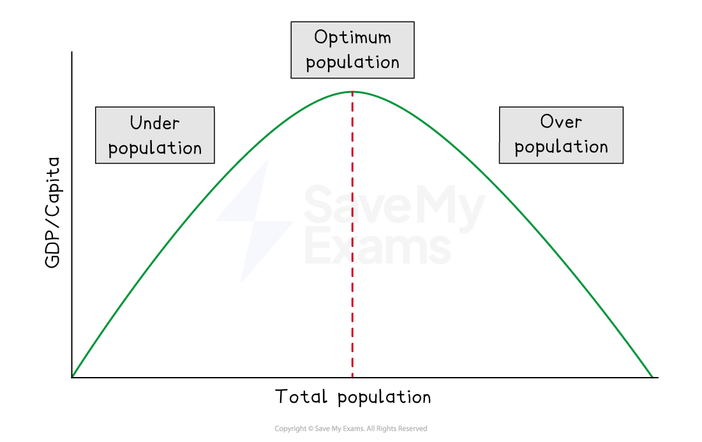
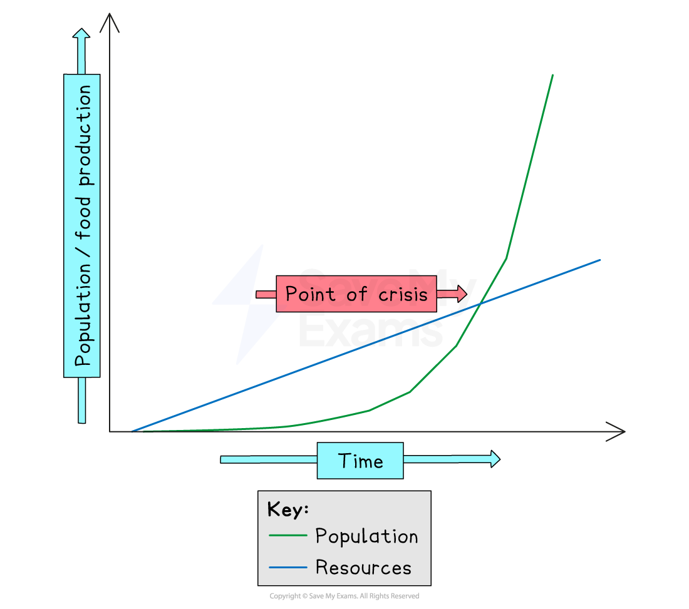
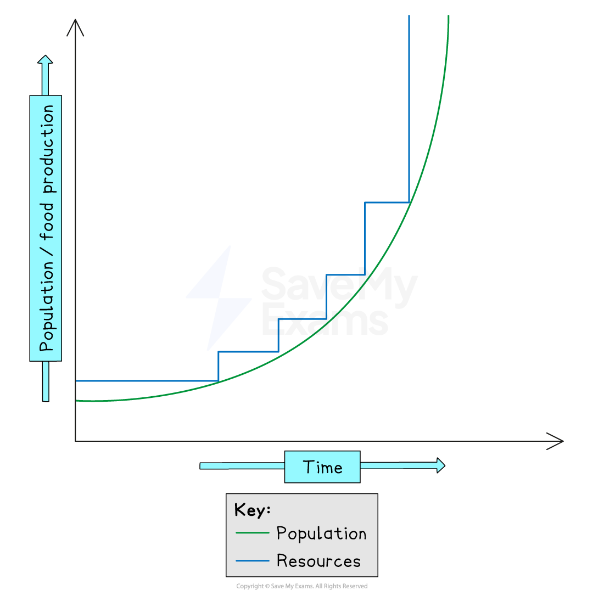

# Relationship of Population on Resources

## Population & Resources

> **Spec point** — `spcpt_RzNdGFZTZhfC8WWx`

## Population & Resources

- Economic activities all involve the use of **resources** and **energy**
- The rate at which resources & energy are used depends on two main factors:

  - The population size
  - The rate of development
- Many resources including energy sources are ***finite*** and** non-renewable**

### Carrying capacity

- Each country/area has a **carrying capacity, **which is the maximum number of people (population) an area's resources can sustain
- The population that results in the highest standard of living is the **optimum population:**

  - There are not so many people or so few resources that the standard of living falls
  - There are enough people to develop the resources of the country
- **Underpopulation **is when the population is too small to develop the resources effectively
- **Overpopulation **is when there are too many people or too few resources to ensure a high standard of living
- **Population pressure** occurs when the population is greater than the** carrying capacity**

*Optimum Theory of Population*

- The Earth's population is now over **8 billion**
- Whether there are enough resources to sustain the population has been examined by different theorists

## Theories of Thomas Malthus

> **Spec point** — `spcpt_J4zXryHDhBbKYHWn`

## Theories of Thomas Malthus

- Malthus proposed his theory in 1798 in *An Essay on the Principle of Population*
- He had a ***pessimistic*** view of the relationship between population and resources (specifically food) which states:

  - population growth is increasing at a faster rate than food supply
  - there will be a time when there is not enough food to sustain the population
  - as a result, population growth will stop as a result of a **Malthusian catastrophe** - famine, disease or war
  - these are known as **positive checks **as they increase the death rate
  - **preventative checks** are factors which decrease the birth rate
  - these** limiting factors** maintain the balance between population and resources
- Malthus's predictions were incorrect as they came before much of the technological developments which have enabled food supply to be increased
- As the world population increases much of the world's productive land has been used
- **Neo-Malthusians **today base their views on Malthus' theory. They argue that:

  - we have now used most of the available agricultural land
  - the amount of fertile land is in decline
  - food prices are increasing
  - the population continues to increase
- They suggest that famines are one example of how Malthusian theory has proved to be correct
- Neo-Malthusians argue that population control is essential to avoid Malthusian catastrophe

*Graph illustrating Malthus' theory*

## Theories of Ester Boserup

> **Spec point** — `spcpt_8JBRhXGBDrZ4gF67`

## Theories of Ester Boserup

- A Danish economist,** Ester Boserup **put forward her theory in 1965
- An ***optimistic*** view of the relationship between population and resources (specifically food) which states that:

  - population growth will stimulate developments in technology to increase food production
  - more efficient resources will be discovered/used
  - renewable resources will replace non-renewable

*Graph illustrating Boserup's theory*

> **Exam Hint**
> Remember Malthus and Boserup both focus on food resources. However, the ideas can be applied to other resources.
