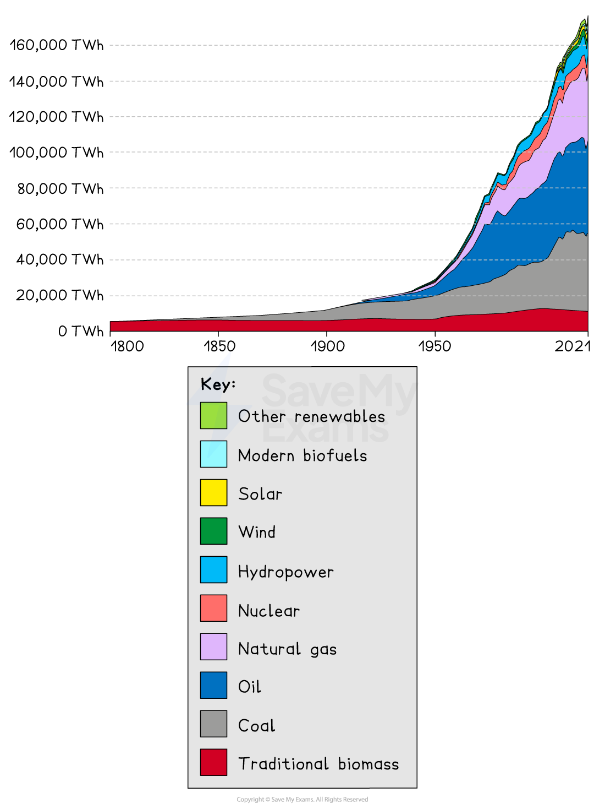
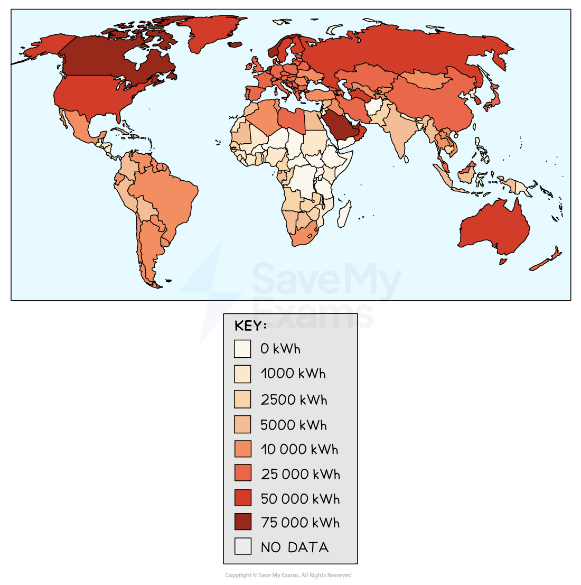
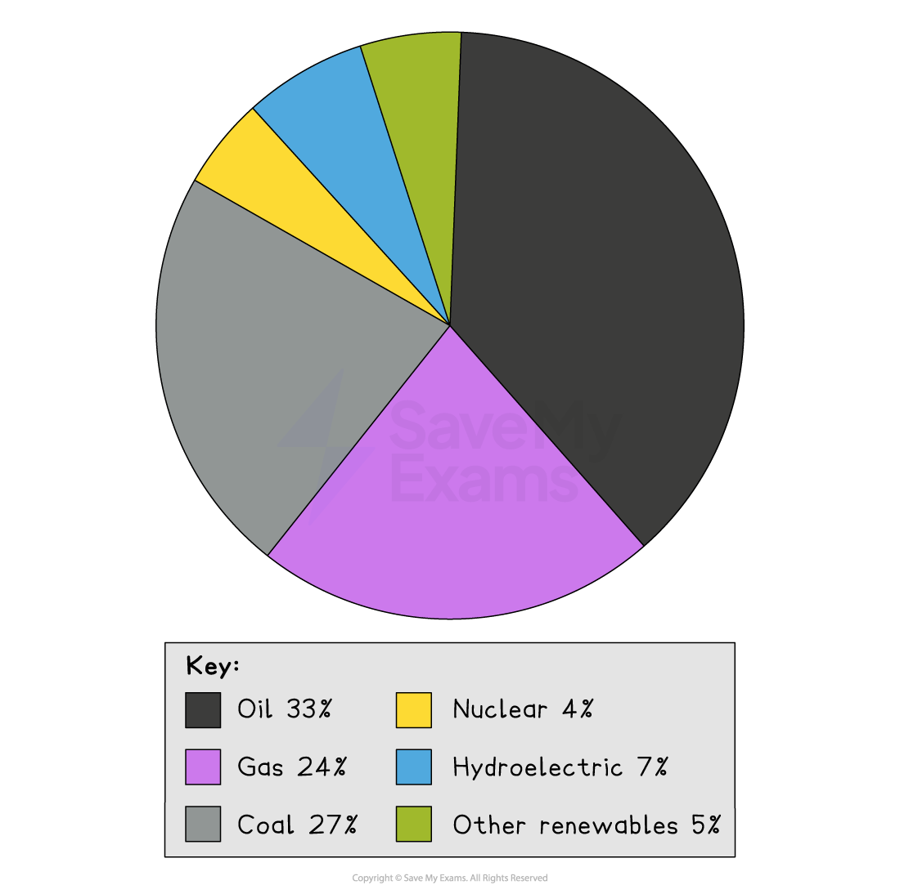

# Energy Demand and Production

## Energy Demand

> **Spec point** — `spcpt_hTrTxcWHn8kz3bGz`

## Energy demand

- Global energy demand has rapidly **increased**

*Graph showing global energy demand*

### Causes of increased energy demand

- **Population growth** and **development** are the two main causes of the increase in energy demand:

  - The **higher demand for food** leads to more ***intensive farming,*** which requires more energy for machines, light and heat
  - Increasing **industry** requires energy for heating, lighting and machinery
  - There is more **transport,** all of which requires energy in the form of petrol, diesel or electricity
  - **Urbanisation** increases with development increasing domestic appliances, heating, lighting
  - **Increased wealth** means people buy more appliances and technology which require energy
  - Advances in technology in energy production and in appliances
  
    - New technology in energy production means more energy sources are available, including nuclear energy and advances in renewable energy
    - Technology advances in wider society affect demand

### Patterns of energy demand

- Countries with the **highest energy consumption** per person tend to be developed countries, including Canada, Norway and Saudi Arabia
- Countries with the **lowest energy consumption** per person are developing countries which are all in Africa and include Niger, Chad and Tanzania

*Global energy use per person *

- The main energy sources are ***fossil fuels,*** which supply 84% of the world's primary energy
- Renewables are increasing but only make up 11% of the ***energy mix***
- Nuclear energy is 4% of the primary energy
- It is estimated that 2.5 billion people still rely on fuelwood as their main source of energy

  - This is mainly in developing and emerging countries which lack the infrastructure to connect people to electricity supply
  - **Energy poverty** is when people do not have access to modern energy supplies

*Global Energy Sources*

### Environmental concerns

- There are increasing concerns about the environmental impact of non-renewable energy sources and the link to pollution and global warming
- Public concerns about the environmental impact of using fossil fuels has increased pressure on governments
- Legislation about energy production has increased

> **Worked Example**
> **Study figure 1a below which shows global energy consumption**
> 
> 
> 
> *Energy Use by World Region*
> 
> **Suggest one reason for the increased energy use in Asia**
> 
> ** (3 Marks)**
> 
> - Identify the command word
> 
>   - The command word is '**Suggest**'
> - The focus of the question is 'increased energy use in Asia'
> - This is a three-mark question looking at only one reason so a detailed explanation of the reason is needed
> 
> - **Answer:**
> 
>   - The big increase after 2000 **(1)** due an increase in global population** (1) **which means overall there will be a substantial increase in consumption **(1)**
>   - The big increase after 2000 **(1) **due an increase in consumption per head** (1)** a people become wealthier they generally have more appliances and devices which use more energy **(1)**
>   - Asia shows the biggest overall increase** (1) **this may be caused by the continued growth in manufacturing **(1)** which uses large amounts of energy in the process **(1)**

## Energy Production

> **Spec point** — `spcpt_5y697fZszMG576JW`

## Energy production

- Energy sources are not evenly distributed across the world
- Some areas produce very little energy due to a lack of natural resources or because they do not have the money to ***exploit*** the resources
- The main producers of fossil fuels for primary energy are:

  - USA
  - Canada
  - Norway
  - Russia
  - Australia
  - Middle East
- The world's largest producers are often the largest consumers of energy

## Energy Security

> **Spec point** — `spcpt_9kXX2S7X922Bn7Tn`

## Energy security

- An **energy gap** is when a country cannot meet the demand for energy using its own resources
- When countries have an energy gap, they have to import energy to meet the demand
- Having an energy gap means that a country is not **energy-secure**
- To be energy secure a country needs an:

  - **uninterrupted **supply of energy
  - **affordable** supply
  - **accessible **supply
- The UK has a widening energy gap and is not energy secure because:

  - renewable energy is not as efficient and so cannot replace in full energy from fossil fuels
  - it is cheaper to import fossil fuels than it is to exploit the resources in the UK
- The commitment of many countries to tackling climate change and reducing the use of fossil fuels has increased energy insecurity for many countries
- Energy security can also be affected by:

  - energy sources running out
  - war/conflict
  - natural hazards
  - political disputes
  - cost
  - environmental concerns
