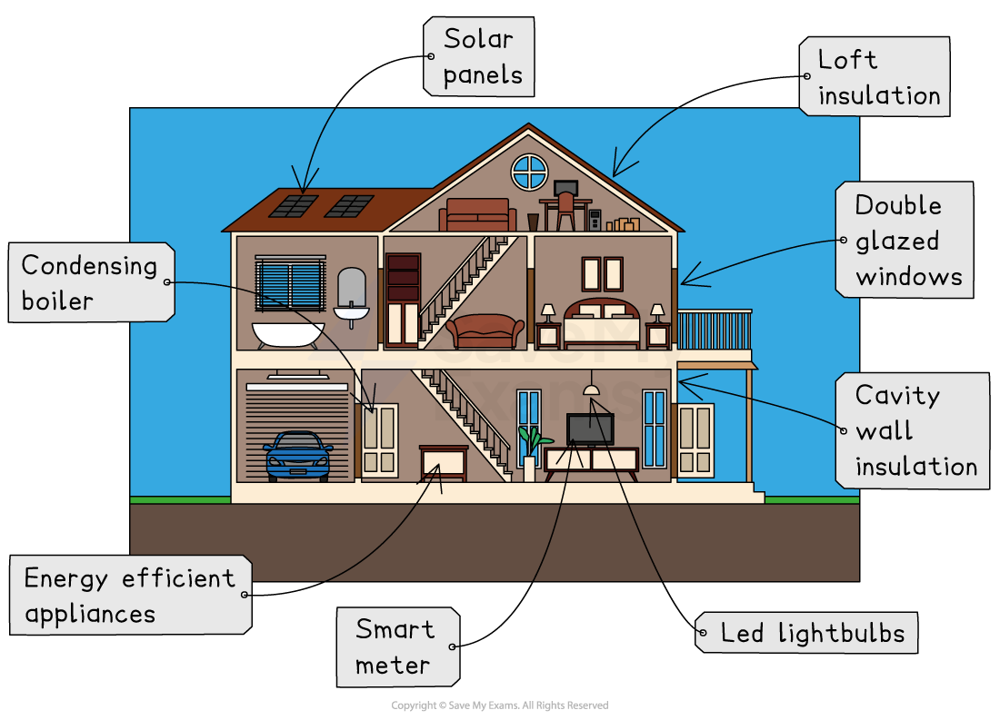

# Management of Energy Sources

## Sustainable Energy Management

> **Spec point** — `spcpt_FzsDjqkVQGnysptM`

## Sustainable energy management

- ***Sustainable*** energy management is essential:

  - to ensure future generations are to have the energy resources they need
  - to limit climate change
- UN sustainable development goal 7 is '**affordable and clean energy**'
- The **International Energy Agency (IEA)** estimates:

  - that around the world **1.2 billion **people have **no access to electricity**
  - approximately **2.7 billion** people rely on biomass for cooking
- **Non-renewable** sources will at some point run out, so they need to be used carefully
- As supplies start to run out, prices will increase. This will mean:

  - economic development is harder as profits will decrease
  - countries with an energy surplus become more powerful
  - countries with an energy gap pay more to import energy
- Fossil fuels create pollution and emit greenhouse gases so the amount used needs to be reduced
- Energy management can be Individual and national
- Energy efficiency is key to making the most of energy sources, as it cuts down on waste and reduces consumption

  - Less energy is used and fuel is used more economically

### Ecological & carbon footprints

- An **ecological footprint** is a way of measuring the impact on the environment
- This can range from an individual's ecological footprint to a country's ecological footprint
- The ecological footprints of developed countries and the individuals within them are higher than those of developing and emerging countries
- **Carbon footprints** measure the impact in terms of the greenhouse gases produced

### Energy efficiency

- Efficient use of energy is an essential aspect of sustainable management of energy
- **Energy efficiency** involves using the least energy possible to meet the demands
- This may involve:

  - improved energy efficiency of appliances
  - reducing energy waste

### Energy conservation

#### Individual

- There are many actions that individuals can take to reduce energy use and conserve resources or use energy more efficiently, including:

  - Reduce car use by using public transport, walking or cycling
  - Insulating walls and roof spaces
  - Buy ***energy-efficient*** (AAA-rated) appliances such as washing machines
  - Don't leave electrical items on standby
  - Install double or triple-glazing
  - Install heat exchange
  - Turn the thermostat down and wear more layers
  - Install solar panels

*Individual methods of reducing energy use - energy-efficient home*

#### National

- Governments have several strategies to make energy use sustainable
- These include ways to conserve energy and use it more efficiently:

  - Invest in renewable technologies such as wind and solar
  - Encourage the switch to electric cars
  - Invest in public transport
  - Provide grants and loans for homeowners to install solar panels or insulation
  - Building regulations to ensure that new homes are energy-efficient
  - Educating the population about the importance of energy conservation and efficiency through campaigns on TV and social media

## Energy Management in Nepal

> **Spec point** — `spcpt_4K4XpYNt4dNx6YC5`

## Energy management in Nepal

> **Case Study**
> ### Energy use in Nepal
> 
> - Nepal is a developing country located between China and India
> - The landscape is mountainous and includes much of the Himalayas
> - The population is rural with only 16% of the population living in towns and cities
> - Energy demand is very low but growing as the country develops
> 
> 
> 
> *Graph showing energy use per person in Nepal and UK*
> 
> ### Nepal's energy mix
> 
> - The main source of energy for 82% of the rural population is fuelwood
> - In urban areas, the use of fuelwood is 36%
> - Nepal has no suitable coal, oil or gas reserves so these have to be imported
> - 98% of all electricity in Nepal is generated through hydropower
> 
> 
> 
> *Graph showing the energy mix in Nepal*
> 
> ### Sustainable future
> 
> - Access to electricity has increased rapidly over the past 15 years:
> 
>   - 88% of the population now have access to electricity
> - Support from the **World Bank** has led to more investment in hydropower
> - There are now over **3000 micro-hydro plants** in Nepal
> 
> ### Ruma Khola micro-hydro
> 
> - Completed in **2009**
> - Provides electricity for the town of **Darbang** and five neighbouring villages
> - It supplies energy for 22 industries, including:
> 
>   - metal workshops, furniture manufacturers, a cement block manufacturer, a noodle factory, poultry farms and dairy farms
> - Built and operated by the community, the micro-hydro plant was funded using grants from the government with support from the World Bank
> - The loans are paid back using money that the community pay for the electricity supply
> - It has improved the standard of living in the communities
> - Reliance on kerosene and fuelwood has reduced and emissions have fallen
> - Deforestation has decreased

## Energy Mangement in Norway

> **Spec point** — `spcpt_cTx6bk5ckP9dW8Yf`

## Energy management in Norway

> **Case Study**
> ### Energy use in Norway
> 
> - Norway is a developed country in northern Europe
> - The demand for energy is one of the highest in the world
> - The population is mainly urban with 83% of people living in towns and cities
> 
> 
> 
> *Graph showing the energy use in Norway and the UK*
> 
> ### Energy mix in Norway
> 
> - Norway has significant energy resources, including:
> 
>   - 1% of the world's gas reserves (17th in the world)
>   - 0.3% of the world's oil reserves (22nd in the world)
>   - There are also some coal reserves
> - Norway is one of the **world's largest energy exporters**
> - Hydropower generates 90% of Norway's electricity and accounts for 65% of energy use
> 
> 
> 
> *Graph showing the energy use in Norway and the UK*
> 
> ### Sustainable future
> 
> - There are over **1500 hydropower plants** in Norway
> - Due to the issue of reliance on hydropower during the dry season and the environmental impact of large hydropower plants Norway is expanding other renewable energy sources
> - Demand continues to increase
> - Norway is expanding the number of wind farms:
> 
>   - There are currently **53 wind farms**
>   - 36 additional onshore and offshore are planned and due to be started or completed by 2030
>   - Includes the world's first floating wind farm
> - Norway is also investing in solar energy:
> 
>   - Homeowners in Oslo get a 30% subsidy for installing solar panels
> - To reduce the consumption of oil, Norway is encouraging the population to move to electric cars:
> 
>   - In 2021 66% of all new car sales in Norway were electric
