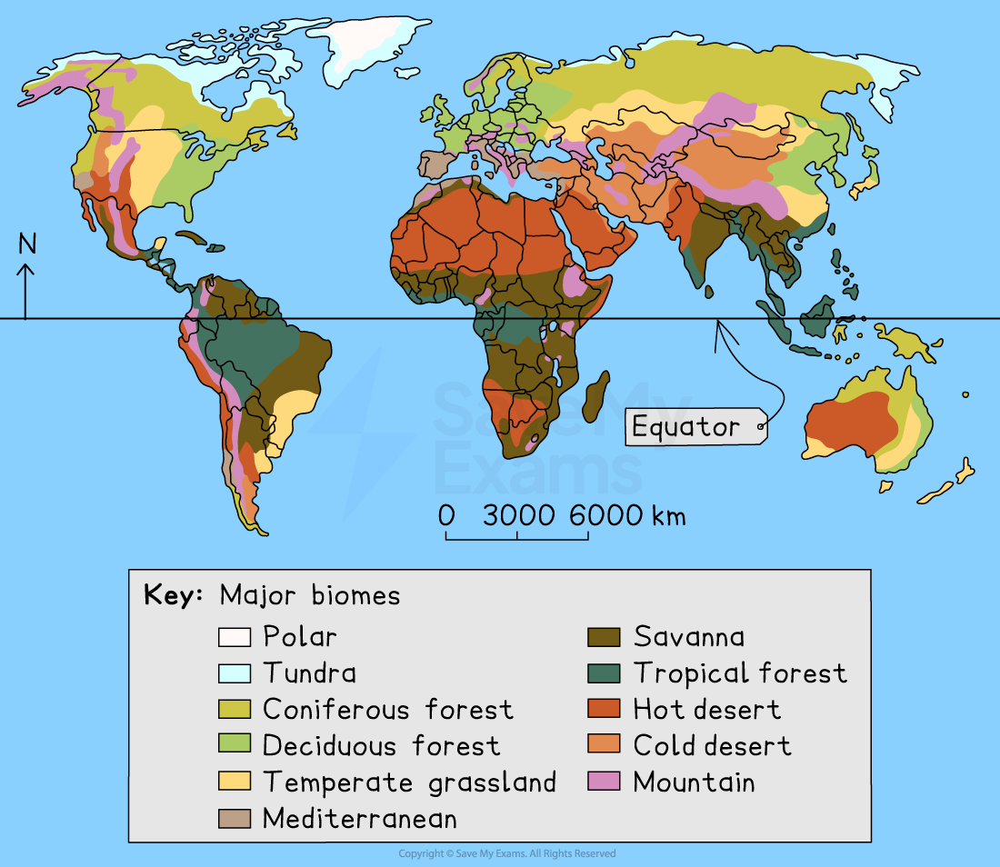

# Distribution and Characteristic of Biomes

## Distribution & Characteristics of Biomes

> **Spec point** — `spcpt_Wf9Fy9xTQZyvZ4FG`

## Distribution & characteristics of biomes

- There are 11 **biomes** in Earth's ***biosphere***
- A **biome **is a group of **ecosystems** around the world with similar characteristics

### Biome distribution

- **Latitude:** with distance from the equator temperatures and sunshine hours decrease
- **Precipitation:** areas of high pressure experience low rainfall, and areas of low-pressure experience high rainfall
- **Altitude:** an increase in altitude leads to a decrease in temperature
- **Continentality: **locations further inland heat up more quickly in the summer and cool more quickly in the winter
- **Ocean currents:** warm and cold currents circulate in the oceans either warming or cooling the adjacent land

*Map showing the distribution of the world biomes*

## Tropical Biomes

> **Spec point** — `spcpt_YHYwD6mdjTQtbZ8N`

## Tropical biomes

### Tropical rainforest characteristics

- **Location**

  - Low latitudes
  - Within the Tropics 23.5° north and south of the equator
  - Amazon in South America, New Guinea, Southeast Asia, Zaire Basin
- **Precipitation and temperature range**

  - Over 2000mm of precipitation
  - Between 26-28oC
- **Seasons**

  - No seasons - hot and wet all year round
  - Growing season - all year
- **Soils**

  - Infertile due to leaching and rapid uptake of nutrients by plants
- **Biodiversity**

  - About 50% of the world's plant and animal species live in the rainforest biome
  - Four layers of vegetation
  
    - Plants include mahogany, teak trees, lianas, orchids
  - Animals include toucans, jaguars, frogs and snakes

## Temperate & Boreal Forest Biomes

> **Spec point** — `spcpt_n8s7kvjfbCWMznSx`

## Deciduous & coniferous forest biomes

### Deciduous forest

- **Location**

  - Between 40°-60° north and south of the equator
  - Main locations include Western Europe, North-east USA, Eastern Asia
- **Precipitation and rainfall**

  - Average precipitation between 750-1500 mm
  - Winter temperatures over 0oC
  - Summer temperatures between 20oC-25oC
- **Seasons and growing season**

  - Four seasons of equal length - spring, summer, autumn and winter
  - A 6-8 month growing season
- **Soils**

  - Fertile soils
  - Nutrient-rich due to the decomposition of organic matter over autumn and winter
- **Biodiversity**

  - A wide range of animals and plants
  - Deciduous trees including beech, oak, birch
  - Animals include deer, rabbits, squirrels, bears

### Coniferous forest

- **Location**

  - Between 50°-60° north and south of the equator
  - Includes Canada, Russia, Scandinavia
- **Precipitation and temperature**

  - Between 300-900 mm of precipitation annually
  - Winter temperatures average -30oC
  - Summer temperatures reach an average 20oC
- **Seasons and growing season**

  - Two main seasons, winter and summer
  - A growing season of 2-3 months
- **Soils **

  - Not very fertile often acidic and contains permafrost
  - Shallow soil with a thick litter layer due to slow decomposition
- **Biodiversity**

  - Less biodiverse than temperate forests
  - Coniferous trees
  - Animals include squirrels, bears, reindeer, wolves

## Tropical & Temperate Grassland Biomes

> **Spec point** — `spcpt_TYSft3Cy87ThhXG7`

## Savanna & temperate grassland biomes

### Savanna

- **Location**

  - North and south of the tropical and monsoon forest biomes 5°-30° north and south of the equator
  - Countries include Central Africa - Tanzania, Kenya
- **Precipitation and temperature**

  - Precipitation is between 800-900 mm
  - Temperatures range from 15°C to 35°C
- **Seasons and growing seasons**

  - The grasslands have a wet and dry season
  - The growing season is between 4-5 months (in the wet season)
- **Soils**

  - Free-draining soils with a thin layer of humus
  - Soils are not very fertile most nutrients near the surface
- **Biodiversity**

  - Wide range of plant and animal species
  - Plants include grasses, baobab and acacia trees
  - Animals include zebras, elephants, giraffes
  - The greatest diversity of hoofed animals

### Temperate grasslands

- **Location**

  - The Velds of South Africa, the Pampas of Argentina, and Steppes of Russia and the plains of the USA
  - Between 40°-60° north and south of the equator
- **Precipitation and temperature**

  - Between 250 - 750 mm
  - Temperatures vary between -40°C to 40°C
- **Seasons and growing seasons**

  - Four seasons
  - Growing season over the summer (dependent on temperature)
- **Soils**

  - Fertile soil
- **Biodiversity**

  - Large numbers of plant and animal species
  - Grasses, sunflowers
  - Bison, antelopes, rabbits
  - Grasses and trees

## Desert Biomes

> **Spec point** — `spcpt_sjts7pRZGCBTth75`

## Hot and cold desert biomes

#### Hot desert

- **Location**

  - Between 15° - 30° north and south of the equator
  - North Africa - Sahara, Southern Africa - Kalahari and Namib, Australia, Middle East
- **Precipitation and temperature**

  - Precipitation is below 250 mm annually
  - Daytime temperatures up to 50°C but average around 25°C
  - Night time temperatures below 0°C
- **Seasons and growing season**

  - Two seasons summer and winter
  - Growing season is all year round
- **Soils **

  - Soils are infertile
- **Biodiversity**

  - Low diversity
  - Cacti, yucca
  - Spiders, scorpions, camels, meerkats

#### Cold desert

- **Location**

  - Central Asia, Southeastern South America
- **Precipitation and temperature**

  - Precipitation is below 250 mm annually
  - Summer temperatures up to 10°C
  - Winter temperatures can be as low as -40°C
- **Seasons and growing season**

  - Two seasons summer and winter
- **Soils **

  - Soils are infertile
- **Biodiversity**

  - Low diversity
  - Shrubs and grasses
  - Camels, snakes, snow leopards

## Tundra Biomes

> **Spec point** — `spcpt_hSyqnJkJFCNKHNvQ`

## Tundra and polar biomes

- **Location**

  - North of the Arctic Circle and Antarctica
- **Precipitation and temperature**

  - Less than 250 mm of precipitation
  - Temperatures are below 0°C for 6-10 months
- **Seasons and growing season**

  - Two seasons, winter and summer
  - Growing season of 6-10 weeks
- **Soils**

  - Thin, infertile soil
  - Permafrost
- **Biodiversity**

  - Low biodiversity
  - Animal species include Arctic fox, polar bears, snowy owls, Arctic wolves, Arctic hares, caribou
  - Plant species include small grasses, mosses, lichen

> **Exam Hint**
> You may be asked to describe and explain the distribution of biomes or climate patterns. Consider the following;
> 
> - Biome distribution
> - Latitude
> - Country and continent names
> - Factors which affect the distribution - latitude, altitude, ocean currents, continentality
> - Climate patterns
> 
>   - Temperature - maximum and minimum
>   - Seasonal variations
>   - Rainfall totals, maximum and minimum
