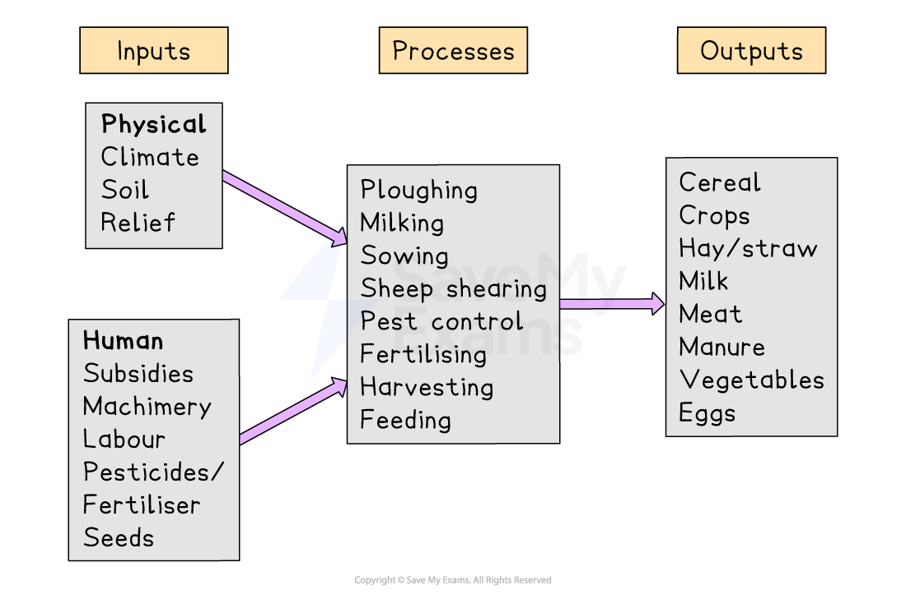

# Human Impact on Ecosystems

## Impact of Farming Systems

> **Spec point** — `spcpt_37xWkm96XyHgVRK4`

## Impact of farming systems

- To obtain food humans use and modify the ecosystems through farming
- There are four groupings commonly used to categorise farming:

  - Categorisation by **outputs**
  
    - **Arable** (the cultivation of crops) and **pastoral **(raising livestock)
  - Categorisation by whether a profit is made** **
  
    - **Commercial** (farming to gain profit) and **subsistence **(farming to feed farmer and family)
  - Categorisation by the **inputs**
  
    - **Extensive** (a farm with low inputs or yields per hectare) and **intensive **(a farm with high inputs or yields per hectare)
  - Categorisation by location
  
    - **Nomadic** (farmers moving seasonally with crops/livestock) and **sedentary **(where the same area of land is farmed every year)
- A farm that has both livestock and grows crops is a **mixed farm**

### Farming systems

- All farms are systems, they have inputs, processes and output

*Diagram to illustrate a farm system*

### Impacts of farming systems

- All farming systems impact the ecosystem in which they are located
- Some have more impact than others
- **Commercial arable **and **pastoral **farming tends to:

  - increase ***monocultures*** which reduces diversity because the animals have no access to a wide range of foods
  - mean that nutrient cycling is dependent on fertilisers added to the soil, which may be natural (manure) or artificial fertilisers
  - modify the ecosystem with inputs of seed, fertiliser, pesticides, herbicides and the use of machines
  - reduce the links within food webs
  - reduce the amount of biomass
- **Intensive **farming has more impacts than extensive farming because it is more likely:

  - to rely on high levels of fertilisers and pesticides
  - to be a monoculture which reduces biodiversity
  - have increased use of machines
- **Subsistence** and **nomadic** farming have less impact on the ecosystem because they tend to be smaller scale and make less use of:

  - machines
  - fertilisers
  - pesticides

> **Exam Hint**
> Remember farms do fit more than one category. For example, a sheep farm in Cumbria, UK would be categorised as pastoral, commercial, extensive and sedentary.
