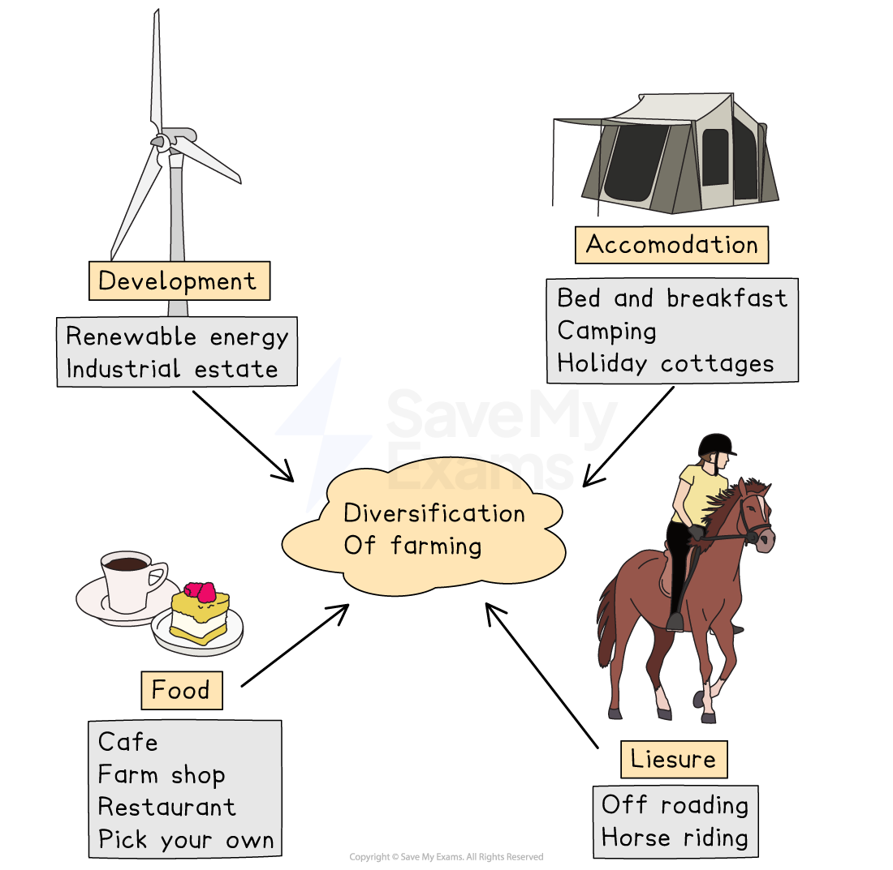

# Diversification of Farming

## Farm Diversification

> **Spec point** — `spcpt_Cc578MDTQvY3yZSt`

## Farm diversification

- Farming in developed countries has changed significantly over the last 200 years:

  - **Farms are larger**: many small farms have been taken over and combined to create larger farms
  - **Mechanisation** has increased meaning less labour is needed
  - Fertilisers and pesticides have improved in effectiveness
  - Animals are bred to produce more milk and meat

- In the UK farming now only creates 1% of the GDP
- Overall farming is becoming less profitable

  - The cost of farming** inputs **such as machinery and animal feed is greater than the profits made from** outputs**
- This has led to:

  - **diversification **which refers to any additional activities used to raise income
  - methods of **raising productivity** and profits
- There are many different ways of diversifying
- All diversification requires an investment of** capital**

*Examples of rural diversification*

### Recreation & leisure

- Many of the ways of diversifying are linked to recreation and leisure
- People in developed countries have more time and disposable income
- Visiting rural areas in leisure time for activities is increasingly popular
- Leisure activities linked to this on farms include:

  - horse riding
  - alpaca walking
  - hunting and shooting
  - off-roading
  - mountain biking
- Farms also often provide accommodation with barns and outbuildings converted to holiday cottages and fields used as camping/caravan sites

## Increasing Productivity

> **Spec point** — `spcpt_rMRw7vRy4f9PnJK5`

## Increasing productivity

### Genetically Modified (GM) crops

- **Genetic modification** involves using genes from one species to improve another species and increase yields:

  - Crops can be made **pesticide-resistant** so that when pesticides are sprayed to remove the pests the crop is undamaged
  - The vitamin which causes carrots to be orange (beta carotene) is added to rice to increase human uptake of the vitamin
- Genetic modification is controversial
- GM crops are grown in many countries, including the USA, Canada, Argentina and India
- In 2022, the UK government is looking to remove the controls which stop the widespread growth of GM crops

| **For** | **Against** |
|---|---|
| - Increases crop yields - Improves food quality - taste and nutrition - Reduces the use of herbicides and pesticides in some cases - Reduces the cost of food - Produce lasts longer, reducing food waste | - Impacts on other species of plant - No long-term studies  are available regarding the impacts on human health - allergic reactions and antibiotic resistance are two concerns - Seeds are expensive - No long-term studies on the effects on wildlife such as bees |
|   |   |
|   |   |
|   |   |

### Specialist crops

- Farms may choose to specialise in a specialist crop or livestock
- Specialist livestock and crops increase profits as they sell for higher prices
- Specialist livestock farmed in the UK include:

  - buffalo
  - ostriches
  - llamas
  - alpacas
  - reindeer
- Specialist crops may include:

  - cut flowers
  - grapes for wine
  - the UK's first tea plantation is in Cornwall
  - seaweed

### Organic farming

- Increasing numbers of farmers are converting to **organic** methods
- Demand for organic food is growing due to health, animal welfare and environmental concerns
- Organic certification means that:

  - organic livestock are grazed on the land and antibiotics are only used when it is medically necessary
  - organic crops are grown **without** the use of **artificial pesticides, herbicides or fertilisers**
- Organic farming may be **less productive **
- Products are only available** seasonally**
- The price farmers receive for organic produce is higher which compensates for the lower yield
