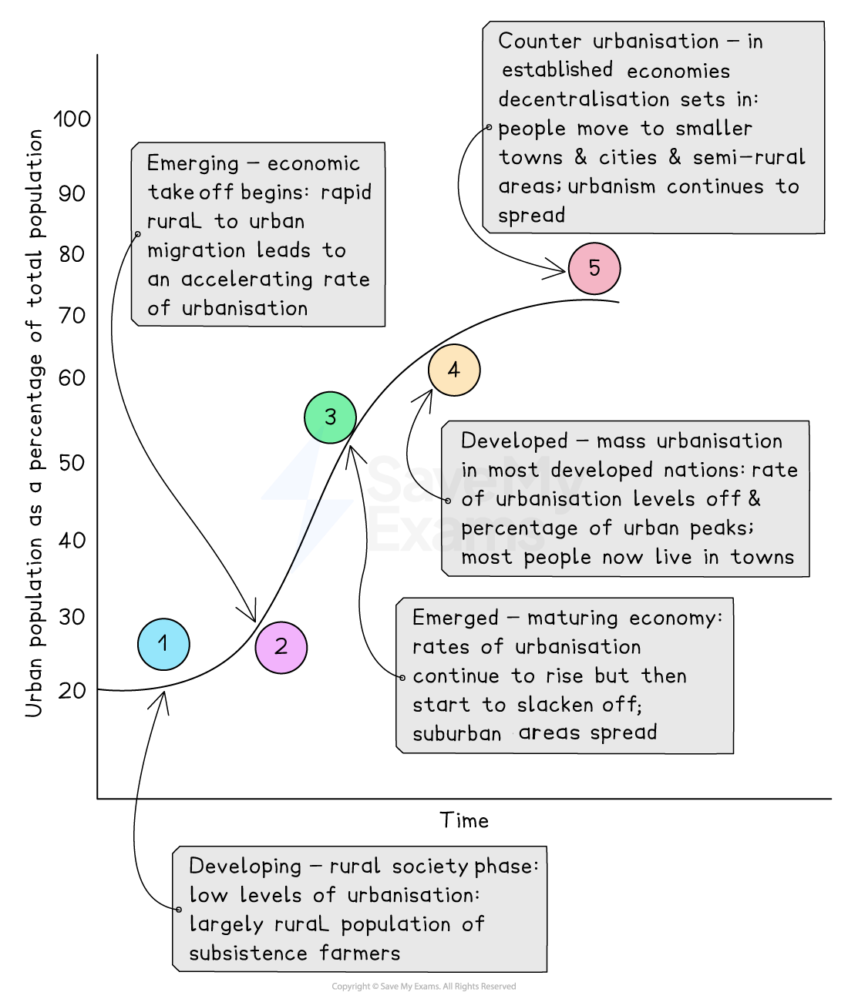
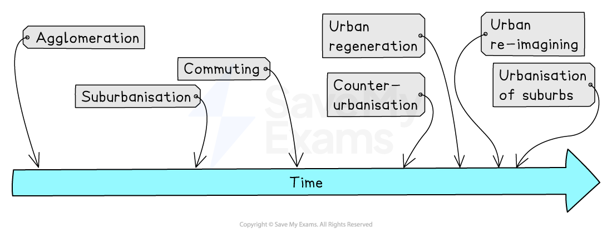

# Trends in Urbanisation

## Growth of Urbanisation Over Time & Space

> **Spec point** — `spcpt_hr4D96TfBxzykdcW`

## Growth of urbanisation over time & space

- **Urbanisation** is the process by which an increasing percentage of a country's population comes to live in** **towns and cities
- Urban settlements differ from rural ones in terms of:

  - **Way of life:** faster-paced
  - **Size:** larger
  - **Density of buildings and people:** compact and high
  - **Economy and employment:** finance, service, and manufacturing

### Levels of development and urbanisation

- Urbanisation varies across the globe and between countries at different levels of development
- **Developed countries** show the **highest levels of urbanisation**
- The lowest levels of urbanisation are in mainly in developing countries within Africa and Southeast Asia
- Globally more people now live in towns and cities than in rural areas

  - According to the UN, 55% of the world's population lives in urban areas
  - This is predicted to increase to 68% by 2050
- The world population doubled between 1950 and 2015, but the urban population more than trebled

#### Emerging countries and urbanisation

- In emerging countries this is mainly the result of:

  - The decline of industry in developed countries
  - Industries moved overseas to **emerging countries** (cheaper workforce, incentives, tax breaks, etc)
  - This led to industrial growth in emerging countries
  - The industries 'pulled' people from rural regions to urban areas with the hope of a better life and employment

#### Developing countries and urbanisation

- High rates of urbanisation occur in **developing countries** because:

  - Most new **economic development **is concentrated in the big cities
  - ***Push-pull factors***** **lead to high rates of **rural-to-urban migration**
  - Cities are experiencing higher levels of ***natural increase***** **in population

#### Developed countries and urbanisation

- Rates of urbanisation are lower in **developed countries** as a high percentage of the population already live in towns and ***cities***
- In some developed countries, rates of urbanisation may start to decrease as *counter-urbanisation *occurs

### Millionaire and megacities

- In 1900, there were just 2 ***'millionaire'*** cities (London and Paris), by 2018 this had grown to 512
- As the growth of cities continues, the term **megacity** is used to describe cities with more than 10 million people:

  - In 1970, there were only 4
  - By 2000, there were 15
  - In 2018, that rose to 33, with the Greater Tokyo metropolitan area having close to 37.3 million people
- Due to modern transport and communication, urban areas are spreading into rural regions in what is termed ***rural dilution***

> **Exam Hint**
> **Natural increase** does not include the inward** migration** of people to a place, just the number of births vs. the number of deaths. E.g. On one street, there were 5 new migrants, 10 births, and 2 deaths. The natural increase is 8 people because the migrants chose to move there. If they then had children, then those children would be included in the natural increase rate.

### Causes of rapid urban growth

- **Natural increase**

  - Accounts for roughly 60% of urban population growth
  - Due to decreased death rates and higher birth rates
- **Urban pull factors**

  - Higher wages
  - Pace and excitement
  - Improved education and healthcare
  - Better job opportunities
  - Public utilities: water, gas, electricity, etc.
  - Government support
- **Rural-urban migration**

  - Accounts for 40% of urban growth
  - Due to rural push factors along with urban pull factors
- **Rural push factors**

  - Limited healthcare and education
  - Mechanisation of farming
  - Lack of opportunities
  - Lack of government support or investment
  - Harsh and monotonous lifestyle

### Urbanisation pathway

- The differences between developed and developing countries can be shown as a pathway over time
- Countries become more urban as they develop economically
- As they move through the stages, the pace begins to slow and begins to flatten out or decline as **counter-urbanisation** gains speed

*Urbanisation pathway*

## Urban Process Timeline

> **Spec point** — `spcpt_dvFdVGRMCQ3DwWJB`

## Urban process timeline

*Urban process timeline*

- Urban settlements first appear as a result of ***agglomeration***:

  - People gather together in one area to sell goods and live
  - Small trading posts and villages begin to develop
- As towns grow, they expand outwards through a process known as **suburbanisation:**

  - This adds to the built-up area, but the building densities are generally lower than in the older parts of the town
  - The new suburbs are made up of mostly houses, but also include places of employment and services
- Urban settlements continue to prosper and grow, and people move out of the town or city altogether and commute to work:

  - These are called **dormitory settlements** because many residents only sleep there.
  - They continue to have links with the town or city they have left
  - They still make use of urban services, shops, education, and healthcare

### Counter-urbanisation

- This is the movement of people ***from ***an urban area ***into ***the surrounding rural region
- **Causes of counter-urbanisation** include:

  - **mobility **and **improved accessibility **due to:
  
    - higher personal car ownership
    - increase in public transport
    - road development
  - **increased wealth**
  
    - Making housing and travel more affordable
  - **agricultural decline** (mechanisation and merger of farms)
  
    - More land becomes available for housing and agricultural workers leave the area
  - **green belt**
  
    - People need to go further out to get the rural life they are looking for
  - **second homes and early retirement**
  
    - Increases the movement of people from the city to the countryside

### Urban regeneration and re-imagining

- Urban regeneration and urban re-imaging are different

#### Urban regeneration

- **Urban regeneration** is the investment of capital in the revival of old urban areas by either improving what is there or clearing it away and rebuilding
- The process occurs in the following stages:

  - Over time, older parts of urban areas begin to suffer a decline
  - Factories move elsewhere, resulting in job loss
  - Quality of life and housing become poorer, people move away
  - ***Urban blight***** **sets in
  - The area needs to be 'brought back to life' leading to urban regeneration

#### Urban re-imaging

- **Urban re-imaging **is changing the image and reputation of an urban area and the way people view it
- The process involves:

  - Focusing on a new identity or function
  - Changing the quality and appearance of the built-up area
  - It is a good opportunity for ***brownfield site*** development
- **London Docklands** was completely redeveloped and regenerated

  - The area had:
  
    - new industries
    - more executive services
    - homes
    - entertainment, and leisure
- Together, urban regeneration and urban re-imaging =** *****rebranding***
