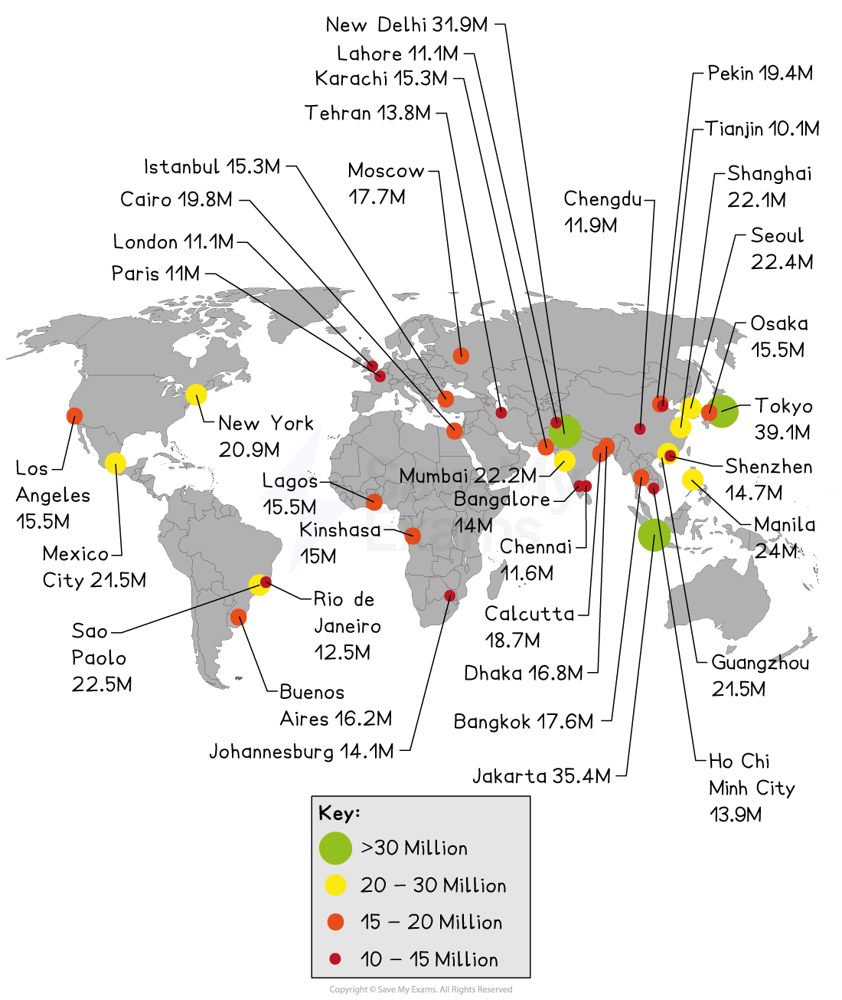
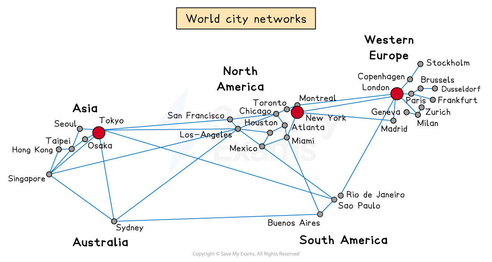

# Rate & Rise of Megacities

## Rate of Urbanisation

> **Spec point** — `spcpt_ZHt75sd6TDyvtwNd`

## Rate of urbanisation

### Factors affecting the rate of urbanisation

- The main factors affecting the rate of **urbanisation** are:

  - Speed of economic development
  - Rate of population growth
- **Speed of economic development**

  - Economic growth drives urbanisation
  - The faster the growth of ***secondary*** and ***tertiary*** employment sectors, the faster the growth of urbanisation
- **Rate of population growth**

  - Economic growth needs a supply of labour
  - This demand can be met in two ways:
  
    - **Natural increase** in urban population is a slow way of meeting demand
    - **Rural-urban migration **– this is the more important source of labour, as it attracts a wider pool of people into the urban region

## Rise of Megacities

> **Spec point** — `spcpt_WgSjYtfx3RkVRvkJ`

## Rise of megacities

- **Megacities **are urban regions with **over 10 million residents**

*Map showing the location of world megacities*

- In 2007, more people lived in an urban environment than a rural one
- By **2050** it is thought that more than **two-thirds (7 billion)** of the world's population will **live **in **urban areas**
- This scaling up of the urban environment is the **fastest **in human history
- The **largest growth **of megacities is seen in **Asia**

### Reasons for growth

- The** four main factors **for the growth** **of megacities** **are:

  - Economic development
  - Population growth
  - Economies of scale
  - Multiplier effect

#### Economic development

- Encourages population growth, which leads to the desirability of goods and services
- All megacities act as **service centres** within the **formal economic sector**
- However, megacities in developing and emerging countries are also important manufacturing centres (Mumbai in India or Dhaka in Bangladesh) with thousands working in the **informal economy**

#### Population growth

- Young people are drawn to live in megacities with their vibrancy, fast pace and opportunities
- There is also ‘**internal growth**', where people who have moved into the cities have children, thereby sustaining population growth (Mexico City, Mumbai, Pearl River Delta in China)

#### Economies of scale

- It is cheaper to provide goods and services in one place than spread across several cities
- Financial savings for local governments in respect of infrastructure provision
- Communication and transport are centralised, making savings in time and money

#### Multiplier effect

- As a city prospers, it acts as a beacon to people and businesses
- This encourages inward investment
- This leads to yet more development and growth
- Generating further need for skills and labour and job growth
- This cycle multiplies the positive effects and growth continues (San Francisco and the digital development)

### World cities

- **Megacities **have a **powerful attraction **for people and businesses
- They are **influential *****cores*** with large ***peripheries***
- **World** or **global cities** can be **any size** but **exert** particular **influences **around the globe; they are:

  - considered prestigious, with status and power
  - **critical hubs** in the global economy
- The three top **(alpha)** world **cities **are:

  - **London**
  - **New York**
  - **Tokyo **
- These are the **financial centres of the world**, each with smaller networks of world cities feeding into them
- There are **only four** world cities in the **Southern Hemisphere**:

  - Sydney
  - Rio de Janeiro
  - Sao Paulo
  - Buenos Aires

*World city network*
