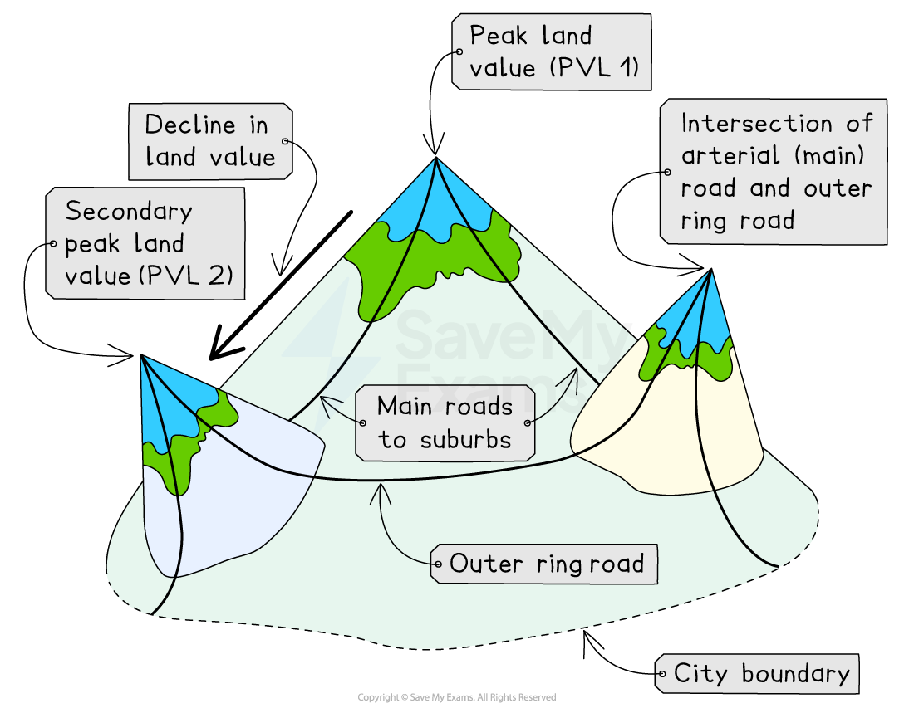
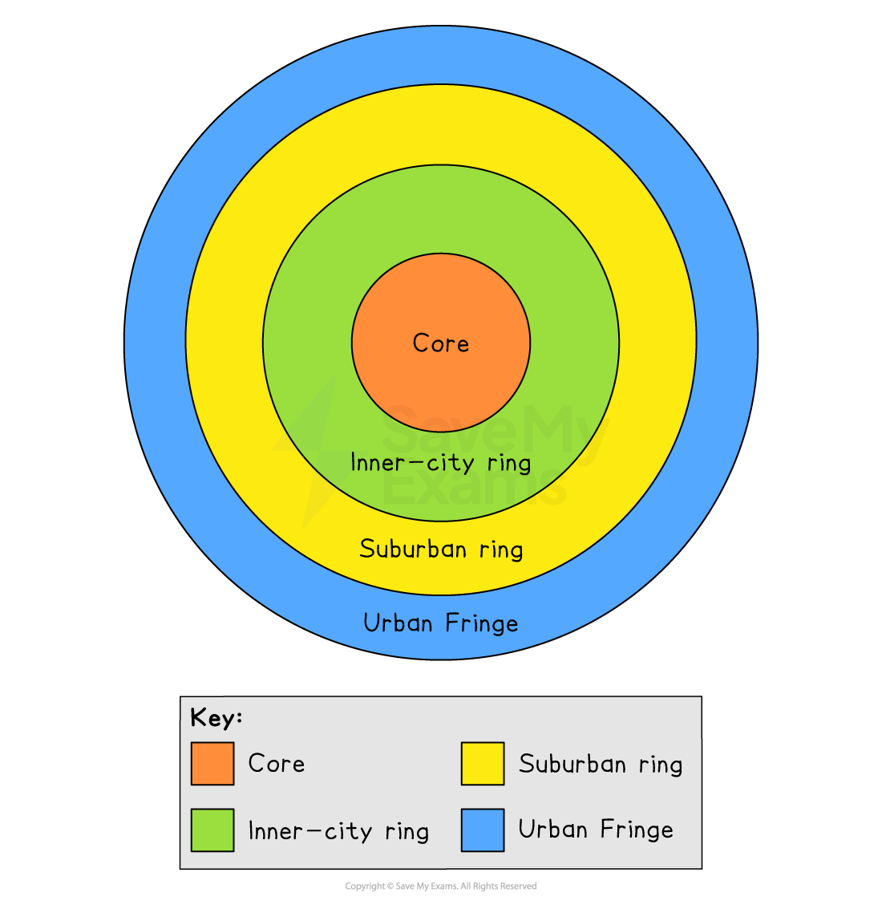
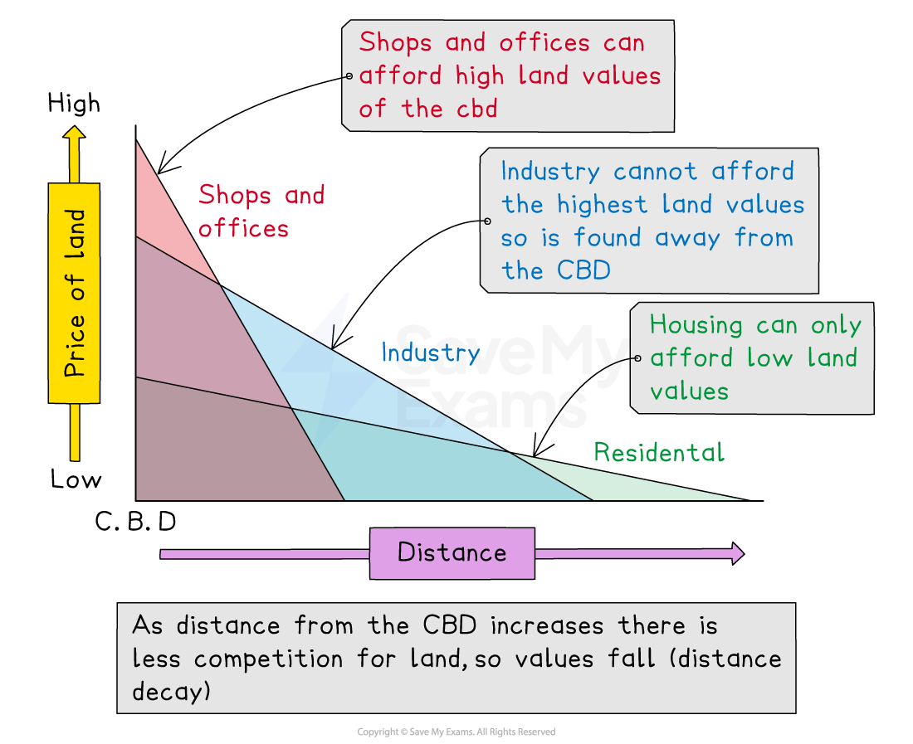

# Urban Land Use Patterns

## Urban Land Values

> **Spec point** — `spcpt_qHXphSsjRR2TNVBb`

## Urban land values

- All urban settlements have recurring features:

  - A central core or **central business district (CBD)**
  - Industrial areas
  - Different residential districts
  - Shopping centres
  - High-rise buildings
  - Cultural and leisure areas
  - Multi-storey car parks
  - Bus and railway stations
- These features have created **segregated land use over time**

### Land values

- ***Segregation*** of land use is due to the differences in urban land values

  - Land that has '**purpose**' will be **valuable **and cost more to buy or rent
- Usually, retail shops can make money and seek **prime **positions

  - Segregation is formed by retailers that can afford to be in those prime locations
  - Therefore, land uses of similar activities will come together creating  '**peaks**' and '**troughs**' of land values across the urban landscape
- There are a couple of points to consider:

  - The **value** of the land:
  
    - Land value varies across the urban areas
    - Value usually decreases from the centre, outwards
    - Higher land prices are also found along main roads, urban hubs and around ring roads
  - The **location **of the land:
  
    - Location is important to value
    - The closer to key functions, the higher the value
    - Accessibility and desirability increase land value

*Distribution of urban land value*

## Patterns of Urban Development

> **Spec point** — `spcpt_M2yHxqvyJhxDVwDZ`

## Patterns of urban development

- Cities can be segregated into **zones**
- Zones will have similar land values and locational needs, such as access for customers, employees, etc. or space for expansion or privacy
- All towns and cities grow outwards, in a series of rings, from a historic centre or **core **to an **urban fringe**
- Each zone grows due to the needs of the city during its development, over time
- As a general rule, **all towns and cities,** regardless of place or level of development, **show the same four features**:

  - A **central core:** the oldest part of a city
  
    - Home to the central business district (CBD) e.g. banks, retail and commercial offices
  - An** inner-city** ring: also known as the twilight zone
  
    - Older, terraced 'worker' housing
    - Older industrial areas
    - Areas are centred around transport links and access
  - A **suburban** ring: residential area
  
    - Semi- and detached housing with gardens
    - Tree-lined avenues and cul-de-sacs
    - Smaller retail premises
  - An **urban fringe:** outer edges of the city
  
    - The countryside is eroded through the urban spread
    - Housing is clustered into estates
    - Some industrial land use
    - Accessibility is best

- **Other similar** characteristics of modern urban settlements include:

  - The age of the built-up area decreases from the core to the fringe
  - The density of building developments decreases from the core to the fringe
  - Grandeur, function, design and style changes across the zones

> **Exam Hint**
> - Remember that whilst the four-zone model is simple and applies to virtually all urban areas across the globe, each zone varies in character, use and people depending on circumstances.
> - In emerging cities, the urban fringe contains informal settlements or shanty towns that serve as 'housing estates', while industry remains ***informal***.
> - Whereas, in developed cities, the poorer areas are usually within the inner city, and industry is on the fringes for ease of access to motorways.
> - Same features but different characteristics/uses.

*Four Zones of a City*

### Bid-rent theory

- Also known as '**distance decay theory**', where the price and demand for land change as the distance from the CBD increases
- Different land uses will compete for desirable plots to **maximise their profits**
- **Accessibility** increases the potential for more customers
- There is a trade-off between accessibility and the cost of the land
- The closer to the CBD, the more desirable land is to retail and the higher the price charged/paid
- Industry cannot compete with high prices moving further away from CBD
- Residential land is outpriced across the zones, but competition is less so value decreases as more space becomes available

** **

* Illustration showing bid-rent theory*

## Residential Pattern

> **Spec point** — `spcpt_36gP9pDRzgFdkVhN`

## Residential pattern

- People are also zoned or 'sorted' within an urban area
- People will live near other people who they consider the same

  - This may be due to *ethnicity*, religion, occupation, etc.
- This creates an urban pattern of **self-organised segregation**
- The largest segregation is created through personal wealth
- The wealthiest people can buy smart, large homes in the best locations
- This forces the less well-off to live in cramped or sub-standard housing in the worst areas
- Many have to pay high rental prices with little to no security
- Due to their limited means, many are forced to live in small, cramped spaces creating **high-density** residential areas and **unequal** sorting across the urban area

> **Worked Example**
> #### Study the photograph.
> 
> **Explain one piece of evidence that shows this is a central urban area **
> 
> **(1 mark)**
> 
> 
> 
> *An urban area in Amman, Jordan*
> 
> - **Answer:**
> 
>   - 1 mark for a piece of evidence, 1 mark for developing the point, e.g.
>   - The housing in the picture is very high density **(1), **which is typical of city areas where land values are high **(1)**
>   - The image shows multiple-storey houses **(1) **which are likely to house large numbers of people **(1)**
>   - There is little green space **(1)**, indicating the built-up nature of the area since land values are so high **(1)**
