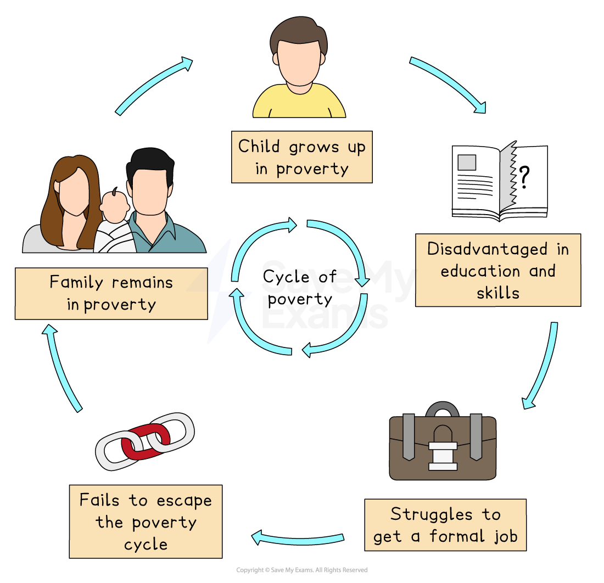

# Urban Challenges in Emerging Cities

## Urban Challenges in Emerging Cities

> **Spec point** — `spcpt_YXHztR8MYMjD36wX`

## Urban challenges in emerging cities

### Housing issues

- Urban populations are increasing at a rapid rate
- Availability and affordability of housing cannot keep up with the rate of population increase
- This leads to people building their own homes on any vacant land using scrap materials like cardboard, corrugated iron and plastic
- These homes are **unplanned** and **unregulated** housing **(informal settlements) **with little sanitary facilities, freshwater or reliable energy supply
- The settlements are usually on land not owned by the people building them and are found:

  - in areas of no economic value
  - on the urban edges or fringes
  - along main roads or railways
  - clinging onto the side of steep slopes
- Depending on the country, these **informal settlements **or **squatter settlements **are also called:

  - **Favelas **in Brazil
  - **Shanty towns** in the West Indies and Canada
  - **Bustees** on the Indian subcontinent
  - **Skid row** in the USA
  - **Townships** in South Africa
- In **developing countries,** about a quarter of urban inhabitants (1.6 billion) live in these impoverished squatter settlements
- By 2030, the UN estimates that 1 in 4 people on the planet will live in some form of informal settlement
- Some cities have** 'mega-slums'**, which are very large, overcrowded, informal settlements usually within megacities

  - The largest examples are found in:
  
    - **Nairobi, Kenya** with a population of 1.5 million crowded into three sprawling slums of mud huts and tin shacks – Kibera** **being the largest of the three
    - **Neza, Mexico City, Mexico **with a population of 1.1 million people
    - **Dharavi, Mumbai, India** with 1 million people in a warren of narrow lanes, interconnected shacks and single-room living spaces that double as factories
    - **Orangi Town, Karachi, Pakistan** with an estimated population of 2.4 million people across 8000 acres of concrete block homes with 8-10 people sharing two or three rooms
    - **Khayelitsha in Cape Town, South Africa **with a population of 400,000 in iron and wooden shacks
- These unregulated housing areas present serious risks such as fire, flooding and landslides
- Squatter settlements typically suffer from housing which is:

  - made from poor-quality materials
  - overcrowded
  - small
  - built very close together
- The settlements have restricted access to water and electricity supplies
- There are little to no **sanitation facilities** and **no solid waste disposal**

  - This leads to a polluted and degraded local environment
- There are inadequate health facilities

  - Together with poor living conditions, this increases sickness and death rates
- The population in these areas have insecure living conditions, as they may be forcibly removed by landowners or other authorities

## Informal Economy

> **Spec point** — `spcpt_dCRWDDnSkmZK9rsh`

## Informal economy

### Issues of the informal economy

- **Megacities** have rapidly growing populations
- Job creation cannot match the pace of growth
- As a result, unemployment and ***underemployment*** are not unusual
- People will often work on street corners and do ***informal*** work, including:

  - shining shoes
  - giving haircuts
  - taxing
  - selling water or food
- These jobs are often unskilled and labour-intensive and require little money to set up
- The **informal economy** leaves cities without revenue to provide adequate services, as workers pay no taxes
- It also makes wages and working conditions difficult to regulate, so employees are unlikely to get holiday or sick pay, medical benefits or protective equipment
- Inadequate health and safety safeguards may result in unsafe working conditions and employee injuries
- People may struggle to pay their bills and food because they don't have a steady source of income, which could result in experiences of poverty

## Urban Pollution

> **Spec point** — `spcpt_Q2YQh3bDcm6YqfKP`

## Urban pollution

### Energy supplies:

- Electricity supplies are often inadequate and unreliable in megacities

  - This results in frequent blackouts and brownouts
  - Power outages reduce foreign investment and quality of living for residents
- Power theft is also rampant in megacities
- Without electricity for cooking, biomass (such as wood or dung) is often used by the poorest households

  - This contributes to low air quality and greater household fire risk

### Sanitation and water supplies

- The UN estimates that:

  - over 1 billion people do not have access to adequate supplies of fresh, **clean drinking water **
  - approximately 2 billion do not have adequate access to sanitation facilities, organised sewage disposal or waste collection
- The lack of safe water means that people have to find alternative sources, which may lead some people to drink from pools of water on the ground

  - This poses a serious health risk, as these conditions make it a perfect breeding ground for diseases such as cholera, and accounts for 2 million deaths each year worldwide
- Open water attracts mosquitoes which may lead to the spread of malaria
- Open defecation and industrial waste pollute water sources

### Transportation

- Roads in developing and emerging cities were never designed to take large volumes of traffic
- A drop in the rate of extreme poverty around the world makes vehicle ownership possible

  - This worsens *congestion* and pollution
- Two features add to the  congestion problems:

  - Firstly, the type of vehicle can restrict movement
  
    - It is not uncommon for 2-stroke engine taxis (such as auto-rickshaws or 'tuk-tuks'), cycle rickshaws, bullocks, elephants, motorcycles, cars, buses and trucks to all share the same roads
    - Because these forms of transport move at different speeds and with different manoeuvrability, they often block each other's flow, creating congestion and pollution (noise and air)
  - Secondly, traffic is also hampered by a culture of 'unstandardised' driver training
  
    - Without a significant culture of road rules, traffic becomes more gridlocked
    - This adds to pollution through exhaust emissions (smog)

- Air pollution from using old, un-serviced vehicles that emit dirty and harmful fumes adds to serious health problems such as asthma and bronchitis
- **Unregulated factory emissions** pollute not only the air but water sources as well

## Quality of Life

> **Spec point** — `spcpt_r9HHQqTCmwsfMtVB`

## Quality of life

### Cycle of poverty

- Developing cities have high levels of **inequality**
- Many **low-income families** are 'pulled' to informal settlements around towns and cities looking for a sense of 'belonging' with others in the same situation
- For others without a strong social network or cities with recently arrived large populations, high levels of crime, begging and petty theft are more common
- Overall, this creates urban poverty that degrades both the physical and social environment around that area
- This makes it difficult for people to escape from poverty and they fall victim to the vicious '**cycle of poverty**’

  - Urban poverty becomes ingrained within the city
- Combined with a lack of suitable work, housing, water supply, sewerage, solid waste disposal and pollution, the quality of life for people in emerging and developing cities is low

*Cycle of poverty*

### Deprivation

- ***Deprivation*** is connected with poverty

  - It occurs when a person’s well-being falls below an acceptable minimum standard
  - The minimum standard varies from country to country and applies to several different aspects of daily life
- In the UK, there is a **multiple deprivation index (MDI)**
- The UK MDI has 7 different indicators:

  - Income
  - Employment
  - Health
  - Education
  - Access to housing and services
  - Crime
  - Living environment
- It is more than just not having enough money

### Quality of life index

- The ***Quality of Life Index (QLI)*** looks at the availability of eight different variables:

  - Political and economic stability
  - Legal system and civil rights
  - Health and medical services
  - Safety
  - Climate
  - Costs and incomes
  - Education
- The Index reflects the differences between emerging, developing and developed countries
- The higher the index number, the better the quality of living in that area

### Low quality of life

- Poverty and deprivation are passed on from one generation to the next

  - Children will tend to get less parental support and usually have to attend inadequate schools
  - They also tend to leave school early with few qualifications
  - Lack of qualifications means they cannot find well-paid employment and rely on social handouts
- Children they have will be born into this cycle and so families remain ‘trapped’ and unable to improve their circumstances
- This feeds into a lower quality of life

## Example Case Study of Rio de Janeiro & Nairobi

> **Spec point** — `spcpt_px388trKs3BMwPRF`

## Example case study of Rio de Janeiro & Nairobi

> **Case Study**
> #### A developing city – Rio de Janeiro, Brazil
> 
> **Background**
> 
> - Brazil is an important agricultural and industrial power, with the strongest economy in Latin America
> - **Brasilia** is its capital
> - In 1950, Rio de Janeiro (Rio) was the capital of Brazil with a population of 3 million
> - Today it is the second largest city in Brazil (after São Paulo) with a population of over 12.5 million
> - Rio is a **major trading port**, with oil refining and shipbuilding industries
> - The main exports are iron, steel and crude petroleum
> - Rio is also a major** tourist destination** and hosted the 2016 summer Olympics and Paralympics
> 
> **Migration**
> 
> - Rio is experiencing rapid growth due to **rural-to-urban migration** in search of jobs
> - Despite having a large agricultural sector, there is no land ownership and few opportunities for advancement
> 
>   - It is difficult and unprofitable farming, with low wages and huge wealth disparities
> - For many internal migrants, the city offers:
> 
>   - better job opportunities
>   - higher wages
>   - better schooling
>   - healthcare
>   - the potential for a higher quality of life
> 
> **Housing**
> 
> - Inward migration has put **pressure on services** and amenities, which has led to a **housing shortage**
> - Most rural migrants begin life in the** favelas**
> 
>   - **Rocinha** is the largest, most developed informal settlement, just south of Rio
>   - Over 20 per cent of the population live in around 1000 favelas in and around the city
>   - Favelas are found mainly on the edges of the city, on poor-quality land that is not suitable for urban development
>   - People have no legal rights to the land they occupy
>   - Many of the favelas in Rio are now well-established
>   - Over 95% of favela homes are built of solid materials, such as brick, with 75% having a tiled floor
>   - Some favelas have electricity, running water, televisions, computers and access to the Internet
>   - The newer and less well-established neighbourhoods are overcrowded, consisting of shelters made from materials like timber and corrugated iron
> 
> **Transport**
> 
> - The rapid expansion of Rio from the 1950s was not supported by the necessary **urban infrastructure** planning
> - Rio de Janeiro’s roads are seriously ***congested***
> - Rail services are limited
> - **Private bus services** are the main means of public transport
> - The number of cars in the city is increasing as the population rises and people become wealthier
> - Underground rail services are efficient but with limited stops along its network
> 
> **Education**
> 
> - Children start school at 4 years old
> 
>   - School days typically last between 3 and 4 hours, due to lack of space in the classrooms
>   - There is no strict national curriculum in Brazil, but teachers follow national guidelines for the state (county) that they are teaching in
>   - Education is often low quality, due to Brazil investing late in its education system
> - Many of Rio's public schools are in desperate need of repair, adding to poor educational attainment
> - Rio has the highest rate in Brazil of non-attendance in school, teenage pregnancy and lack of opportunities for further education
> - Violence can be a barrier to education, as in some neighbourhoods it is not always safe for children to travel to school
> 
> **Crime Rates**
> 
> - Crime rates have increased as the city has grown
> 
>   - This is due in part to **high unemployment rates** and petty crime such as pickpocketing
> - Rio has a problem with youth crime and gang violence within the favelas
> - Many residents feel unsafe in their homes as the gangs control the streets with guns, and trade in drugs
> 
> **Environmental challenges**
> 
> - The majority of the favela's residents illegally tap into the main electrical grid
> 
>   - This makes electricity poles in the street unsafe, with several households connecting to the one pole
> - Many households in Rio do not have access to safe, running water, as many of the main water pipes are damaged and are leaking
> 
>   - Very few houses in the favelas have water directly to their houses
> - Access to doctors and healthcare varies across the city
> 
>   - Healthcare access for people in the favelas is poor, raising the risk of spreading diseases such as cholera and typhoid
> - Urban sprawl is an issue as the city continues to grow rapidly, encroaching on surrounding rural (countryside) areas
> - **Air pollution** is a major problem, particularly from traffic congestion in the city centre and from industrial zones
> - **Waste disposal **is a particular problem in the favelas, where access is difficult and there are no organised sewage or waste recovery systems
> - **Sewage** isn't properly treated or disposed of
> 
>   - It often ends up in local rivers and Guanabara Bay, polluting the water and damaging the marine wildlife there

> **Case Study**
> #### An emerging city – Kibera, Nairobi, Kenya
> 
> - **Kibera **is the largest **informal settlement** in Kenya
> - Over 60% of the people who live in Nairobi live in informal settlements
> - Between 800,000 and 1 million people live in Kibera 255 ha (around the size of 255 football pitches)
> - The settlement has an extremely high population density of 1 meter of floor space per person
> - There are around 100,000 orphans under the age of 18 years – this is due in part to the AIDS epidemic in Kibera
> - Due to rapid expansion, Kibera lacks sewers and has poor levels of sanitation, making diseases the main killer
> 
> **Unemployment**
> 
> - Kibera is near the industrial area of Nairobi where up to 50% of the available workforce are employed – usually as unskilled labour
> - Changaa is a cheap alcoholic drink, which is widely available, and very strong (over 50% alcohol)
> - It is usually made incorrectly, and has a very high level of methanol
> - The cost is only KES 10 (7p) per glass and after a couple of glasses, people become very drunk
> - With over 50% unemployment in Kibera, many start drinking early in the morning, leading to problems of violence, crime, rape, etc.
> - Several charities are trying to help by showing Changaa makers how to make the drink less dangerous
> - Cheap drugs and glue sniffing are an increasing problem
> - Initially taken to alleviate boredom but then people find themselves hooked, again leading to a rise in crime rates
> 
> **Land ownership**
> 
> - The Government owns all the land
> - 10% of people are shack owners and many of these people own many other shacks and let them out to tenants
> - The remaining 90% of residents are tenants with no rights
> 
> **Housing**
> 
> - The average size of a home is 12ft x 12 ft, built with mud walls, a corrugated tin roof and a dirt or concrete floor
> - The cost is about KES 700 a month (£6)
> - These 'shacks' often house up to 8 or more, with many sleeping on the floor
> 
> **Electricity**
> 
> - Only about 20% of Kibera has electricity
> - The UN-Habitat is providing electricity to some parts of Kibera
> 
>   - This includes street lighting, security lighting and connection to shacks
>   - Whilst this costs KES 900 per shack (£6.50), in most cases cannot afford it
> 
> **Water**
> 
> - Water was collected from the Nairobi dam until recently
> - As the dam water is polluted, typhoid and cholera were prevalent in Kibera due to a lack of sanitation
> - Now there are two water mains in Kibera, one from the municipal council and one from the World Bank
> - Residents pay KES 3 per 20 litres (25 pence) for clean, safe water
> 
> **Sewage**
> 
> - Most of Kibera has no toilet facilities
> - One latrine (hole in the ground) is shared by up to 50 shacks
> - Once full, young boys are employed to empty the latrine and take the contents to the river, further polluting the water and spreading diseases
> - UN-Habitat and a few other agencies are trying to help improve this situation but it is a slow process
> 
> **Medical facilities and HIV/AIDS Clinics**
> 
> - Kibera has no government clinics or hospitals
> - The providers are ***NGOs*** (charitable organisations): Oxfam, Red Cross, ***MSF***, churches and others
> - All people are encouraged to have a free HIV test and, if positive, to take free generic ***ARV*** medicines
> - Many men in Kibera do not use condoms and with the availability of Changaa, many girls become pregnant
> - At any one time about 50% of 16- to 25-year-old girls are pregnant
> - Most of these pregnancies are unwanted, resulting in abortions, which, due to lack of medical care, are dangerous in such a poor area as Kibera
