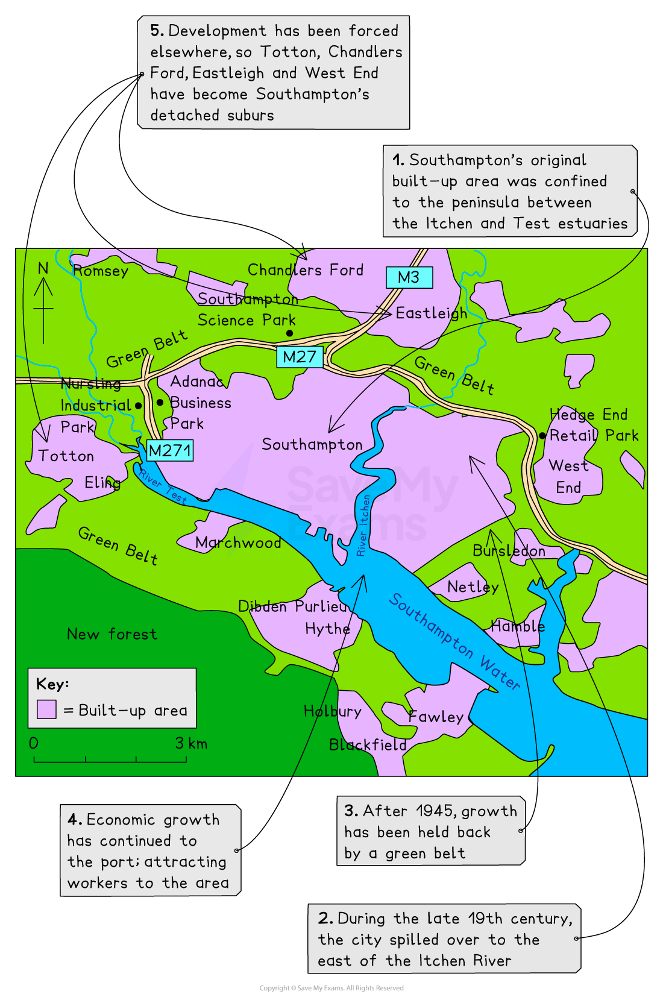

# Development of Rural Urban Fringe

## Rural-Urban Fringe

> **Spec point** — `spcpt_v32HS5nqwWjDgTRf`

## Rural-urban fringe

- Also called the **urban fringe**

  - It is where green, open spaces meet the built-up areas of towns and cities
- Growth at the urban fringe is due in part to:

  - counter-urbanisation
  - population growth
  - lack of space
  - spiralling land costs
- These can be divided into **push factors** (negative factors causing people/businesses to leave central urban areas) and** pull factors** (positive factors pulling people/businesses to the rural-urban fringe)

### Push factors

- Housing is old, congested and relatively expensive
- There are various forms of environmental  pollution – air quality is poor, and noise levels are high
- Companies find that there is a shortage of land for expansion or building shops, offices and factories
- ***Brownfield*** sites are expensive to build on due to the added costs of cleaning the land (especially if contaminated with asbestos) before building

  - Also there may be restrictions on what can be built
- Access for heavy goods vehicles is limited or difficult, adding to congestion and air pollution

### Pull factors

- Land is cheaper so houses are larger and have gardens
- Factories can be more spacious and have plenty of room for workers to park their cars
- Closeness to main roads and motorways allows for quicker and easier customer contacts
- Closeness to main roads and motorways allows for quicker and easier commutes for car drivers and access for lorries
- Changing working patterns thanks to technology, e.g. flexible working, working from home, etc.

### Changes along the urban fringe

- Some of the biggest changes in the urban landscape can be seen in the rural-urban fringe
- Other than **new housing estates**, there are also:

  - **Retail parks **
  
    - These have a large sphere of influence due to being easily accessible, ample free parking, the concentration of businesses in one place, longer opening hours, and a large choice of goods
  - **Industrial estates **
  
    - Space for expansion, purpose-built road networks, cheaper land, sited away from housing
  - **Business parks **
  
    - Space is created for a nicer working environment, easier access and commute for workers, the area is specifically created for office space and includes a conference hotel
  - **Science parks**
  
    - Purpose-built to encourage research and development (R&D), high-tech industries and other quaternary activities, close to a university and transport networks (including airports) to allow for knowledge transfer
  - **Airports**
  
    - Increase in air traffic and low-cost carriers, but also airports feed into businesses on the fringe through imports and exports but also knowledge with speakers and investors having easy access to businesses
  - **Motorways and ring roads**
  
    - Feed into ease of access for residents, workers, lorries, buses, cars etc.

## The Greenfield vs Brownfield Debate

> **Spec point** — `spcpt_jZCvqSbgDkPmHxzv`

## The greenfield vs brownfield debate

- Urban growth involves building on land, which is in short supply in the urban centres
- This makes the **open land **around the urban fringe desirable for:

  - housing
  - industry
  - shopping
  - recreation
  - public utilities such as reservoirs and sewerage works
- However, some people feel too much countryside is being lost through this **outward growth **of towns and cities
- Some urban areas have a planned and protected ***greenbelt*** on which no development is allowed, but urban areas still need to grow
- This means there are two choices, either build on a ***greenfield*** or ***brownfield***** **site
- With all land uses there are arguments for and against each type of site

### Brownfield sites

#### Advantages of brownfield sites

- Helps revive old and disused urban areas
- Reduces the loss of countryside for agricultural or recreational use
- Services such as water, electricity, and sewage, are already in place
- Located near to main areas of employment.
- Reduces the risk of squatter settlements developing

#### Disadvantages of brownfield sites

- Often more expensive because old buildings must be cleared, and land made free of pollution
- Often surrounded by rundown areas so does not appeal to wealthy people
- Higher levels of pollution

### Greenfield sites

#### Advantages of greenfield sites

- Healthier environment
- Close to the countryside, leisure, and recreation
- The layout is not restricted by the existing layout
- Relatively cheap and the rate of house building is faster
- Access and infrastructure easier to build

#### Disadvantages of greenfield sites

- Valuable farmland lost
- Encourages further suburban sprawl
- Wildlife and habitats lost or disturbed
- Recreational space and attractive scenery lost
- Lacks access to public transport
- Development causes noise and light pollution in the surrounding countryside
- Cost of installing services such as water, electricity, sewage, etc.

### Conclusion

- There are no clear winners in this debate
- It depends on the particular land use:

  - Housing is flexible in terms of where it could be built, but shops and offices need more space and specific locations
  - Depends on the needs of the town or city
  - What value is the greenspace really to the town or city?
  - The issues and costs in reusing the brownfield site (asbestos etc.) need to be considered

## Example Case Study - Southampton's Rural-Urban Fringe

> **Spec point** — `spcpt_N2tMhykdGk76YvHB`

## Example case study - Southampton's rural-urban fringe

- Southampton has a population of over 270,000 with **detached suburbs** or ***commuter dormitories***

*Growth of Southampton's residential areas*

- Pressure from developers resulted in green belt restrictions being relaxed
- **Motorways **were added through the green belt, giving Southampton good access all round
- As a result, certain types of businesses have been allowed to build on a limited number of sites

### Nursling Industrial Park

- Located beside the M271
- This large estate has **service industries **of which **distribution** and **storage** are the main ones

### Southampton Science Park

- In a prime location close to the London **M3 motorway**
- A 17-hectare park which provides high-quality office and laboratory space in **attractive landscaped surroundings**
- Over **60 companies**, dealing in high-tech research fields, sit side by side
- This has resulted in a thriving community of young and old sharing ideas and knowledge
- Businesses are attracted by the:

  - strategic location
  - quality of the environment
  - access to some of the UK’s leading scientific expertise at the University of Southampton

### Hedge End Retail Park

- Located just off the M27
- One of the largest out-of-town retail parks in the South of England
- Home to:

  - Marks and Spencer
  - Sainsburys
  - Currys/PC World
  - Many more stores

### Adanac Business Park

- Approved in 2008
- A 74-acre site
- Home to the Ordnance Survey (OS), which produces all the maps of the UK
- The park is earmarked for major office developments and large space occupiers

> **Worked Example**
> **Explain one advantage and one disadvantage of developing greenfield sites. **
> 
> **[4 marks]**
> 
> - 1 mark for the initial explanation
> - 1 mark for development through further explanation or exemplification
> 
> **Final answer:** **Possible Answer:**
> 
> - **Advantage:** Greenfield sites are often flat and uncontaminated** [1], **which makes it cheaper to develop land compared to the clearing cost of brownfield sites. **[1]**
> - **Disadvantage:** Uses permeable land that, when developed, increases surface run-off **[1], **which can increase urban flood risk in an area. **[1]**
