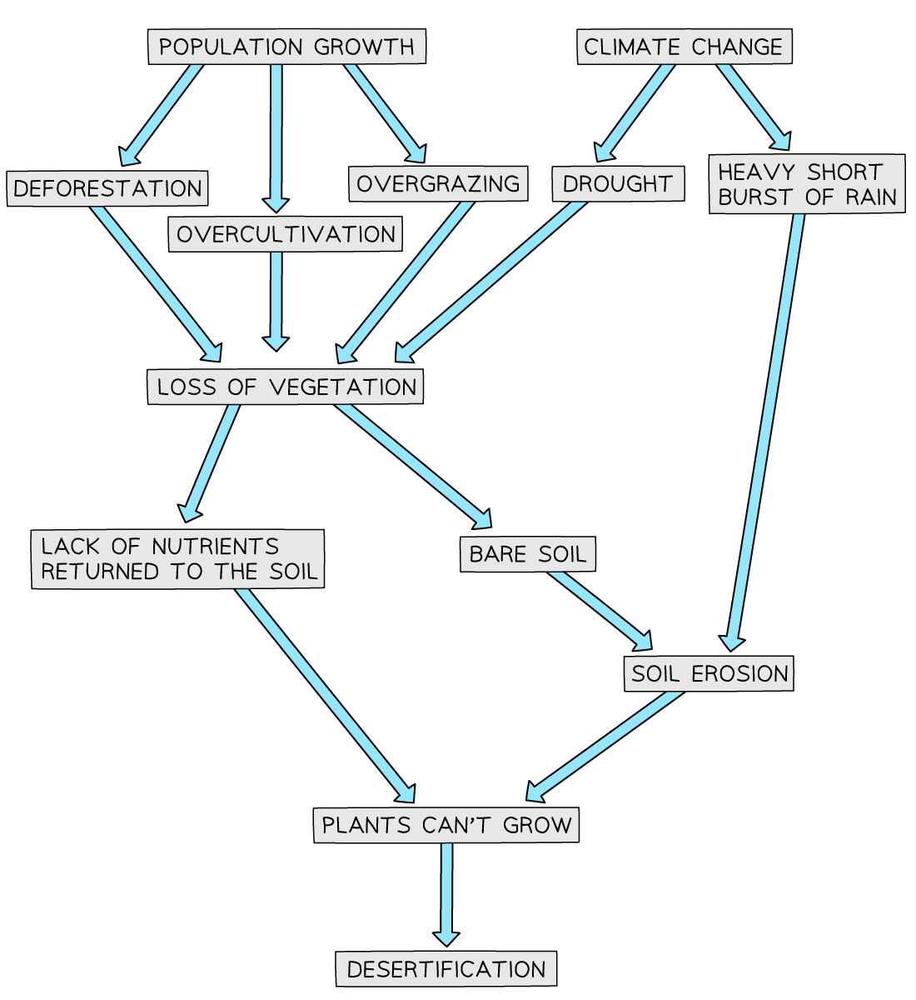
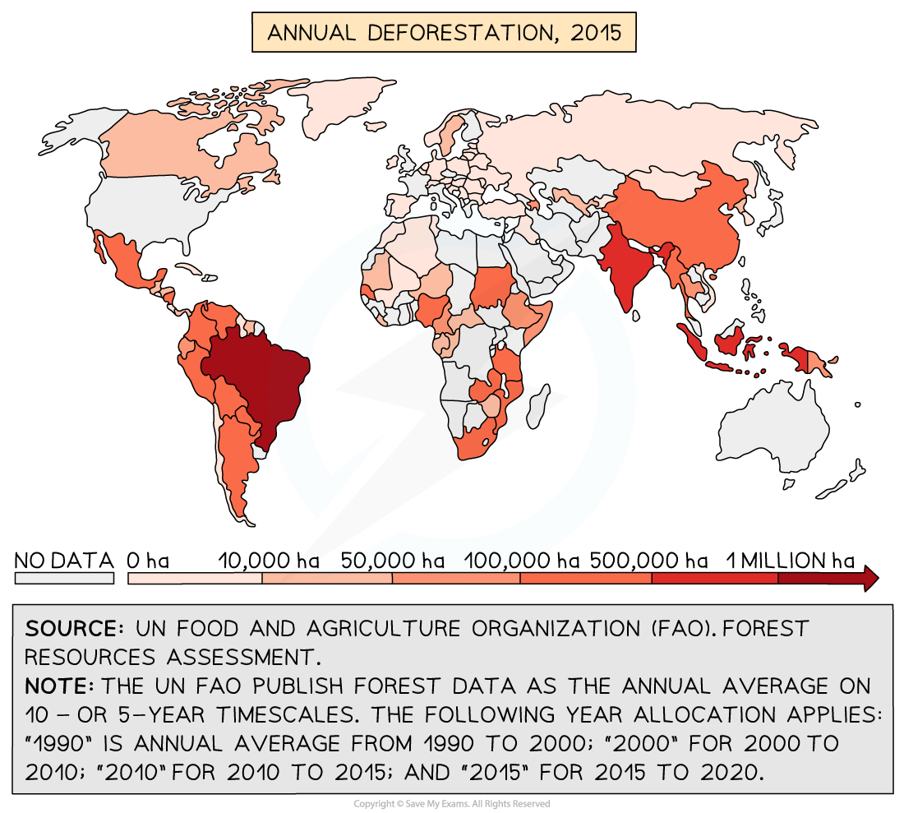
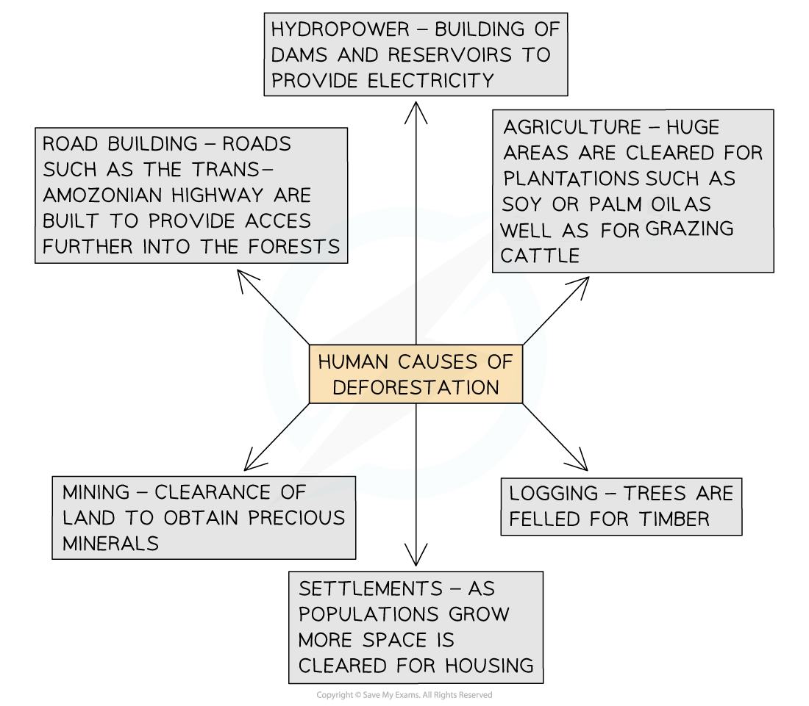

# Causes of Desertification & Deforestation

## Causes of Desertification

> **Spec point** — `spcpt_zz64rWBkrjmDhrGy`

## Causes of desertification

- ***Desertification*** is caused by both **natural factors** and **human activities**
- Many of the natural causes may be made worse by **climate change **

### Natural causes

- ***Soil erosion*** leads to the loss of nutrients. Plants are unable to establish and grow
- **Rainfall patterns** have become less predictable leading to drought and any vegetation dying due to lack of water
- **Reduced vegetation** means that nutrients are not added to the soil through the decomposition of dead organic matter
- Any rain that does fall is often in short, intense bursts, leading to increased surface runoff and soil erosion

### Human causes

- ***Overgrazing*** means the vegetation has all gone due to the number of animals or the land does not have a chance to recover
- *Over-cultivation* leads to all the nutrients in the soil being used
- **Deforestation** removes shade from the soil which means there are no roots which bind the soil together. This increases soil erosion, whilst decreasing infiltration and interception
- **Population growth** puts increased pressure on the land as people raise more animals and grow more crops

*Causes of Desertification*

## Causes of Deforestation

> **Spec point** — `spcpt_2XSdTbZFYWZpDbnJ`

## Causes of deforestation

- **Deforestation** is the **felling **and** clearance **of trees
- Brazil, Democratic Republic of the Congo and Indonesia are experiencing the highest levels of deforestation in the world

*World Deforestation 2015*

### Natural causes of deforestation

- **Wildfires** are a natural cause of deforestation

  - The frequency and severity of wildfires have increased. This is linked to climate change

### Human causes of deforestation

- There are six main human causes of deforestation

*Human Causes of Deforestation*

> **Worked Example**
> **(i)   Define the term deforestation           **
> 
> **(ii)  Outline two causes of deforestation **
> 
> **(6 Marks)**
> 
> - **Answer:**
> - (i)
> 
>   - The maximum mark requires a full and accurate definition
>   - The felling** (1) **and removal/clearance of trees **(1)**
> 
> - (ii)
> - Any two of the following to gain 1 mark to each for the cause with the 2nd mark for outlining/expanding linked to 1st mark so that cause is clear
> 
>   - Hydropower **(1)** to make space for dams and reservoirs **(1)**
>   - Mining** (1)** to make space for mining equipment and buildings **(1)**
>   - Agriculture **(1)** for grazing or planting crops **(1)**
>   - Settlement **(1)** to make space to build houses **(1)**
>   - Timber **(1)** for furniture/building/paper **(1)**
>   - Roads **(1) **to gain access to transport resources and people** (1)**
> - Factors need to be specific, not just human activity or climate

> **Exam Hint**
> It is important to remember that the causes of both desertification and deforestation are often a combination of factors rather than any one cause.
