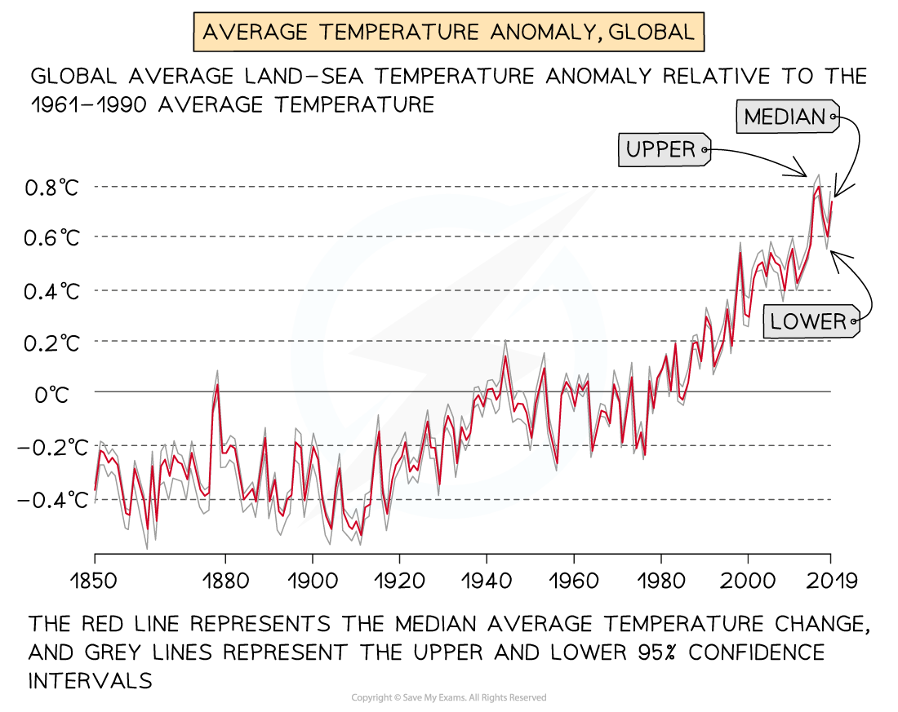
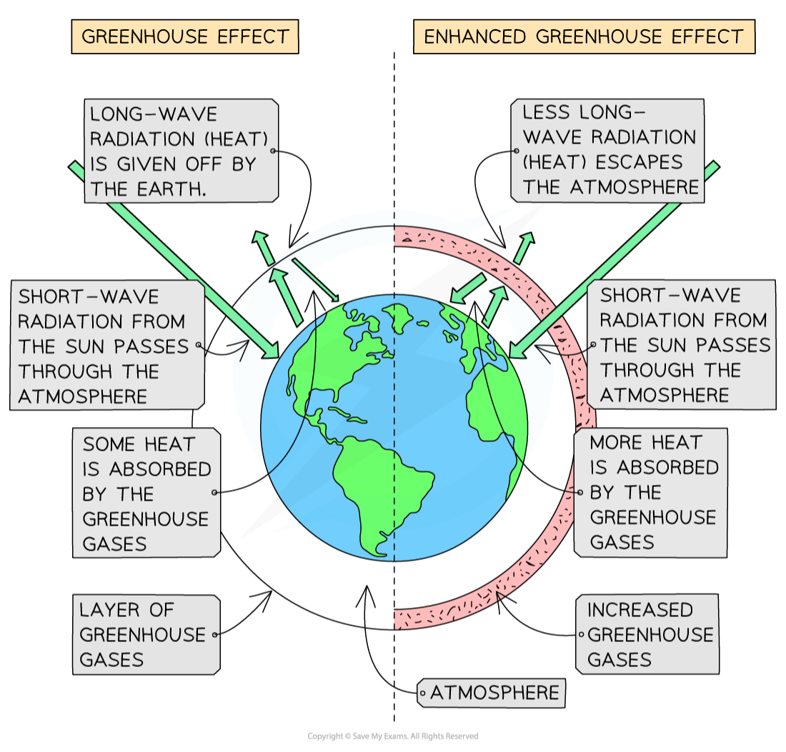

# Natural & Enhanced Greenhouse Effect

## Natural Climate Change

> **Spec point** — `spcpt_7VfTHN9kyrhQ7ffq`

## Natural climate change

### Changes in the global climate

- The global climate conditions of the Earth change over time, leading to colder and warmer periods
- The last 2.6 million years are the **Quaternary** period. During this, there have been 60 cold periods and warmer ***interglacial*** periods
- The last glacial or cooler era ended approximately 25,000 years ago
- The evidence for these changes comes from:

  - Ice cores which trap ash, air bubbles and microbes
  - Preserved pollen
  - Historical sources such as diaries and art
  - Tree rings

#### Milankovitch cycles

- The Milankovitch Cycles theory refers to** long-term** changes to the Earth's orbit and position

  - These changes affect how much **solar radiation** the Earth receives
- The Earth's orbit varies over a **100,000-year period; ** a more circular orbit leads to cooler periods and an elliptical orbit leads to warmer periods
- The Earth's tilt varies every** 40,000 years **and the greater the tilt the hotter the summers and the colder winters
- Every** 24,000 **years, the Earth wobbles on its axis and this can affect the seasonal temperatures

#### Volcanic eruptions

- Large-scale eruptions lead to vast quantities of ash being ejected into the atmosphere
- Ash in the atmosphere blocks solar radiation, leading to a decrease in temperatures

#### Sunspot activity

- Increased sunspot activity is linked to higher average temperatures

#### Atmospheric dust

- Asteroids and meteors entering the Earth's atmosphere may increase the amount of dust, which decreases temperatures

## Enhanced Greenhouse Effect

> **Spec point** — `spcpt_W4Fy3Vrp52VM757n`

## Enhanced greenhouse effect

### The greenhouse effect

- The greenhouse effect is essential to the survival of life on Earth:

  - Greenhouse gases in the atmosphere allow **short-wave radiation** from the sun through to the Earth's surface
  - This is absorbed by the atmosphere and Earth's surface and re-radiated as **long-wave radiation**
  - The greenhouse gases absorb some of the **long-wave radiation (which we feel as heat)**
  
    - They stop it from radiating out into space
  - This maintains the Earth's average temperature
  - Without the greenhouse effect, the average temperature would be -18oC

#### Greenhouse gases from natural sources

- **Water vapour **– evaporation from the oceans/seas and plants
- **Carbon dioxide** – volcanic eruptions, wildfires and respiration
- **Methane **- is emitted from oceans and soils as part of decomposition; termites also emit methane
- **Nitrous oxide** – soils and oceans

### The enhanced greenhouse effect

- Human activity is increasing the number of greenhouse gases in the atmosphere:

  - **Carbon dioxide** **(CO₂) **levels in the atmosphere have increased by more than 100 parts per million (ppm) to 420 ppm in 2020
- Increased amounts of greenhouse gases have led to the **enhanced greenhouse effect:**

  - Less **long-wave radiation (heat)** can escape the atmosphere
  - Average global temperatures have increased over 1°C since pre-industrial times

*Average Global Temperatures*

#### Human sources of greenhouse gases

- **Carbon Dioxide (CO****₂****) **

  - Burning of **fossil fuels **– power stations, vehicles
  - Burning of **wood**
  - **Deforestation** – trees utilise CO₂ in photosynthesis. The fewer trees there are, the less CO₂ is removed from the atmosphere
- **Methane (CH****₄****)**

  - Decay of organic matter – manure, waste in landfills, crops
- **Nitrous Oxide (N****₂****O)**

  - Artificial fertilisers
  - Burning fossil fuels
- **Chlorofluorocarbons (CFCs)**

  - Aerosols
  - Refrigeration units
  - Air conditioning

### Tipping point

- The **Intergovernmental Panel on Climate Change (IPCC)** warns that there is a tipping point, which they define as

> **blockquote**
> 'a critical threshold beyond which a system reorganises, often abruptly and/or irreversibly'

- This means that small changes can lead to large-scale changes which are irreversible

> **Worked Example**
> **Identify which of the following is the result of the enhanced greenhouse effect **
> 
> **(1 Mark)**
> 
> **     A.** increasing global average temperature due to natural causes
> 
> **     B.**decreasing global average temperature due to human activity
> 
> **     C**. increasing global average temperature due to human activity
> 
> **     D.**decreasing global average temperature due to natural causes
> 
> - **Answer:**
> 
>   - **C ****(1)**** - **The enhanced greenhouse effect causes the average global temperature to increase and is the result of human activity.

> **Exam Hint**
> Remember not all scientists agree about the causes of climate change. There are a few scientists who argue that global warming is the result of the Earth's natural climate pattern and not the result of human activities.
