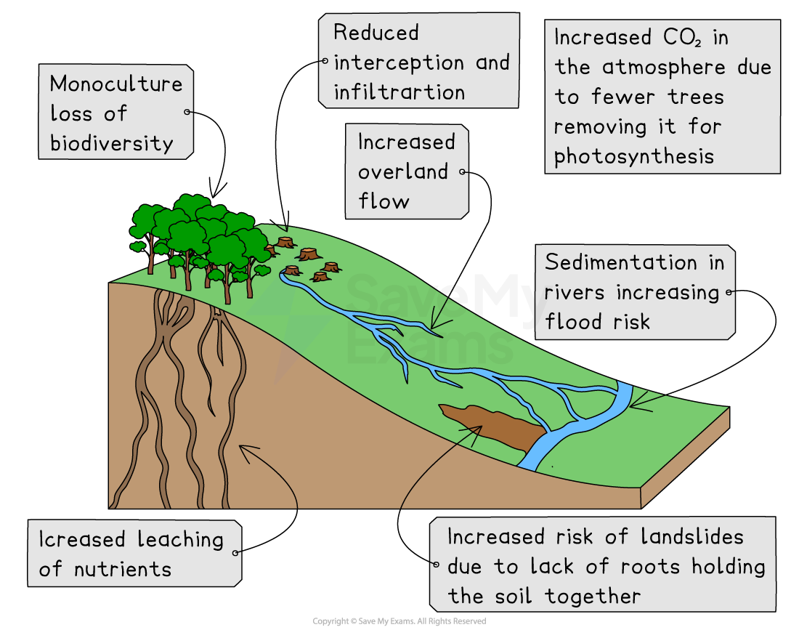

# Impacts of Deforestation

## Environmental Impacts of Deforestation

> **Spec point** — `spcpt_zyW4S8f39tkjz7g4`

## Environmental impacts of deforestation

- Many of the impacts of deforestation are environmental including:

  - areas that have been deforested being planted with ***monocultures*** which reduces **biodiversity**
  - **interception** and **infiltration** decrease which reduces **evapotranspiration** and as a result **precipitation** decreases
  - increasing **overland flow **which leads to soil erosion and ***sedimentation*** of the rivers
  - sediment building up on river beds reducing their capacity and increasing the flood risk
  - lack of **interception** increases the** leaching** of nutrients
  - fewer trees to absorb CO2 means an increase in the amount of CO2 in the atmosphere adding to the **enhanced greenhouse effect**
  - the use of monocultures leads to more use of fertilisers and pesticides which pollute water sources
  - local climate changes such as increased temperature and reduced precipitation

*Impacts of deforestation*

## Social Impacts of Deforestation

> **Spec point** — `spcpt_D5Q6X6zXD7SFQ8Cz`

## Social impacts of deforestation

- **Indigenous communities** have less land to sustain their traditional way of life this means:

  - the land does not get the opportunity to recover
  - there is **less food available **
- Improved** quality of life **for some people due to increased income and jobs
- Indigenous communities may give up their way of life leading to a **loss of culture and traditions**
- Increased risk of **landslides **which can destroy homes and block roads
- Loss of potential medicines
- Increased risk of **flooding **of settlements

## Economic Impacts of Deforestation

> **Spec point** — `spcpt_v3K6x7bhdR8rb3NT`

## Economic impacts of deforestation

- **More jobs** available in mining, forestry, agriculture and HEP
- **Increased income** for the country through the export of goods from the forest - minerals, timber, crops

  - Almost a quarter of Brazil's GDP comes from activities in the deforested areas of the Amazon

> **Worked Example**
> **Explain two negative impacts of deforestation on the environment**
> 
> ** (4 Marks)**
> 
> - Identify the command word
> - The command word is 'explain'
> - Your focus is on the negative impacts of deforestation on the environment so social or economic impacts will not be awarded a mark nor will positive impacts
> 
> - **Answer:**** **(any two of the following impacts and their explanation)
> 
>   - Increased risk of flooding **(1)** due to increased sedimentation of rivers reducing their capacity** (1)**
>   - Decreased biodiversity **(1)** due to the planting of monocultures** (1)**
>   - Increased CO2 in the atmosphere** (1)** due to fewer trees using CO2 in photosynthesis** (1)**
>   - Increased soil erosion** (1)** as a result of decreased interception **(1)**
>   - Reduced levels of precipitation **(1)** due to decreased transpiration** (1)**

> **Exam Hint**
> In the exam, the question may ask about the impacts on a particular area, for example, the impacts on people, the environment or the economy. It is essential that you focus your answer on that area and don't just write about impacts generally.
