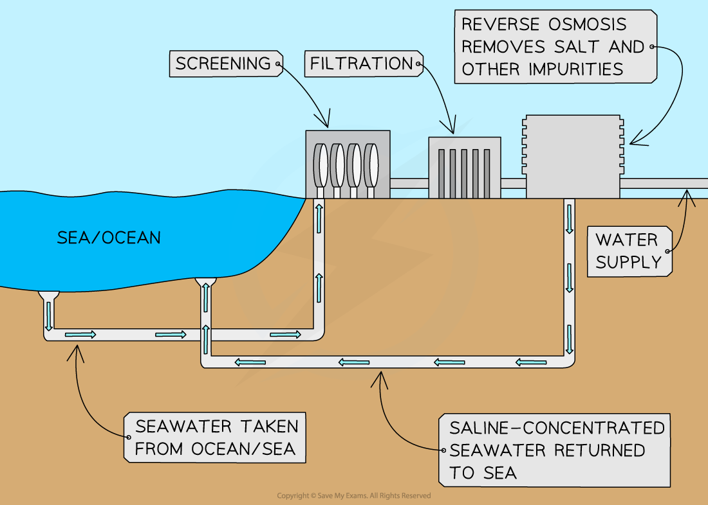
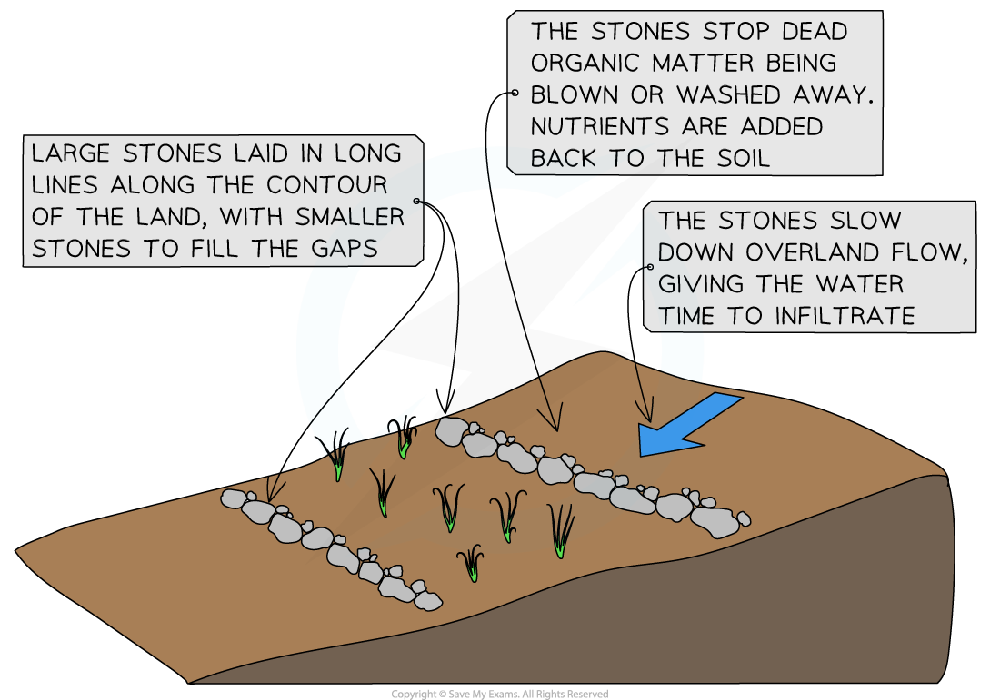

# Responses to Desertification

## Desertification - Water Shortage Solutions

> **Spec point** — `spcpt_xQ5r5CNvfzhn3SJv`

## Desertification - water shortage solutions

- Desertification can be halted and even reversed with careful management
- **Water shortages** are a key issue in areas at risk from desertification

  - **Desalination** can be used to increase water supply but the process is expensive
  
    - This means that only some countries can afford it
  - Groundwater can be abstracted using water pumps but care must be taken not to **over-abstract **

*Diagram to illustrate the desalination process*

### Other water shortage solutions

- Other techniques and filtration systems can be used to increase the supply of clean water

  - Solar water disinfection uses solar radiation to improve water quality
  - Life straw which filters unclean water

## Desertification - Other Responses

> **Spec point** — `spcpt_V2vHnMMjNsJrxtVc`

## Desertification - other responses

- Halting and reversing desertification means tackling the causes
- There are a variety of political and social responses

### Education

- Education including:

  - Sustainable farming methods including ***agroforestry*** and ***crop rotation***, which help to keep the soil healthy
  - Family planning to reduce population growth

### Agriculture

- Focus on livestock breeds which are better adapted to drier conditions
- Reduced herd size
- Use high yield varieties (HYV)
- Crop rotation

### Agroforestry

- This combines agriculture with forestry, which means some trees remain, which:

  - decreases deforestation
  - provides shade as well as increasing infiltration and interception, which reduces soil erosion
  - provides organic matter from the trees and adds nutrients to the soil

### Afforestation

- Tree planting, such as the **Great Green Wall **across the** Sahel**, helps to reverse desertification in several ways:

  - The roots help to bind the soil together reducing soil erosion
  - The canopy offers shade helping to prevent the soil from drying out and also reducing soil erosion from rainfall landing directly on the soil
  - Nutrients in the soil are replaced by falling leaves and branches
  - The trees increase animal and insect activity which helps improve soil quality

### Fertilisers, high yield varieties (HYV) and genetically modified (GM) crops

- Fertilisers, HYV and GM crops can:

  - Increase the yield
  - Reduce the amount of land cultivated
- HYV and GM crops may also be:

  - Drought resistant
  - Pest resistant

### Contour stones and terraces

- These help to reduce soil erosion by:

  - Preventing the soil from being blown or washed away
  - Increasing infiltration of water and reducing overland flow
  - Ensuring that dead organic matter stays in one place and can decompose adding nutrients to the soil

*Contour Stones *
