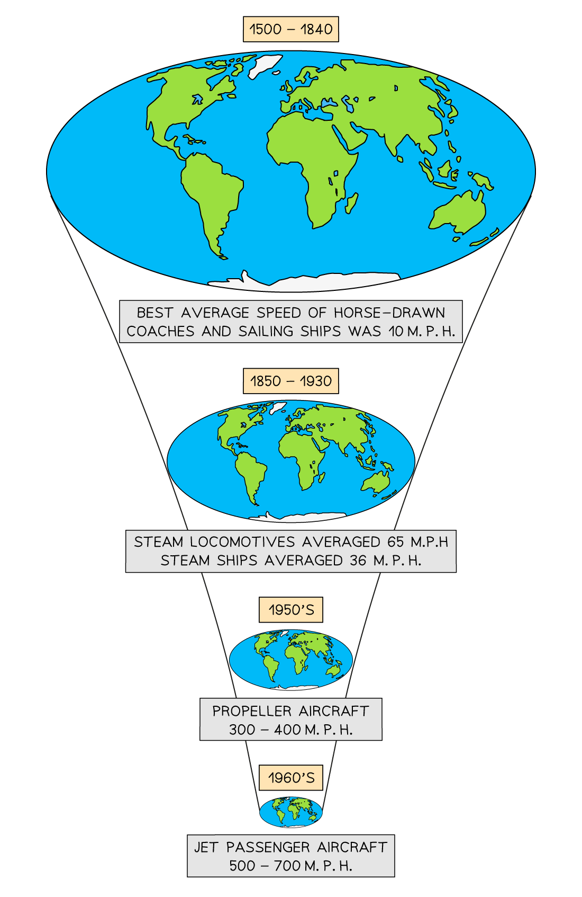
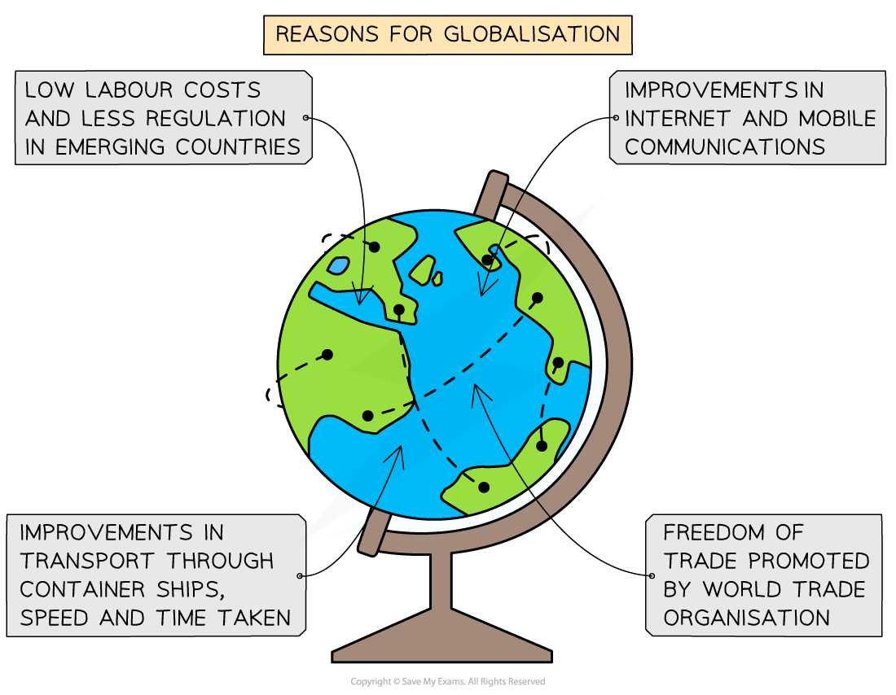

# Rise of the Global Economy

## Causes of Globalisation

> **Spec point** — `spcpt_5QWF8sqDgXWJJm2y`

## Causes of globalisation

- **Globalisation** is where the world has become or is becoming **interconnected **through the **processes **of:

  - economics
  - culture
  - politics
  - trade
  - tourism
- It also includes **environmental globalisation** through the impacts of **global warming**
- Modern transport and communications have made trade almost **instantaneous **
- Globalisation reduces the effect of political borders of countries

  - It makes them more ***interdependent***
- More powerful countries and businesses affect decisions in other parts of the world

  - This has led to a rise in **global inequality**
- **Global cities** have developed, which are the focus of the world economy
- The improvements and developments in communication and transport have made globalisation what it is today—a** shrinking world**

*Time-space compression*

- The **network flows** to places and populations are the result of  **four **significant developments:

  - Appearance of large transnational corporations (***TNCs***)
  - Growth of regional economics and ***trading blocs***
  - Development of modern transport networks
  - Advances in ***IT*** and communications, particularly the ***WWW*** and the ***internet***

## The Production Chain

> **Spec point** — `spcpt_9438byds5ccNGSfZ`

## The production chain

- The developments in globalisation have led to the formation of a ***global economy***
- There are very few countries in the world that haven't 'networked' in one way or another
- There are **five **different network flows:

  - Trade
  - Aid
  - Foreign investment
  - Labour
  - Information

### Trade

- Trade is the import and export of raw materials, food goods and services
- Increased volume of trade can lead to better political relationships between countries
- It can also lead to a  sharing of different cultures
- Trade between countries can increase economic development and reduce inequality
- However, global trade is** unequal**

  - **Developed countries** benefit more from trade than **developing** and **emerging countries **
  - Many developing countries are paid** low rates** for materials and products
- There are **fewer barriers **to trade than there were previously

  - *Tariffs* and *quotas* are much lower
- *Trade blocs* have developed to make trade easier. For example:

  - The **European Union (EU)** has encouraged free trade between its members, which has increased trade overall

### Aid

- Aid is the transfer of resources from one country to another to help with development or after a disaster

  - Most aid is economic, either through receiving or donating
- This allows developing countries to invest in education, health, infrastructure and trade

### Foreign investment

- Investment can either be direct or indirect

### Labour

- This is important to the working of the global economy and labour migration fuels this market either with a specialist or cheap labour
- The availability of** lower-cost labour **in developing and emerging countries has led many **transnational corporations (TNCs) **to invest in those areas

### Information

- Advances in communication mean that companies can have factories and offices around the world
- Media and advertising also increase the demand for products

### Commodity chain

- The global production, supply or ***commodity chain*** pulls these flows together to produce goods or ***commodities***

  - A commodity chain is therefore a pathway along which goods travel from producers to consumers
- Before the development of global production, products tended to be manufactured in one country

  - Globalisation means that parts of different products can be made in several countries
  - At each stage of the flow, **value is added** to the emerging product
- Despite the miles involved and the number of countries involved, the product is still cheaper to produce in various stages
- This is known as the **economies of scale:**  the cost per item reduces when operated on a large scale
- **Transport improvements** through large container ships mean that costs are reduced and goods are moved longer distances more quickly
- **Labour costs are cheaper** in emerging and developing countries and there are usually reduced legal restrictions

## Global Investment

> **Spec point** — `spcpt_pHszgygqCcqYSJxX`

## Global investment

- **Investment** is not just monetary (economic), although this is a large part of it

  - Investment can be in **people, research or products**
- **Foreign investment** is when individuals or firms from abroad invest in another country
- Call centres are examples:

  - Call centres can be located anywhere, e.g. India
  - **Investment **is made in the country through building the call centre, paying taxes, etc.
  - Local people are employed and trained
  - Service is provided to the donor country, for example the UK

### Transnational corporations

- **Transnational corporations** **(TNC)** provide most of the **foreign direct investment (FDI)**

  - Transnational corporations (TNCs) are companies which operate in more than one country
  - These companies invest in factories and infrastructure

### Location of manufacturing

- **Moving manufacturing** from developed to developing or emerging countries

  - China is the main area for manufacturing goods from around the world
  - Investments are made in China to produce goods
  - Completed goods are shipped back to the original country, e.g. Germany

### Labour

- **Investment **in **people,** either for cheap labour or for their expertise

  - Specialist surgeons from the USA to Australia
  - Investment in developments that attract cheap labour—the construction of Dubai attracts many Indian migrants
  - Research and development investment - motor car industry to build more fuel-efficient motoring—Elon Musk's Tesla electric cars

### Aid

- **Investment** can come from **aid **for rebuilding after a disaster. Ukraine will need aid after the war with Russia ends

  - Aid can be funds sent to the government to use as necessary, although this can often lead to corruption and funds not going where they should
  - Aid can be in the form of goods and services directed to the affected area – refugee camps or after a natural hazard such as a tropical storm or earthquake

> **Worked Example**
> **Identify the meaning of the term TNC **
> 
> **(1 Mark)**
> 
> **        A. **Translocal Corporation
> 
> **        B. **Transnational Corporation
> 
> **        C. **Transnational Country
> 
> **        D. **Transporting National Corporation
> 
> - **Answer:**
> 
>   - B **(1) –** as none of the other terms exist.
