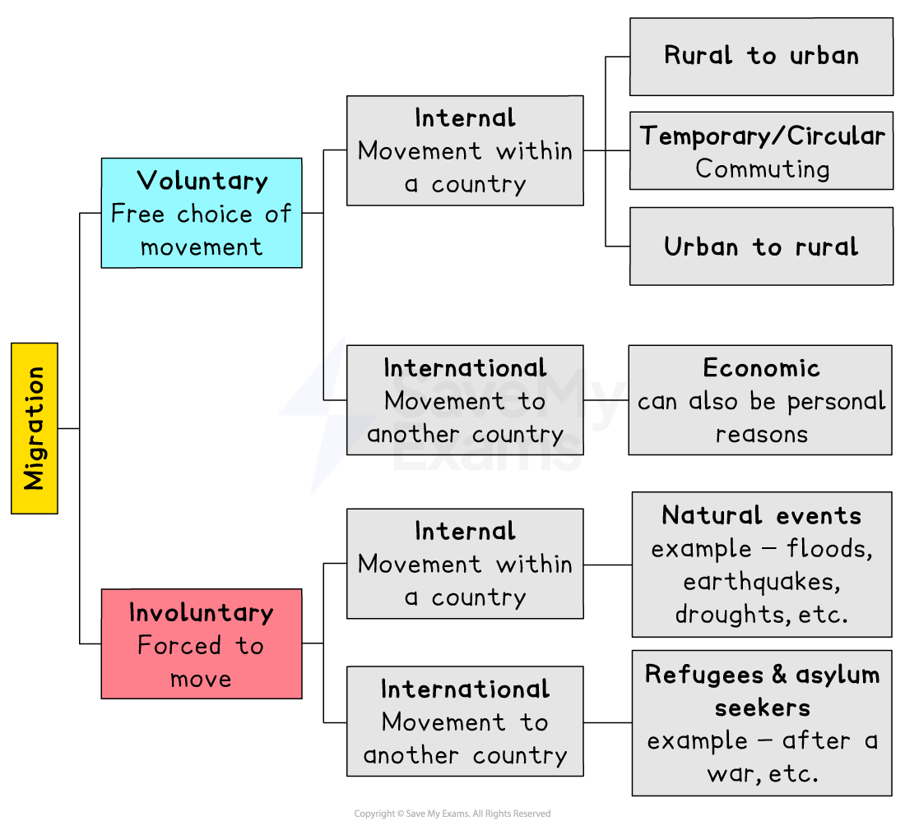
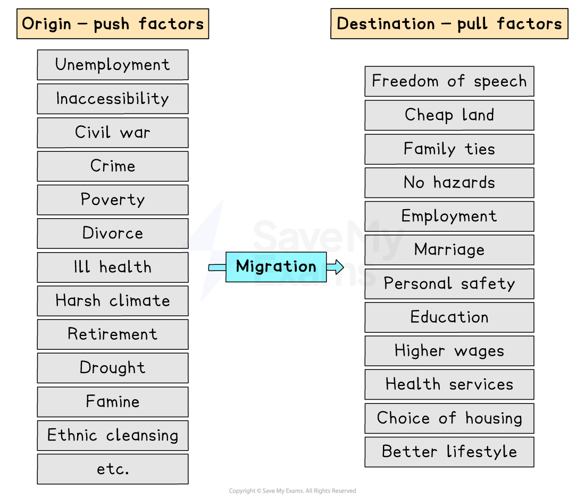

# Movement of People

## Push-Pull Mechanism

> **Spec point** — `spcpt_y2Z2RcGrTFtGD8tM`

## Push-pull mechanism

- People have always migrated from one place to another either within their country (***internal migration***) or across borders (***international migration***)
- **Globalisation** has made this move easier and faster
- There are different types of migration

  - **Forced (involuntary)**
  - **Voluntary**
  - **Circular**
  - **Political:** refugees and asylum seekers

*Types of migration*

- The main reasons for migration are **push-pull factors**
- The push factors are the **reality** of the current situation for the migrant

  - It is what makes the person consider moving from their **place of origin**
- The pull factors are the **perceived outcome**

  - It is what they imagine the move will bring to their **place of destination**
- Push-pull factors are **unique to each migrant,** depending on their end goal
- These factors can be divided into:

  - **Social**
  - **Economic**
  - **Political**
  - **Environmental**

> **Exam Hint**
> - Remember do not just state the opposite when asked to give push-pull factors
> - Poverty is a push factor, however, everywhere has certain levels of poverty, so a pull factor could be better welfare and healthcare services

*Push-pull factors of migration*

- High levels of unemployment are a push factor, but higher wages and a better lifestyle are a pull factor
- Three other factors related to migration are:

  - **modern communications**
  
    - Mass media allow people to 'see' and 'feel' distant places without the risk of moving to an unknown and potentially unwelcoming destination, making people more willing to migrate
  - **modern transport**
  
    - This moves the migrant to their destination quickly and cheaply once the decision has been made to migrate
  - **relaxed national borders**
  
    - Globalisation has made many countries more willing to relax their boundaries, particularly if it is to their advantage, e.g. skilled migrant workers, doctors, scientists, etc.

## Voluntary Migration

> **Spec point** — `spcpt_z8RFRYRCt59nHqvw`

## Voluntary migration

- **Voluntary migration** is the** free choice** to migrate or not

  - This can be **internal **(within the same country) or **international **(to another country)
- Voluntary migration is usually for **economic **reasons such as work, promotion, higher wages, etc

  - In **developing countries**, this is usually **internal**, from rural to urban areas
  - In **developed** countries, **counter-urbanisation** is more common, from urban to rural
- **Temporary economic migrants** (short-stay workers) are those people who migrate purely for economic purposes, stay for a few years or less and then move on
- **Retirement migration** is a new form of voluntary movement where pensioners retire and move elsewhere

  - Retirees no longer need to live close to a place of work
  - **Warmer climates**: Las Vegas is home to a large number of retirees due to its dry, warm climate
  - **Downsize** into a smaller and/or cheaper home to save costs with their pension (pensions are usually less than regular wages)
  - Retirees want a quieter, calmer or more attractive environment
- **Professional migration** involves sports people signing contracts to play for foreign clubs—footballers, cricketers, etc.

  - Players benefit from higher wages and bigger media profile
- **Medical migration** is where doctors, surgeons, etc migrate to other countries where their skills are in demand or patients migrate for health reasons

## Circular Migration

> **Spec point** — `spcpt_B5kSqG53JYrWbvJ8`

## Circular migration

- Circular migration is where there is **no intention of a permanent move**

  - This can be for work, medical, educational or pleasure reasons
- **Seasonal workers** are circular migrants who work in one place and return home after a short contract
- **Students** at university return at the end of the term to their normal place of residence
- **Medical** treatment encourages people to move to other countries temporarily
- **Tourism** encourages circular movement with longer stays

## Forced Migration

> **Spec point** — `spcpt_vshRF8H4Bq3cdRmc`

## Forced migration

- This is where a migrant has **no choice** but to leave their place of origin
- This is usually international but can also be internal
- There are several reasons for internally forced migration, including:

  - natural hazards
  - war and persecution
  - ethnic cleansing

### Natural hazards

- **natural hazards** such as volcanic eruptions, tropical storms, floods and droughts
- in most cases, survivors will move back home when it is safe to do so
- jobs become available again

### War  and persecution

- The most common reasons for forced migration are **war **and **persecution**

  - This includes events such as the Jewish people fleeing German and Russian troops during the Second World War
  - More recently, the Syrian civil war, where more than half of the country's population (13 million) has been forcibly displaced

### Ethnic cleansing

- **Ethnic cleansing** forces out entire groups or communities from the country

  - Bosnian Muslims in the former Yugoslavia
  - Rwanda in 1994, where the Hutus attempted to wipe out the Tutsis in 3 months, forcing 2 million people to flee

## Refugees & Asylum Seekers

> **Spec point** — `spcpt_bVbpnb7DTfrw4yTr`

## Refugees & asylum seekers

- The **UN High Commission for Refugees (UNHCR) **is responsible for those people forced to migrate—a **'person of concern'**
- There are four different categories:

  - **Refugee**
  
    - a person who lives outside their country of nationality because of well-founded fears of being persecuted, either through race, religion, political opinions or social groups
  - **Asylum seeker**
  
    - a refugee who has applied for citizenship in a country that has provided protection
  - **Internally displaced person (IDP)**
  
    - forced to flee their home but do not cross international borders
  - **Returnee**
  
    - a refugee or asylum seeker  who has voluntarily returned to their own country or an IDP who has returned home again
- In 2021, UNHCR estimated that there were 89.3 million people worldwide who were **forcibly displaced **
- Of these, 27.1 million were **refugees**, 53.2 million were **IDPs**, and 4.6 million **asylum seekers**
- Children account for 41% of forcibly displaced people
- Five origin countries account for 69% of all refugees:

  - Syrian Arab Republic (27%)
  - Venezuela (18%)
  - Afghanistan (11%)
  - South Sudan (9%)
  - Myanmar (5%)
