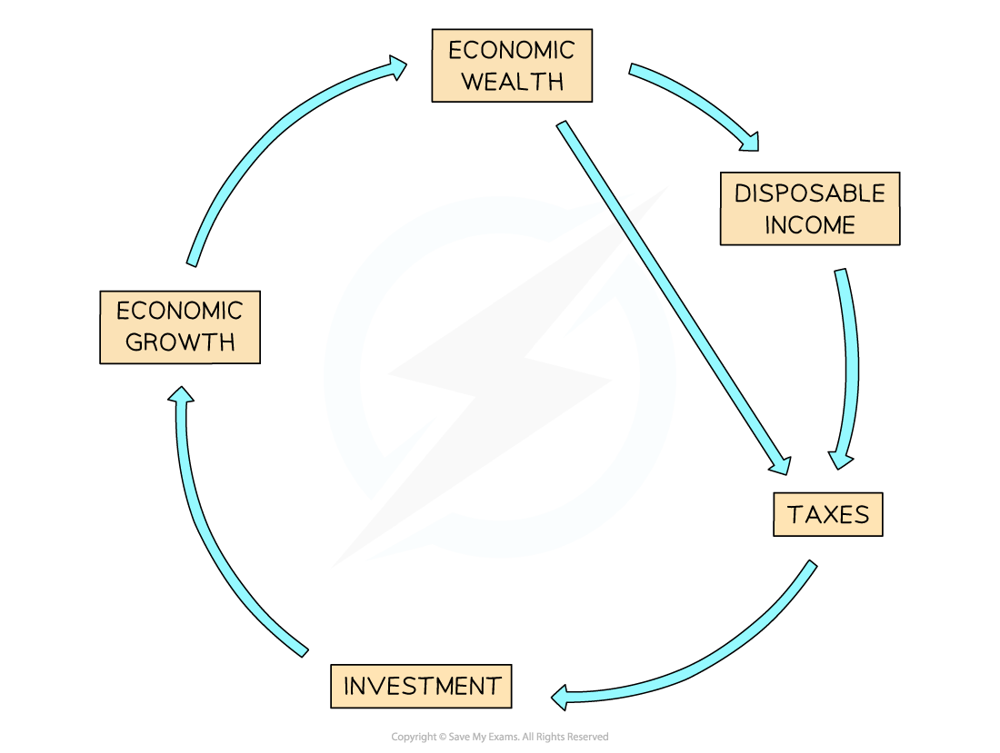

# Defining Development

## Defining Development

> **Spec point** — `spcpt_SSpkqyDWScPNV8NW`

## Defining development

- **Development** is the progress (**improvements**) that countries make

  - The progress improves the lives of the population and makes the country more independent
  - For example, improving water infrastructure so more people have a supply of clean water
- Development is not a smooth, continuous process
- A range of factors may slow, halt, and even reverse development, including:

  - war/conflict
  - disease
  - disasters
  - economic ***recession***

### Strands of development

- Progress is not just about a country's wealth but also other areas
- These are called** strands of development **and include:

  - **economic** - increasing levels of pay, the standard of living and productivity
  - **demographic **- life expectancy, birth control, the right to migrate
  - **social **- equal opportunities, access to services such as education and healthcare
  - **cultural** - education, diversity, traditions and heritage
  - **political** - free speech, democracy, human rights and the right to vote
  - **environmental **- pollution controls, conservation

### Economic development

- Economic development is often the key to development in all the other areas
- This is dependent on three things:

  - **Resources: **Every country has both natural resources (minerals, soils, climate etc.) and human resources (workers, capital, technology, etc.)
  - **Internal boosters:** These are things which help to utilise the resources, for example government intervention, businesses
  - **External boosters:** These are from outside the country and include **Transnational Corporations (TNCs)**, **globalisation** and international agencies

- **Levels of development** vary on a local, national and international scale
- There are differences between areas of the same city, the same country and between countries
- At the international level, the development of a country can be categorised into one of three groups:

  - **Developed** - a country with very high human development
  - **Emerging **- a country with high or medium human development
  - **Developing **- a country with low human development

## Cycle of Wealth

> **Spec point** — `spcpt_2gqYQcFSRZSPbkbS`

## Cycle of wealth

- The **cycle of wealth** is one of the keys to development
- Economic development creates wealth
- If a country has a **stable** and **effective government**, this also leads to development
- As the economy grows, more people work and earn more money:

  - The government can then **collect more taxes** and people have more **disposable income** to spend, which increases business profits
  - The taxes collected and profits made by companies can then be invested in future growth as well as infrastructure, education, healthcare, etc.

*Cycle of Wealth*

> **Exam Hint**
> Remember, when writing about development in the exam, increasing wealth is not equally distributed. In all countries, some people will benefit more from the cycle of wealth and economic development. Often, as a country develops, the gap between the rich and poor increases.

## Human Welfare

> **Spec point** — `spcpt_7wJnwCzxpMzCQwq5`

## Human welfare

- Human welfare is often referred to as **quality of life**

  - Quality of life includes many components and is difficult to define
  - It includes ***subjective*** evaluations of life, such as happiness
  - The different components are linked together; for example, health and environment are dependent on income, which in turn may impact happiness

### Components of quality of life

- **Physical** components include:

  - housing
  - environment
  - diet
- **Social** components include:

  - family and friends
  - leisure
  - welfare services
  - education
- **Economic** components include:

  - standard of living
  - reliable income
- **Psychological **components include:

  - happiness
  - health
  - security/safety
  - satisfaction

> **Worked Example**
> **Identify the meaning of the term quality of life**
> 
> ** (1 Marks)**
> 
> **        A.** A person's well-being in terms of environment, security and health
> 
> **        B. **A person's level of deprivation
> 
> **        C. **A person's level of income
> 
> **        D. **A person's type of job
> 
> - **Answer:**
> 
>   - **A ****(1)**** - **The other answers are objective and so do not relate to the quality of life
