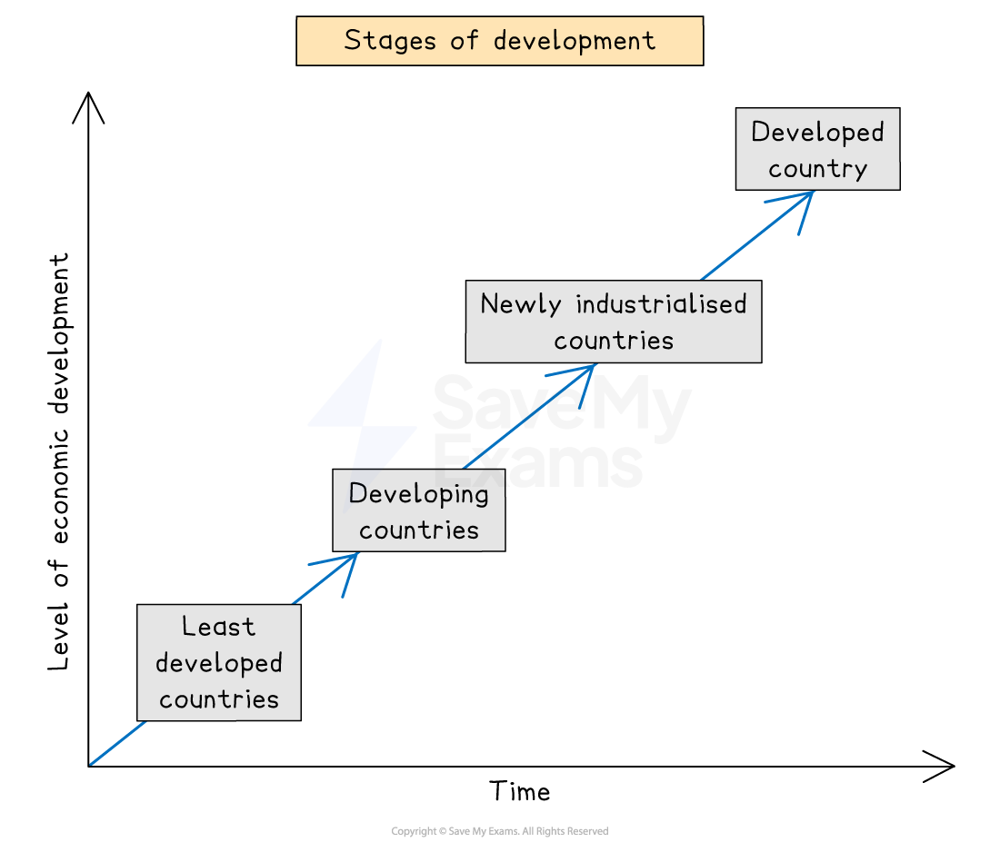
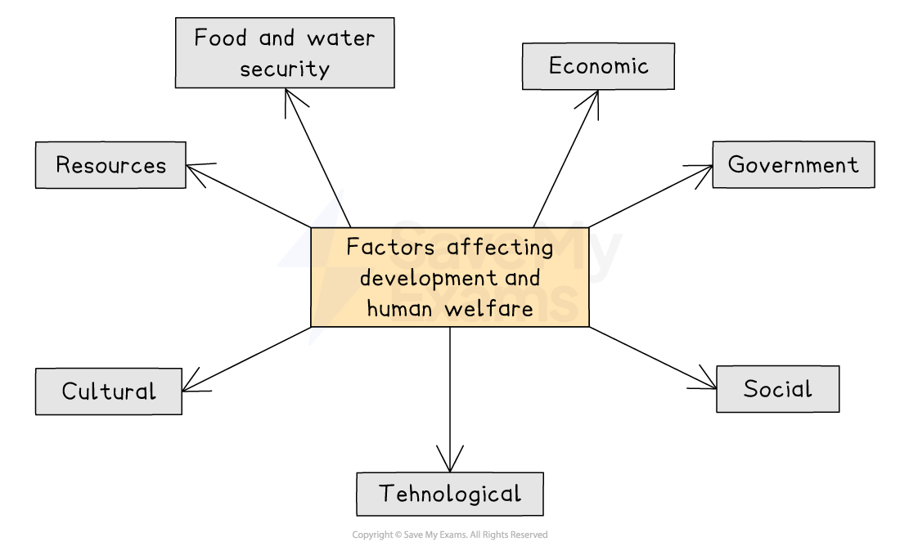

# Factors Affecting Development & Welfare

## Stages of Development

> **Spec point** — `spcpt_GN4K7Df5dJJSM2yP`

## Stages of development

- All countries move through the different stages of development
- The UN identifies **four main stages of development**

*Graph showing the stages of development*

### Least developed countries (LDCs) and developing countries

- The countries with the lowest level of development are the **least developed countries (LDCs) **
- The UN reviews the list of LDCs every three years

  - There are currently **44 LDCs **(2024)
  
    - Africa - 31 countries
    - Asia - 8 countries
    - Caribbean – 1 country
    - Small Island Developing States (SIDS) - 4
- The criteria for inclusion in the list of LDCs is:

  - **Gross National Income (GNI)** below US\$1,018
  - Poor health and education levels
  - Economic and environmental vulnerability
- The LDCs and developing countries are:

  - at a disadvantage in world trade
  - vulnerable to natural hazards
  - lacking infrastructure
  - dependent on primary resources
- Colonialism has also impacted all 44 of the LDCs as well as many **developing countries**, leading to:

  - depletion of resources
  - environmental degradation

### Emerging economies

- **Emerging economies** are also known as **newly industrialised countries (NICs)**

  - These countries have moved up the stages of development
  - Countries that have become emerging economies include:
  
    - Singapore
    - South Korea
    - Brazil
    - China
    - India

## The Development Gap

> **Spec point** — `spcpt_3s5BP7G49PDcjTHx`

## The development gap

- The **development gap **is the difference in levels of development between the least developed and most developed countries in the world
- There are many factors which lead to the differences in development

*Factors affecting development and human welfare*

## Natural Resources

> **Spec point** — `spcpt_GpSWMmv8QnV6SNhR`

## Natural resources

- **Physical geography**

  - ***Landlocked*** countries find **trade **more difficult and so often **develop more slowly**
  - Small countries develop more slowly due to having fewer human and natural resources
  - Those countries with **extreme climates** develop more slowly
  - The **physical geography** also impacts the natural resources available

- The **natural resources **are those things provided by the physical environment

  - **Water **- domestic use, energy
  - **Forests** – timber, habitat, rubber, recreation, food, medicines
  - **Fossil fuels **– fuel, energy
  - **Soil **- growing crops
  - **Rocks** - construction
  - **Minerals **- glass, jewellery, money
  - **Animals** - food, skins

- Some countries can meet all their needs from the natural resources they have
- Many countries have to ***import*** some natural resources that are not available within their borders
- When countries have to import natural resources, this means they do not have the security of supply, as imports could be affected by war or political issues
- **Water, food** and **energy security** are vital to support a country's development

## Human Resources

> **Spec point** — `spcpt_fp4kvK9zwKVB8vZk`

## Human resources

- **Demography**

  - The **population structure** of a country
  - The **birth** and **death rates**, as well as **immigration,** affect the available workforce
- **Technology**

  - Can help to increase water, food and energy security
  - **Mechanisation** of farming increases yields and improved land surveying may reveal more energy sources
  - Technology can also mean that existing resources are used more efficiently
  - Internet access supports economic and social conditions
  
    - It supports business
    - Improves access to education and health
    - The number of people using the internet is known as the **internet penetration rate**
- **Social **

  - **Levels of education** affect the skills people have. The more educated a population is, the more a country will develop
  - **Healthcare** affects how well people are, which affects their ability to work
  - **Lack of equality** can mean that the overall productivity of a country is affected

## Governmental Inputs

> **Spec point** — `spcpt_Fx6ZSDjMJyQ5StzB`

## Governmental inputs

- The **stability** and** effectiveness of government** can have a significant impact on development and human welfare
- Development and human welfare are greatest where there is a **democratically elected government**
- **Corrupt governments** do not invest in the country's development or in improving the quality of life for the population
- Governments impact economic policies which in turn affect development and human welfare

  - Open economies where foreign investment is encouraged to develop faster
  - The higher rates of saving and lower spending result in faster development

> **Worked Example**
> **Study figure 1, which shows GDP per capita in South America and the percentage change in GDP**
> 
> 
> 
> **Identify one piece of evidence that there is a development gap in South America **
> 
> **(2 Marks)**
> 
> - **Answer**
> 
>   - It is important that for the second mark you use evidence from the source
>   - There is a difference in GDP per capita between countries: **(1) **French Guiana has a GDP per capita of less than US\$4,000, whereas Suriname has a GDP per capita of over US\$13,000 **(1)**
> 
> **Final answer:** **OR**
> 
> - There is a difference in the percentage increase in GDP per capita.** (1) **Guyana's increase in GDP per capita is only 1.4%, whereas Chile's is 3.7% **(1)**

> **Exam Hint**
> Remember, where an exam question asks for one piece of evidence, do not give more than that. In the case of the worked example, the one piece of evidence is the comparison between two countries.
