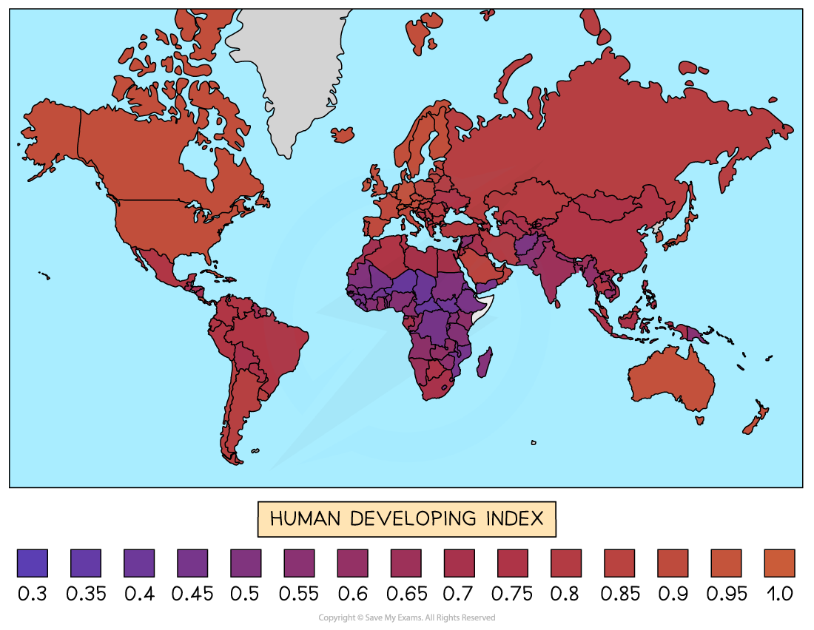
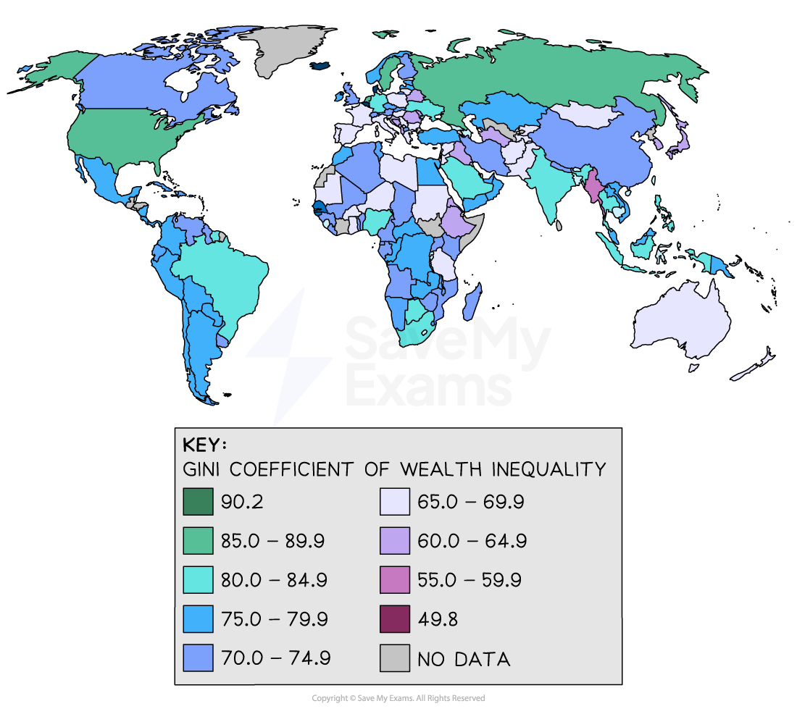

# Measuring Development

## Measuring Development

> **Spec point** — `spcpt_H6W24739YvXmtMJV`

## Measuring development

- Measures of development can be economic, social or  a combination
- Some of the most commonly used include:

  - literacy
  - life expectancy
  - infant mortality
  - GDP

### Literacy

- Literacy is a measure of how many adults can read and write

  - In developed countries literacy rates average 96%
  - Less-developed countries have average literacy rates of 65%

### Life expectancy

- Life expectancy is the average age a person can be expected to live

  - Life expectancy is impacted by:
  
    - physical and human environmental factors
    - personal lifestyle
    - incidence of disease
    - access to healthcare

### Infant mortality

- Infant mortality rates refer to the number of children per 1000 who die below the age of 1
- Over 18 countries have an infant mortality rate of over 50 per 1000

  - These are all developing countries
  - Most of these countries are in Sub-Saharan Africa

### Gross Domestic Product (GDP) per capita

- **Gross Domestic Product (GDP) per capita** is the total value of goods and services produced within a country in a year divided by the population of the country

  - There can be huge differences in GDP depending on the size and population of a country
  - Dividing it by the population means that more meaningful comparisons can be made between countries
- GDP per capita is an **average** this means that the variation in wealth is hidden

  - It is possible that two countries can have the same average GDP per capita but that one has a few very wealthy people and lots of people living in poverty whereas the other has a more equal distribution of wealth
- There is no way of knowing what the GDP is spent on

  - GDP increases after an earthquake due to rebuilding which is needed
  - This does not mean that the country is more developed or that everyone's quality of life has improved

## Human Development Index

> **Spec point** — `spcpt_kWktPq8Gvsd8zCBV`

## Human development index

- The **Human Development Index (HDI)** is a **combined measure** of average achievement in key areas of human development, health, education and standard of living using the following data

  - **Life expectancy** at birth
  - Mean years of **schooling **for adults aged 25 years
  - Expected years of education for children at school entering the age
  - ***Gross National Income*** (GNI) per capita
- Countries can be divided into four groups using HDI

  - **Very High Human Development (VHHD) **
  - **High Human Development (HHD)**
  - **Medium Human Development (MHD)**
  - **Low Human Development (LHD)**
- HDI is scored from 0 to 1
- The higher the HDI the higher the level of development and quality of life
- Norway has the highest HDI at 0.957
- Niger has the lowest HDI at 0.394

*Map showing Human Development Index (HDI)*

## Measures of Inequality

> **Spec point** — `spcpt_xdMVHSRb4X5F6Xzb`

## Measures of inequality

- GDP and HDI are not able to identify inequality within countries
- In some countries, there is a significant gap between the wealthy and the poorest in the population
- The **Gini coefficient index **is used to analyse the distribution of wealth and identify the countries where wealth distribution is most unequal

  - Measured on a scale of 0 - 1.0 or as a percentage
  - A **low value** means that the distribution of wealth is more equal - a measurement of 0 would mean that wealth is distributed completely equally
  - A **high value **means the distribution of wealth is unequal - a measurement of 1 would indicate maximum inequality
  - The Gini coefficient index is usually between 0.24 and 0.63 or 24%-63%
- The highest inequality is currently in South Africa, Central Africa, Namibia, Zambia and Suriname
- The lowest inequality is in the Czech Republic and Croatia

*Gini Index - income inequality map*

## Indices of Political Corruption

> **Spec point** — `spcpt_7chD4Qpf73gTKfyN`

## Indices of political corruption

- Political corruption can have a devastating impact on both development and human welfare

  - It means money is often not invested in infrastructure, development and human welfare but goes to wealthy individuals
  - It leads to a lack of trust between local/national governments and the population
- **Transparency International** scores 180 countries around the world out of 100 based on the levels of **public sector corruption**
- The higher the score the less corruption has been found

  - Denmark, New Zealand, Finland and Singapore have the lowest levels of public sector corruption scoring 85/100 or more
  - Somalia, Syria and South Sudan have the highest levels of public sector corruption scoring less than 15/100

> **Worked Example**
> **Suggest why GDP per capita is not necessarily a good indicator of the quality of life. **
> 
> **(2 Marks)**
> 
> - **Answer**** **- any two of the following
> 
>   - GDP measures only economic production **(1)**
>   - Quality of life is not only about income** (1)**
>   - GDP is an average measure so many people may have incomes below this **(1)**
>   - The wealth is not shared equally across the population** (1)**
>   - It depends on what the GDP is spent on - weapons do not improve quality of life** (1)**
>   - It does not consider health or education **(1)**

> **Exam Hint**
> No measure of development will be completely reliable as they all look at different factors. Quality of life and development is a combination of a wide range of factors, not just a few.
