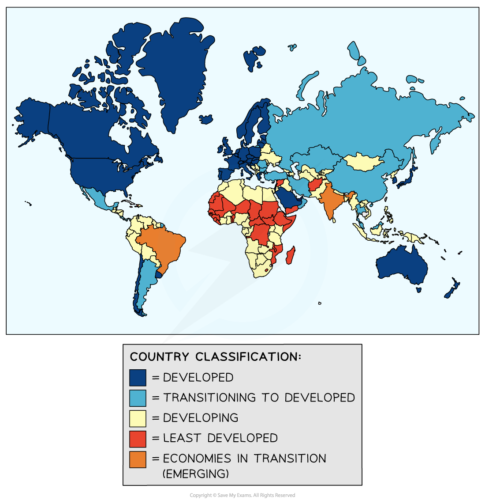
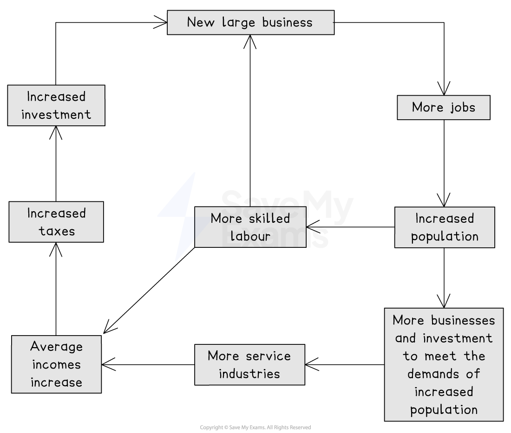

# Pattern of Uneven Development

## Pattern of Uneven Development - Countries

> **Spec point** — `spcpt_DJjM6dVCDBFdPb7M`

## Differences between countries

- Every country's level of development situation is unique
- Each country can be placed into one of the four categories as identified by the UN

*World Stages of Development*

- As well as the reasons outlined for the development gap, there are other reasons why countries are at a certain level of development

## Pattern of Uneven Development - Historic Factors

> **Spec point** — `spcpt_C5XwpPkRgFTvsHYy`

## Historic factors

### Colonialism

- ***Colonialism*** hindered many countries' development
- European countries exploited countries they colonised in the 1700s and 1800s

  - The European countries colonised the countries and then took the resources of those countries to sell for profit
  - There was an investment in colonies, but this was focused on products and infrastructure that would help the European country exploit the country and its people
- Borders were often decided by the European countries with no regard for the boundaries set by the ***Indigenous*** communities
- This led to future tensions and conflicts

### Neocolonialism

- **Neocolonialism** describes how developed countries dominate the least developed and developing countries today
- **'Land grabbing', **where wealthier countries buy large areas of farmland in the least developed and developing countries, is of increasing concern
- In 2012, it was estimated that** 200 million hectares **of land, mainly in Africa and Asia, had been bought by wealthier countries to grow food for their populations
- This has several impacts on those countries, including that it:

  - forces Indigenous populations off their land
  - reduces the amount of food grown for the local population
  - uses vital water resources
  - increases pollution of water and the environment through the use of fertilisers and pesticides

## Pattern of Uneven Development - Social Factors

> **Spec point** — `spcpt_FCWWqfFD8T5tyzV8`

## Social factors

- Where investment in education and health is lower, countries develop at a slower rate
- Education helps to increase the number of people with higher levels of education and skills, which:

  - increases the skilled workforce
  - supports the development of secondary and tertiary economic activities
- Investment in healthcare and clean water reduces the number of people who are sick:

  - People are healthier and more able to work, which boosts the economy

## Pattern of Uneven Development - Political & Economic Factors

> **Spec point** — `spcpt_Ctm4CxGtqTWPT45p`

## Political & economic factors

### Politics

- Political corruption can affect investment in infrastructure, education and healthcare
- Wars and conflict lead to money being spent on weapons rather than investment in development

### Economy

- ***Open economies***  encourage foreign investment to help them develop more rapidly
- Large-scale investment by **Transnational Corporations (TNCs)** can lead to the ***multiplier effect*** or ***cumulative causation,*** which further boosts the economy
- The least developed and developing countries tend to rely on primary produce, which means profits are lower as the price paid for the goods is lower
- Many of the least developed and developing countries are in debt to the developed countries, which means that:

  - The countries have to spend money paying off the debt and the interest on the debt
  - There is reduced investment in development

## Pattern of Uneven Development - Differences Within Countries

> **Spec point** — `spcpt_NpK74YdxgG9bR7v9`

## Differences within countries

- As well as differences between countries, there are also differences in development within countries:

  - This can be seen in all countries, whether they are developed, emerging or developing
  - Often, development is focused on particular regions
- Inequalities within countries are due to several factors
- **Cumulative causation** theory is one explanation for regional differences:

  - Growth in the **core region** attracts skilled labour and capital
  - Areas in the **periphery **suffer as skilled labour leaves and investment is focused on the core
  - The gap between the core and the periphery grows
  - Eventually, the growth of the core region may stimulate growth in the periphery due to the demand for raw materials

*Theory of cumuluative causation*

- There are three stages of regional inequality:

  - **Pre-industrial stage **- regional differences are at their lowest
  - **Period of rapid economic growth** – increasing regional differences
  - **Regional economic convergence** - where wealth from the core spreads to other parts of the country

### Causes of regional inequalities

#### Residence

- Urban areas generally attract greater levels of investment, leading to increased business and incomes:

  - There may also be inequality within the urban area

#### Ethnicity

- Discrimination can result in ethnic groups having income levels significantly below those of the dominant groups within a country

  - This reduces the opportunities open to these groups
- Ethnic minority groups often have higher levels of:

  - informal employment
  - unemployment
  - poverty

#### Employment

- The split between formal and informal employment impacts incomes
- Formal jobs usually have higher incomes and greater benefits, such as holidays and sick pay

#### Education

- Those with higher levels of education usually gain higher-paying employment
- Higher education levels among women are linked to lower fertility rates

#### Land ownership

- Inequalities in land ownership are strongly linked to inequalities in income
