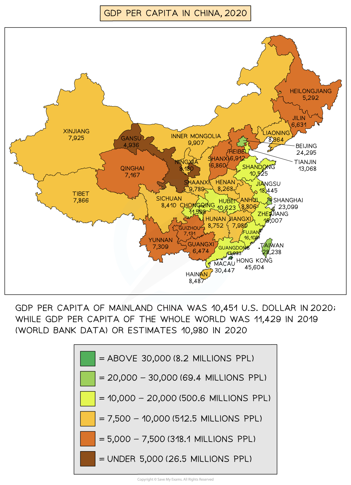

# Impact of Uneven Development

## Example Case Study: Impacts of Uneven Development - China

> **Spec point** — `spcpt_4r3bxzYfBg9cgf2H`

## Example case study: impacts of uneven development – China

- China has a wide variation in** GDP per capita **by province
- Beijing and Shanghai have a GDP per capita of over US\$23,000
- Four provinces all along the **East Coast** have a GDP per capita of over US\$13,000
- The province of Gansu has the lowest GDP per capita of US\$4936

*China GDP per Capita by Province*

- The provinces along the east coast can be regarded as the **economic core** of China
- Most **secondary** and **tertiary economic activity **is located there
- The** economic periphery** is to the west and far northeast of China and includes:

  - the Gobi and Taklamakan Deserts
  - Plateau of Tibet – mountainous region including the Himalayas

### Social impacts

- There are several areas where the **development gap** affects human welfare.

  - Approximately, **17 million** people are still living on about US\$2.30 a day
  - Over **90% **of people living in poverty live in rural areas
  - The standard of housing is often poor
  - Increasing numbers of people are being moved to apartment blocks to free up land for factories
  - Over **25% **of rural households have access to piped water
  - **Literacy rates **in rural areas are **65%,** whereas in urban areas they are **84%**
- Regional inequality has led to significant **rural-urban migration** in China

## Economic Impacts

> **Spec point** — `spcpt_jY2rcC2gdwJYgfns`

## Economic impacts

- In some areas, the rate of **unemployment** in rural areas is over **30%:**

  - This leads to increased** poverty**
- Difficult to attract businesses to these regions
- The **periphery** is more dependent on **primary economic activities**

## Environmental Impacts

> **Spec point** — `spcpt_Vq36y4dxR4VN7WkW`

## Environmental impacts

- Only **15%** of rural sewage is collected and treated properly

  - This leads to **water contamination **and **disease**
- The use of** biomass **for cooking and heating increases** indoor air pollution**
- Lead, zinc and other mining waste increase water pollution
- Small industries such as those that process electronic waste don't dispose of the waste safely
- More than **40% **of China's land is degraded from **over-cultivation**, **overgrazing** and **erosion**
- **19% **of farmland is contaminated by heavy metals and chemical pollutants

> **Worked Example**
> **Suggest one impact of uneven development within a country**
> 
> ** (3 Marks)**
> 
> - Your answer needs to identify an impact, explain it and then outline it to gain the full three marks. Below are two examples of how you could answer the question.
> 
> - **Answer **** **
> 
>   - People may have a low quality of life **(1) **due to the lack of access to clean water** (1); this** can lead to people drinking unclean water, which makes them ill/spreads diseases **(1)**
> 
> **Final answer:** **OR**
> 
> - People may have little access to schools **(1); this** means that children do not learn to read and write **(1), **which means they are not able to get better jobs and increase their income **(1)**
