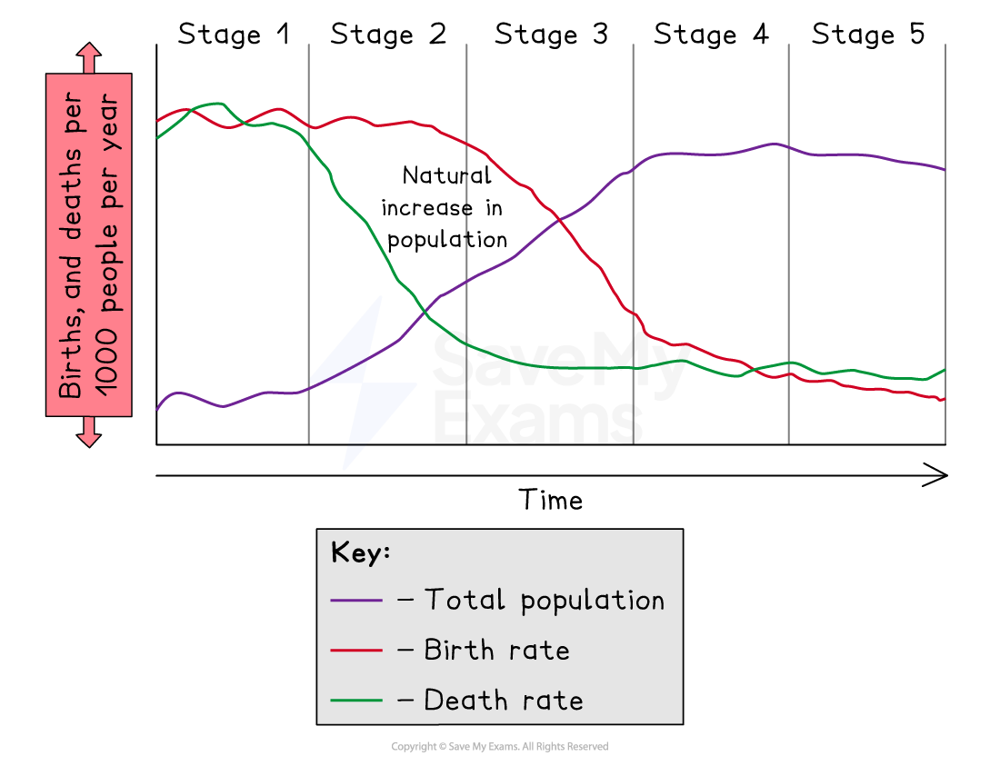
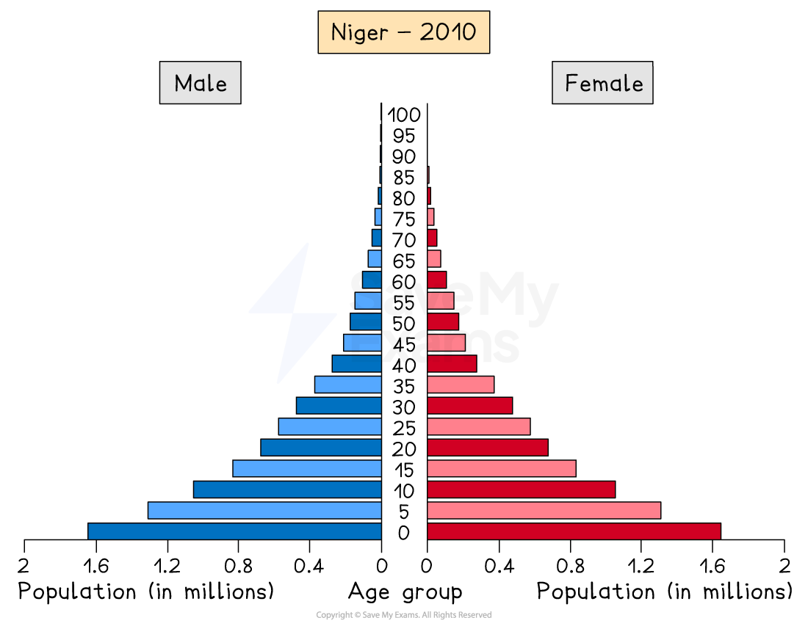
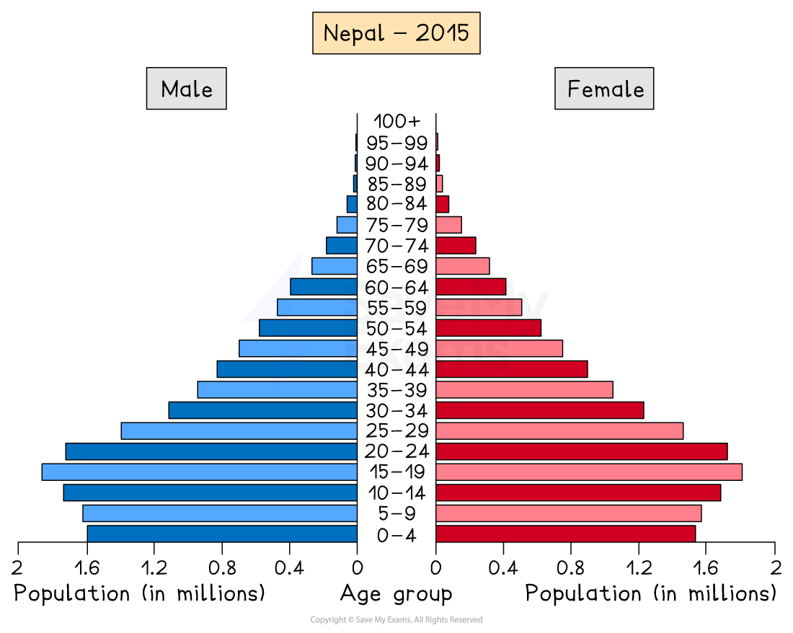
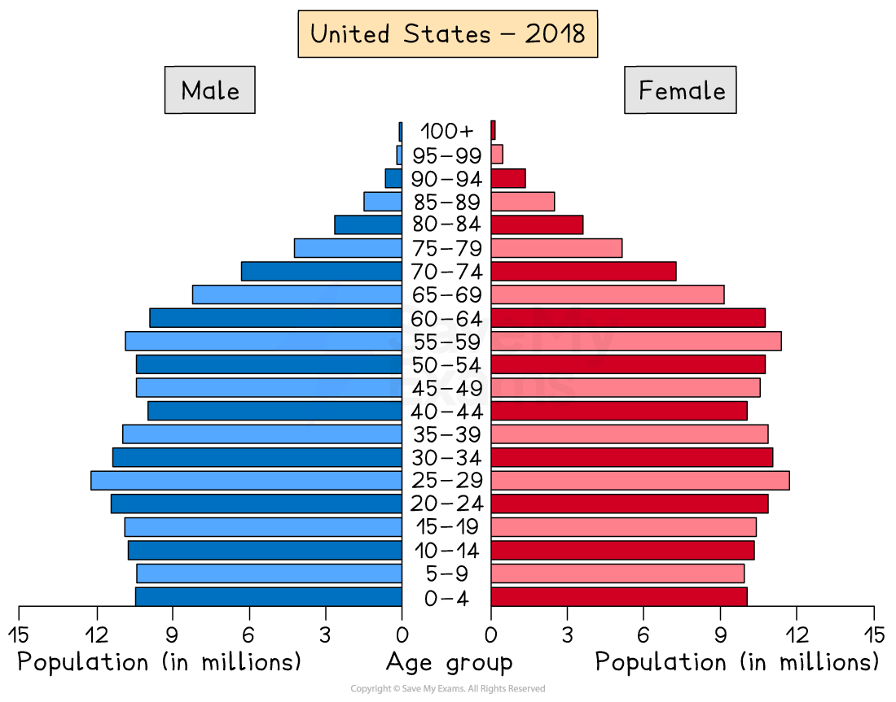
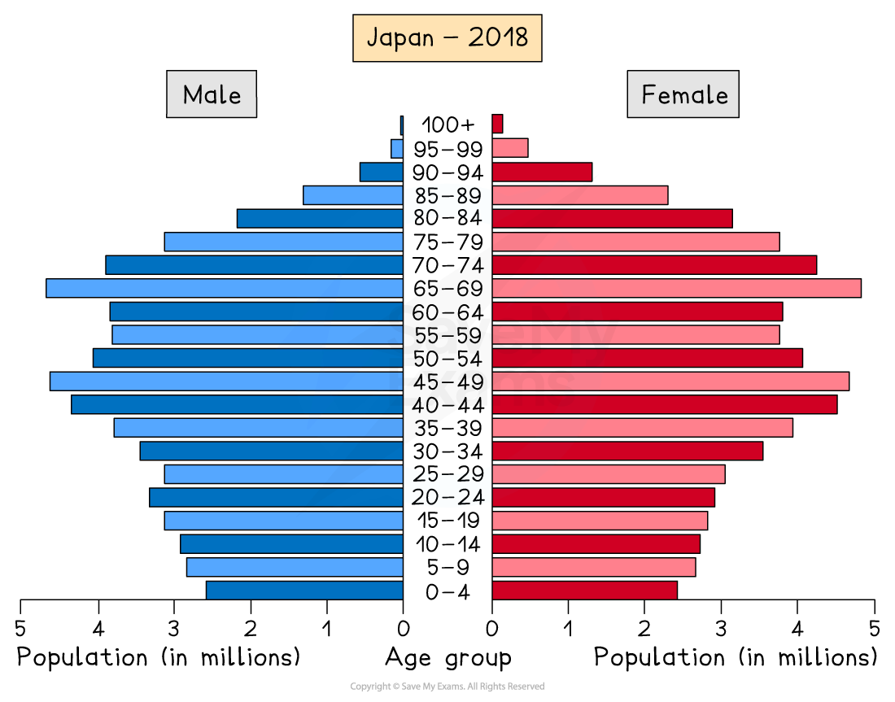

# Development and Demographic Data

## Demographic Transition Model

> **Spec point** — `spcpt_bZgpszStCpJJFHCP`

## Demographic transition model (DTM)

- The **demographic transition model (DTM)** illustrates the five generalised stages that countries pass through as they develop
- It shows how the **birth** and **death rates** change and how this affects the overall population as the country develops

*The demographic transition model (DTM)*

### Stage 1

- The total population is low
- High birth rates due to lack of contraception/family planning
- High death rates due to poor healthcare, poor diet and famine
- High infant mortality which leads people to have more children so that some children survive to adulthood

### Stage 2

- The total population starts to rise rapidly
- Birth rates remain high as people continue to have large families
- Death rates decrease as a result of improved diets, better healthcare, lower infant mortality and increased access to clean water

### Stage 3

- The total population continues to increase but the rate of growth slows down
- Birth rate starts to fall rapidly due to increased birth control, family planning, increased cost of raising children and low infant mortality rate
- Death rate still decreasing but at a slower rate as improvements in medicine, hygiene, diet and water quality continue

### Stage 4

- The total population is high and is slowly increasing
- The birth rate is low and fluctuating as there is accessible birth control and more women are choosing to have fewer children and delay the age which they start to have children
- The death rate is low and fluctuates

### Stage 5

- The total population starts to slowly decline as the death rate exceeds the birth rate
- The birth rate is low and slowly decreasing
- The death rate is low and fluctuates

## Demographic Data - Population Pyramids

> **Spec point** — `spcpt_kSKxNP3J8y27vh92`

## Demographic data - population pyramids

- **Population pyramids** (also known as an **age structure diagram**) are a type of graph which can be used to illustrate the structure of a population
- They illustrate the distribution of population across age groups and between male/female
- As countries develop the shape of the population pyramid changes

*Population pyramid - Niger*

- The **least developed countries **like Niger have a **concave **pyramid shape
- At the start of **stage 2** of the demographic transition model
- This indicates:

  - High birth rate
  - Low life expectancy
  - High death rate but starting to decrease
  - High infant mortality rate
  - Young dependent population dominates

*Population pyramid - Nepal*

- **Developing countries** such as Nepal have a **pyramid-shape**
- **Stage 3 **of the demographic transition model
- This indicates:

  - Decreasing birth rate
  - Increasing life expectancy
  - Decreasing death rate
  - Decreasing infant mortality
  - Larger working-age population

*Population Pyramid - USA*

- **Developed countries** such as the USA have a **column-shape**
- **Stage 4 **of the demographic transition model
- This indicates:

  - Decreasing birth rate
  - Increasing life expectancy
  - Decreasing death rate
  - Low infant mortality
  - Larger working-age population

*Population pyramid - Japan*

- **Developed countries** such as Japan have a pentagon shape with a **narrowing bottom**
- **Stage 5 **of the demographic transition model
- This indicates:

  - Decreasing birth rate
  - Increasing life expectancy
  - Death rate is higher than the birth rate due to the ageing population
  - Low infant mortality
  - Ageing population

> **Worked Example**
> **Study figure 1 which shows a population pyramid outline**
> 
> 
> 
> ***Figure 1 - Population Pyramid ***
> 
> **What does the shape of the pyramid tell you about the population structure of the country? ****(3 Marks)**
> 
> - **Answer**** ****-** any three of the following
> 
>   - The narrow base means a low birth rate** (1)**
>   - A low birth rate means a low number of young dependents** (1)**
>   - A reasonably broad top means high life expectancy **(1)**
>   - The majority of the population is between 40 and 60 **(1)**
>   - This means there will be a large number of elderly dependents in the future **(1)**

> **Exam Hint**
> When interpreting a population pyramid you need to look at four key areas
> 
> - Younger population - is the birth rate high or low?
> - Working population - are there enough people of working age to support the young and old dependents?
> - Elderly population - is it large or small? If it is large then life expectancy is high
> - Male/female split - are there any noticeable differences between the numbers of males and females?

## Birth & Death Rates

> **Spec point** — `spcpt_ZpvbvTY5Y9kZwz2p`

## Birth & death rates

#### Birth rate

- As a country develops the birth rate decreases due to:

  - Increased availability of contraception and education about family planning
  - Infant mortality decreases so people have fewer children as they know children are more likely to survive
  - More education and employment opportunities for women
  - Changing cultural expectations about family size

#### Death rate

- As a country develops the death rate decreases due to:

  - Improvements in healthcare and the availability of medicines
  - Improvements in diet and availability of food
- In stage 5 the death rate rises slightly as a result of the ageing population

## Ageing & Youthful Populations

> **Spec point** — `spcpt_YddMGd85QgMm3YsJ`

## Ageing & youthful populations

- In stages 1 and 2 of the demographic transition model, the population is younger with large numbers of dependent children
- In stages 3 and 4 the number of young people (under 15) starts to decrease
- In stages 4 and 5 the numbers of older people increase creating a dependent ageing population
