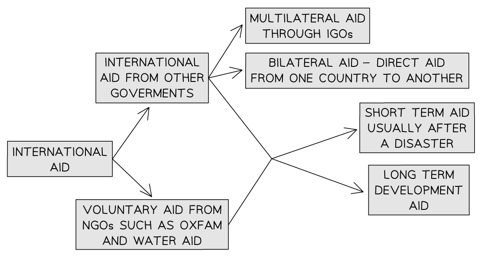

# International Management Strategies

## Intergovernmental Agreements

> **Spec point** — `spcpt_c8jw6RdvK26YzhWc`

## Intergovernmental agreements

- **Intergovernmental organisations (IGOs)** have a significant role in reducing uneven development
- Organisations include many which are part of the **United Nations (UN)**:

  - **World Health Organisation (WHO)**
  - **Food and Agriculture Organisation (FAO)**
  - **United Nations Conference on Trade and Development (UNCTAD)**
  - **United Nations Educational, Scientific and Cultural Organization  (UNESCO)**
- There are also organisations which are part of the UN but are not completely controlled by the UN including:

  - **The World Bank**
  - **International Monetary Fund (IMF)**
- The **World Trade Organisation (WTO)** is not part of the UN but has strong links with it

#### Role of IGOs

- Governments of countries around the world donate money to IGOs
- This money is then allocated to countries around the world for projects to assist the development
- The IMF, World Bank and WTO promote **free trade **and **globalisation**
- The UN developed the **Sustainable Development Goals** which have been agreed upon by 193 countries:

  - Include 17 goals including zero hunger, clean water and quality education
- ***Debt relief*** is also used by IGOs to assist development:

  - Allows countries to focus on developing and investing in areas such as infrastructure and education
  - There is no guarantee that the country will spend it effectively

## Trade Agreements

> **Spec point** — `spcpt_g48tgrzpTVvfGVrw`

## Trade agreements

- Trade is often promoted as the key to economic development
- Trade allows countries to sell the resources they have so they can then invest in things which will improve development such as education and healthcare
- The money generated by trade also means they can import resources that they don't have including:

  - tractors or communication technology
  
    - This can enhance development
- Trade is not always fair:

  - **Developing countries** are often **paid less** for their ***exports*** than developed countries
  - Developing countries are often disadvantaged by ***trade barriers***
  - ***Trade agreements*** often favour developed and emerging countries

## Aid Agreements

> **Spec point** — `spcpt_vbF2CQwzXqfMwG5b`

## Aid agreements

- There are different types of **international aid**
- International aid can be given as:

  - advice
  - technology
  - food
  - money
- Aid must be **appropriate **meaning that it fits the needs of the developing country

  - Aid in the form of tractors may not be appropriate if the community cannot afford the diesel or doesn't have the skills needed to maintain them

*Types of international aid*

### Disadvantages of international aid

- International aid does not always reach the people who need it due to **corruption** and **mismanagement**
- It is not always **appropriate**

  - Large-scale projects such as dams can end up creating more poverty for some people
- Countries may become **dependent on aid **and development may be stalled as a result
- Aid is often **tied aid** which means that countries have to spend their money in specific ways rather than on the development which is needed
- Aid can be used by the **donor country** to apply **political or economic pressure**
- It can result in food and water costing more

> **Worked Example**
> **Explain one way that international aid can reduce uneven development **
> 
> **(3 Marks****)**
> 
> - **Answer**
> 
>   - Transferring resources (food, water, skilled workers) from developed countries to developing countries** (1);** helps to provide the skills and resources that the people need** (1)**; income will increase and this can be invested in infrastructure improvements **(1) **
