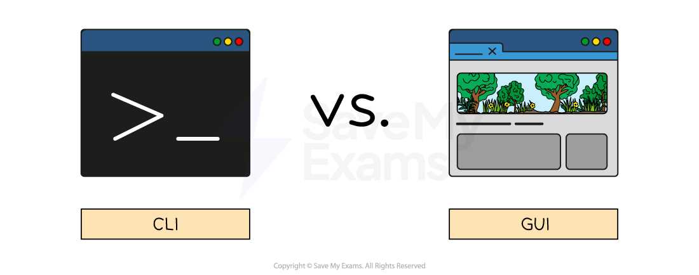

# Features of Digital Devices

## Features of digital devices

> **Spec point** — `spcpt_96BkZQYzq3zBbKnz`

## Features of digital devices

### What are the features of digital devices?

- The most common features of a digital device are:

  - **Portability**
  - **Performance**
  - **Storage**
  - **User interface**
  - **Connectivity**
  - **Media support**
  - **Energy consumption**
  - **Expansion capability**
  - **Security features**

| Feature | Description |
|---|---|
| **Portability** | How easy is the device to carry around |
| **Performance** | Processing power/memory (RAM) |
| **Storage** | How much data can the device hold |
| **Connectivity** | How can the device connect to other devices |
| **Media support** | What media formats can the device play |
| **Energy consumption** | How much energy does the device consume |
| **Expansion capability** | Can more storage, memory or other features be added |
| **Security features** | What security features does the device have to help protect device and user data |

### What is a user interface?

- A user interface is **how the user interacts with the operating system**
- Examples of user interfaces include:

  - **Command Line Interface (CLI)**
  - **Graphical User Interface (GUI)**
  - **Menu**
  - **Natural language (NLI)**

#### What is a command line interface?

- A Command Line Interface (**CLI**) requires users to interact with the operating system using** text based commands**
- CLIs are more commonly used by** advanced users**
- Examples of CLIs are MSDOS (Microsoft Disk Operating System) and Raspbian (for Raspberry Pi)

#### What is a graphical user interface?

- A Graphical User Interface (**GUI**) requires users to interact with the operating system using **visual elements** such as windows, icons, menus & pointers (**WIMP**)
- GUIs are **optimised for mouse and touch gesture input**
- Examples of GUIs are Windows, Android and MAC OS

#### What is a menu interface?

- A menu interface is **successive menus **presented to a user with a** single option at each stage**
- Often performed with **buttons** or a **keypad**
- Examples include

  - **Chip and pin machines**
  - **Vending machines**
  - **Entertainment streaming services**

#### What is a natural language interface?

- A natural language interface (**NLI**) uses** the spoken word **to respond to **spoken or textual inputs from a user**
- Examples include

  - **Virtual assistants **- Amazon Alexa, Google Assistant, Siri
  - **Search engines**
  - **Smart home devices**

### Digital device comparison

| Feature | Desktop | Laptop | Smartphone |
|---|---|---|---|
| **Portability** | ⭐ | ⭐⭐⭐ | ⭐⭐⭐⭐⭐ |
| **Performance** | ⭐⭐⭐⭐⭐ | ⭐⭐⭐ | ⭐ |
| **Storage** | ⭐⭐⭐⭐⭐ | ⭐⭐⭐ | ⭐ |
| **Media support** | ⭐⭐⭐⭐⭐ | ⭐⭐⭐ | ⭐⭐⭐ |
| **Energy consumption** | ⭐⭐⭐⭐⭐ | ⭐⭐⭐ | ⭐ |
| **Expansion capability** | ⭐⭐⭐⭐⭐ | ⭐⭐⭐ | ⭐ |
| **Security features** | ⭐⭐⭐ | ⭐⭐⭐ | ⭐ |
| **User interface** | Keyboard & mouse | Keyboard & touchpad (touchscreen on some laptops) | Touchscreen |
| **Connectivity** | Multiple, wide variety of ports (USB, HDMI etc.) | Most common ports available but fewer number | Wireless (Wi-Fi/Bluetooth) |

⭐ - **Low**
⭐⭐⭐ - **Moderate**
⭐⭐⭐⭐⭐ - **High**
