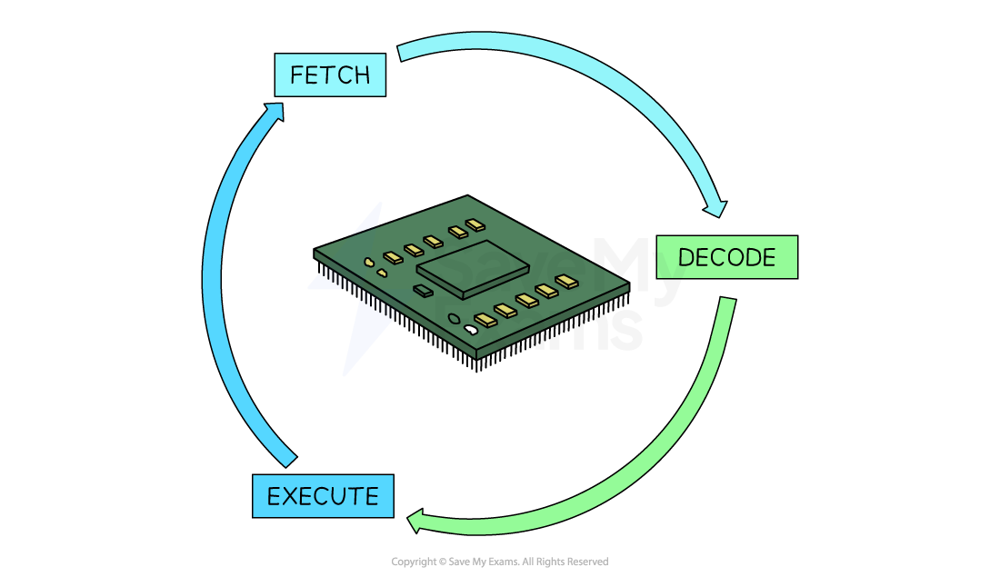
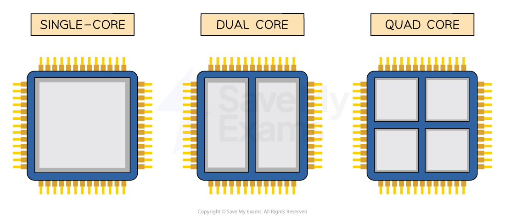

# Central Processing Unit (CPU)

## Central Processing Unit (CPU)

> **Spec point** — `spcpt_g6Rmv5pwnqxDRVnW`

## Central Processing Unit (CPU)

### What is the purpose of the CPU?

- The purpose of the Central Processing Unit (CPU) is to **execute** **instructions **
- The CPU achieves this** **by completing **processor cycles**
- A modern CPU is capable of performing **billions of processor cycles in one second**

### The processor cycle stages

#### Fetch stage

- During the fetch stage of the cycle, the next instruction or data must be **fetched from the computer's memory** (***RAM***)
- The instruction or data is brought back to the CPU

#### Decode stage

- During the decode stage of the cycle, the CPU needs to **work out what is required** from the instruction
- This could be a range of tasks depending on what the instruction or data included

#### Execute stage

- During the execute stage of the cycle, the CPU will **carry out the instruction** that was fetched
- Some examples that would take place at this stage are

  - **Performing a calculation**
  - **Storing a result or data back in main memory (RAM)**
  - **Going to main memory to fetch data from a different location**

### How is the speed of a processor measured?

- The speed of a processor is measured by it's **clock speed**
- Clock speed is** measured in Hertz** (Hz)
- The clock speed measures the** number of processor cycles** that can take place in 1 second
- The faster the clock speed, the more instructions can be fetched and executed per second
- Modern computers have a clock speed in Gigahertz (**GHz**), meaning billion
- A clock speed of 3.5GHz can perform up to **3.5 billion** **instructions per second**

#### Number of cores

- A core **works like it is its own CPU**
- Multiple core processors mean they have multiple** separate processing units** that can fetch, decode and execute instructions at the same time
- Multi-core processors can run **more powerful programs** with greater ease
- Multiple cores increase the performance of the CPU by working with the clock speed

  - Example: A quad-core CPU (4 cores), running at a clock speed of 3Ghz
  
    - **4** cores x **3**GHz
    - 4 x 3 billion instructions
    - 12 billion instructions per second

> **Worked Example**
> Describe how the speed of the processor affects a users experience when playing a game
> 
> **[4]**
> 
> **Answer**
> 
> > *A description to include four from: *
> 
> - Faster processors fetch/decode/execute more instructions/data / have more cycles **[1]** per second **[1]**
> 
> > *so: *
> 
> - graphics render more quickly / at greater resolution **[1]**
> - making the visuals smoother  / graphics can be displayed at greater resolution **[1]**
> - making the environment more realistic **[1]**
> - more actions can be carried out **[1]**
> - making the gameplay more immersive/exciting **[1]**
