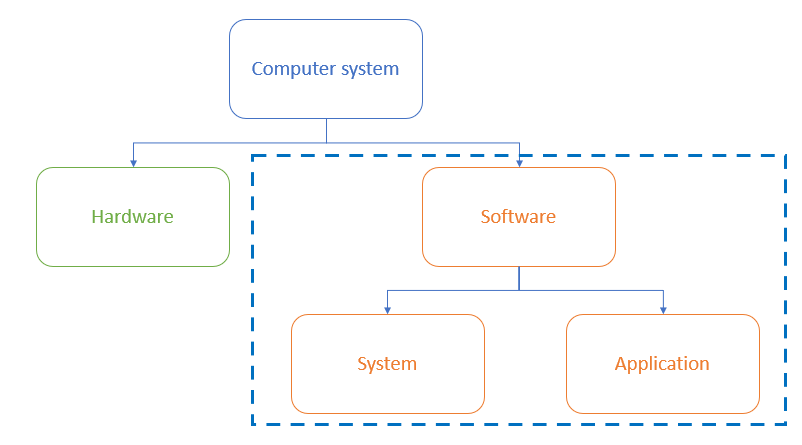

# System Software & Application Software

## Purpose of application & system software

> **Spec point** — `spcpt_DPQbQcBnJbYTSZcC`

## Purpose of application & system software

### What is software?

- Software is the set of programs that **control the hardware**; they live on the computer system but **cannot be physically touched**
- Software can be broken down in to two categories:

  - **Application **software
  - **System  **software

### What is application software?

- Application software (abbreviated 'apps') is software **chosen by a user** to help them **carry out a specific task**
- Application software is **installed on top of system software** and is user-chosen to best suit **industry requirements**
- Common categories of application software include:

  - **Word processing**: creating and editing text documents
  - **Spreadsheet**: organising and analysing data in a grid format
  - **Database management systems**: storing, retrieving and managing data in databases
  - **Control/measurement**: uses sensors to measure and control a system
  - **Video editing**: creating and modifying video files
  - **Graphics editing**: creating and modifying images
  - **Audio editing**: creating and modifying sound files
  - **Computer-Aided Design (CAD)**: designing and modelling objects in 2D or 3D

> **Exam Hint**
> When writing about application software, ensure you refer to it by its type and not a brand name. For example, 'word processing' and not Microsoft Word

### What is system software?

- System software is software **essential for the operation of a computer system**
- Without system software, a user has** no starting point** for giving a computer instructions
- System software gives users** a platform to run applications** and carry out tasks
- Essential services carried out by system software include:

  - **Compilers**: translating high-level programming languages into machine code
  - **Linkers**: combining object files into a single executable program
  - **Device drivers**: controlling hardware components and peripherals
  - **Operating systems**: managing the computer's resources and providing a user interface
  - **Utilities**: tools for maintaining and optimising the computer's performance

## Utility software

> **Spec point** — `spcpt_MmgjynZN7TWzsvrX`

## Utility software

### What is utility software?

- Utility software is software designed to help **maintain**, **enhance **and **troubleshoot/repair** a computer system
- Utility software is designed to **perform a limited number of tasks**
- Utility software** interacts with the computers hardware**, for example, secondary storage devices
- Some utility software comes **installed with the operating system**
- Examples of utility software and their function are:

#### Defragmentation (maintain)

- Defragmentation software **groups fragmented files back together** in order to** improve access speed**
- As programs and data are added to a new hard disk drive, it is added in order,** over time as files are deleted this leaves gaps**
- As programs and data are added over time, **these gaps get filled and data becomes fragmented**
- Defragmentation can only used on **magnetic storage** 

> **Exam Hint**
> If the concept of defragmentation still seems a little difficult then hopefully this analogy will help
> 
> - In a tidy bedroom you can find your things faster because they are in the right place (in order)
> - Over time you move things, forget to put them back and/or add new things
> - The time taken to find your things increases, until...
> - You tidy your room and finding things becomes quicker again (defragmentation!)

#### Compression (enhance)

- Compression **reduces the amount of secondary storage** required by performing an algorithm on the original data
- **Lossy compression** physically **removes data** from the original data to reduce its size, **the original file can not be re-created**
- **Lossless compression** uses mathematics to **order data** more efficiently reducing its size, **the original files can be re-created as no data is lost**

#### Encryption (enhance)

- Encryption is the process of **scrambling data using an algorithm** from plain-text into cipher-text in order to make it unreadable to users without the **master key**
- Encryption software **enhances the security** of the computer system and **keeps data safe**

#### Task manager (troubleshoot/repair)

- Task manager is software that is built into the operating system to allow users to** monitor system resources** in order to help **troubleshoot potential problems**
- Task manager gives system information such as:

  - **Processes**
  - **Performance**
  - **App history**
  - **Start-up apps**
  - **Users**
  - **Services**

> **Worked Example**
> Describe how utility software can reduce access times for large files stored on magnetic media
> 
> **[2]**
> 
> **Answer**
> 
> - By defragmenting file data **[1]**...
> - ...that has been allocated randomly to free space **[1]**
> - By placing file data in adjacent sectors **[1]**...
> - ...to reduce the need to spin the disc / seek across the platter surface **[1]**
