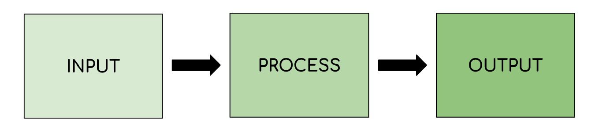

# Types of Digital Devices

## What is a computer?

- A computer is an **electronic device** capable of** taking an input**, **processing data**, **storing information** and **providing an output**
- Data that is input, is **raw**, **unprocessed **information
- Information is data that** people understand**

## Mainframe computers & microprocessors

> **Spec point** — `spcpt_zKxpPRnzmwjbYqYK`

## Mainframe computers & microprocessors

### What is a mainframe computer?

- A mainframe computer is a computer with **huge processing power **and **data storage capabilities**
- Built to handle** enormous amounts of data **and carry out **complex calculations**
- Designed to be **secure**, **reliable **and support **large volumes of simultaneous users**
- Carry out **critical tasks** for large organisations in sectors such as:

  - **Finance**
  - **Health**
  - **Government etc.**

### What is a microprocessor?

- A microprocessor is **an integrated circuit** (IC) that **contains a central processing unit** (CPU)
- A microprocessor is **embedded** into devices to help them carry out tasks
- The  microprocessor is responsible for **executing instructions**
- Microprocessors are used in a home to **monitor **and **control **devices such as:

  - **Central heating systems**
  - **Security alarm systems**
  - **Home entertainment system etc.**

## Laptops & desktop computers

> **Spec point** — `spcpt_vqrjH3qWnYdZCqFM`

## Laptops & desktop computers

### What is a desktop computer?

- A desktop computer is a computer **designed to stay in one place**, for example on a desk
- A desktop computer traditionally consists of a separate:

  - **Monitor**
  - **Computer**
  - **Keyboard & mouse**
- Desktop computers are typically **more powerful** than mobile computers
- Desktop computers are **upgradable**, the parts can be replaced/changed to increase performance

#### Uses of desktop computers

| **Office & Business** | **Education** | **Gaming & entertainment** |
|---|---|---|
| Word processing | Online learning | Online gaming |
| Financial modelling | Research (www) | Streaming music/film/TV |
| Email | Content creation | Social media |
| Data storage & backup | Multimedia presentations | Online browsing |
| Video/image editing | Online collaboration |   |
| Project management | Online communication |   |
| Video conferencing |   |   |

### What is a laptop computer?

- A laptop computer is a computer **designed to be** *portable*
- A laptop computer traditionally consists of built-in:

  - **Monitor**
  - **Computer**
  - **Keyboard & trackpad **or **touch screen keyboard & pointer**
- Laptop computers are typically** less powerful** than desktop computers due to:

  - **Power constraints due to size**
  - **Focus on extending battery life**
- Laptop computers are** not easily upgradable**, components are integrated for size and efficiency
- Laptop computers are **battery powered**
- Some laptops are used** as desktop replacements**

#### Advantages and disadvantages

| **Advantages** | **Disadvantages** |
|---|---|
| Easy to carry and use on the go (**Portability**) | Limited expandability (**Difficult to upgrade hardware**) |
| Access to internet and resources from anywhere (**Flexibility**) | Less powerful (**Lower performance** compared to desktop computers) |
| Can be used for various tasks and activities (**Multi-functionality**) | Shorter battery life (**Needs frequent charging**) |

## Mobile phones & tablet devices

> **Spec point** — `spcpt_qhpsRzf86kYD8xqh`

## Mobile phones & tablet devices

### What is a mobile phone?

- A mobile phone is an **ultra portable electronic device** designed to be **lightweight **and fit in a pocket or small bag
- Mobile phones are used to **transmit information between people and devices **using **radio waves**
- Two examples of mobile phones are:

  - **Smartphones**
  - **Specialist**

#### Smartphones

- A smartphone is a *versatile* **general purpose** device
- Smartphones use subscriber identity module (**SIM**) cards **to link the devices** to a **network carrier**, allowing them to make phone calls and send messages
- Smartphones include features such as:

| Feature | Description |
|---|---|
| **SMS messaging** | - Quick communication - Messages are stored on the device and can be read at any time - Use virtual keyboards and predictive text |
| **Phone calls** | - Simple voice communication - Requires cellular reception |
| **Voice over internet protocol (VoIP)** | - Audio & visual communication via the internet - Requires extra apps installed on the devices - Can make & receive calls via smartphone, tablet and computers - Requires a forward facing camera for video calls |
| **Accessing the internet** | - Requires cellular reception to access on the move - Web pages are optimised for smartphone access - Automatically used Wi-Fi when in range and connected |
| **Mobile payments** | - Uses NFC |
| **Camera** | - Smartphones have built-in cameras for video calls - Camera can act as a barcode scanner for QR codes |

#### Specialist

- A specialist phone is designed for a particular groups of users or environment
- They prioritise specific features over general purpose use

| Example | Specialist features |
|---|---|
| **Senior phones** | - Larger buttons - Easy to read displays - Simplified user interface - Emergency alert buttons - Hearing aid compatibility |
| **Children's phones** | - Brightly coloured - Robust - Child friendly interface - Limited app access - Parental controls |
| **Rugged phones** | - Designed for tough environments - Thick screens - Rugged outer casing - Built to withstand:    - Water submersion   - Dust   - Extreme temperatures   - Drops |

### What is a tablet device?

- A tablet is a general purpose device that sits between a laptop and a smartphone
- A quick comparison shows:

| Feature | Smartphone | Tablet |
|---|---|---|
| **Size** | Ultra portable, designed to fit in a pocket | Portable but the larger screen means they require a bag or case to carry around |
| **Focus** | Communication (calls, texts, mobile data), camera for capturing images & videos | Entertainment & productivity  (games, reading, watching movies) |
| **Power & performance** | Carry out everyday tasks but may lack power for demanding applications or tasks | Typically more powerful than a smartphone but not as powerful as a laptop, more processing power & RAM. |
| **Battery life** | Due to battery size they usually require charging more often than a tablet | Typically longer battery life depending on usage |

## Other digital devices

> **Spec point** — `spcpt_jwT6CgBJ4zTVKmkG`

## Other digital devices

| Device | Description | Features |
|---|---|---|
| **Cameras & camcorders** | Uses light sensors to capture images formed by light passing through a lens | - **Lens **- High quality lens allows light to pass through without defects - **Image processor **- Compensates for poor lighting - **Sensors **- Capture detail, more pixels are produced |
| **Games console** | Specialised PC for playing video games | - **Powerful processors & graphics **for high quality smooth gameplay - **Online capability** - **Controllers **for interactivity |
| **Home entertainment systems** | Hub for connecting audio and video devices | - **Connects **TVs, speakers and media players together - **Receiver **processes audio and video signals - Can provide **immersive **experience (surround sound) |
| **Media players** | A device for multimedia playback | - **Connects to TVs or speakers** for playback - Plays **different media **such as Blu-ray, DVD - **Portable media **players for on the go |

## Multifunctional devices

> **Spec point** — `spcpt_5RW7txs4QRSJjC5x`

## Multifunctional devices

### What is a multifunctional device?

- A multifunctional device is a device designed to carry out **a wide range of tasks**
- Multifunctional devices **combine functions** that would usually be separate
- Examples of multifunctional devices include:

  - **Smartphones **- Communication, photography, gaming, media playback/streaming,  web browsing all in one device
  - **Printers **- Printing, copying and scanning in one device
  - **Smart TVs** - Watch TV, connect to the internet, stream content

### What is convergence?

- Convergence is the **merging of technologies** that would usually be separate
- Convergence led to the rise of smartphones

> **Worked Example**
> A. Which **one **of these could be used as a desktop replacement computer?
> 
> | **Laptop** |   |
> |---|---|
> | **Mainframe** |   |
> | **Media Player** |   |
> | **Server** |   |
> 
> **[1]**
> 
> B. **Describe **how tablet computers allow people to work from home.
> 
> **[2]**
> 
> **Answers**
> 
> A. Laptop **[1]**
> 
> B. *A description to include two linked points from:*
> 
> - Portability
> - Internet connectivity
> - Cloud storage
> - Hosted applications
> - Collaboration
> 
> > *Example*
> 
> - Workers can connect to the Internet **[1]** to access cloud storage **[1]**
