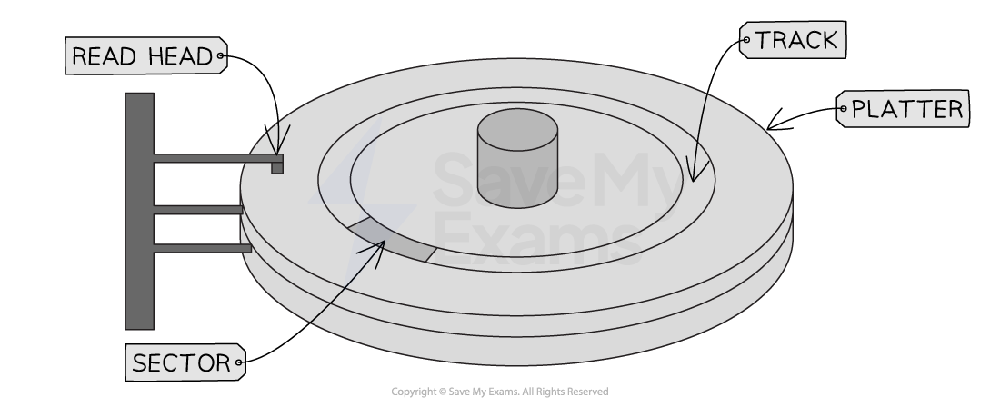

# Storage Media

## Storage media

> **Spec point** — `spcpt_qzQm8gDf8gwr8cmJ`

## Storage media

### What is storage media?

- Storage media is the** physical media that holds non-volatile data**
- Storage devices have a **specific read/write mechanism built in** to interact with a particular storage media
- For example, magnetic tape media is read by a magnetic storage device

> **Exam Hint**
> Try not to get confused between storage devices and storage media.
> 
> Think of storage devices as large pieces of furniture in your home e.g. bookshelf, chest of drawers etc.
> 
> Storage media is what you store in the furniture e.g. books on the shelf or clothes in the drawers
> 
> Storage media all hold data, but the way it stores/accesses it can be very different, so just like you wouldn't store clothes on a bookshelf, you need to pair the correct storage device and storage media

### Media

#### Hard disks

- Hard disks are a **magnetic storage media**
- Made up of **platters **that spin on a **central spindle**
- A** read/write head **moves** on an arm** across the platter to read/write data
- The amount of time taken to read/write data is influenced by:

  - **How fast the platters spin** (measured in revolutions per minute (**RPM**))
  - **How fast the head moves across the platter**
- Used in **personal computers**, **servers **and **backups**

#### Optical media

- Used with an** optical storage device**
- All optical media is **recordable **(CD-R, DVD-R, BD-R)
- Some optical media can be **re-written** (CD-RW, DVD-RW, BD-RE)
- Used for **multimedia **(music, games & films)

| CDs | DVDs | Blu-ray |
|---|---|---|
| up to **700 MB** data | **4.7 GB** single sided/single layer **18 GB **double sides/double layer | **25 GB** single sided  **50 GB** double sided |

#### Flash media

- Flash media is a **solid state storage media**
- **More reliable** than a hard disk as contains **no moving parts**
- **Very fast read/write speeds**
- Used in **mobile devices**, **laptops**

#### Magnetic tape

- **Old technology** used primarily for recording sound
- Now used to **store vast amounts of data** (backups)
- **Very slow read/write speeds**
- Used for **whole system backups** and **archives**

> **Worked Example**
> A USB flash memory card has 64 MiB of storage capacity.
> 
> Construct an expression to show how many bits are in 64 MiB
> 
> **[3]**
> 
> **Answer**
> 
> - 1 mark for sight of 8
> - 1 mark for sight of 1024
> - 1 mark for complete expression: **64 x 1024****2**** x 8**
> 
>   - …including all parts multiplied
> - All three marks for the result of the calculation: **536,870,912**
