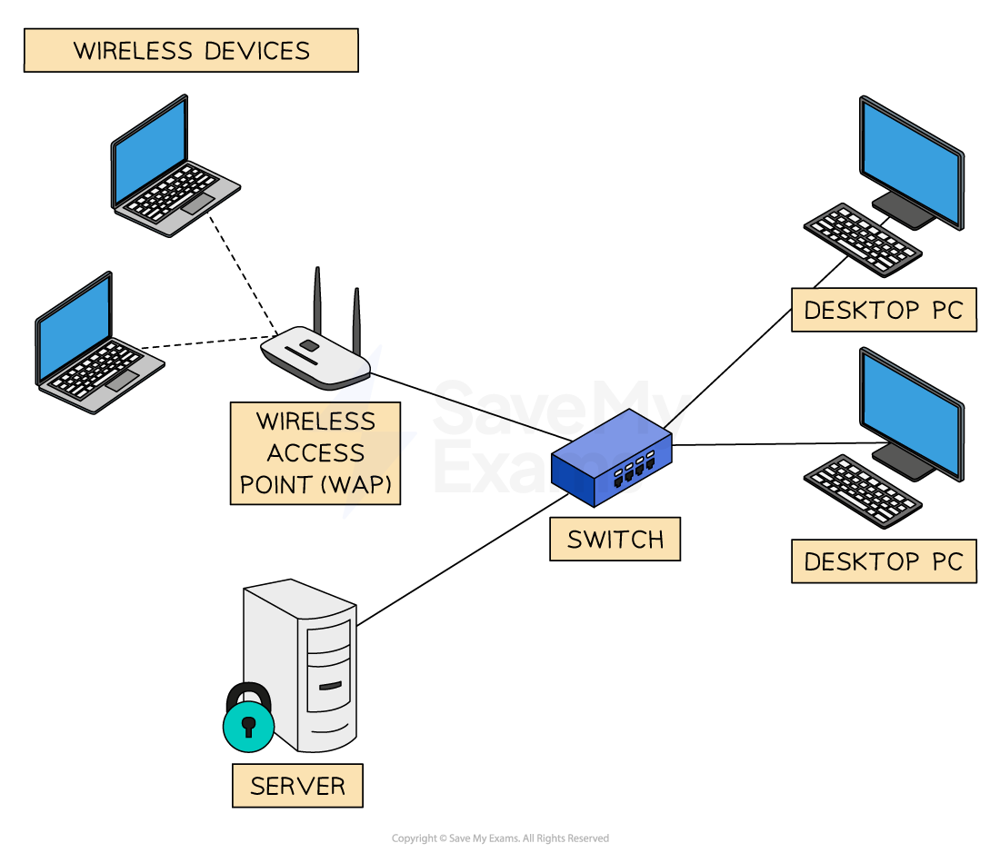

# Peer-to-Peer & Client-Server Networks

## Peer-to-peer networks

> **Spec point** — `spcpt_2HbsmYmcTnGbZ2hH`

## Peer-to-peer networks

### What is a peer-to-peer network?

- A peer is a computer on a network which is **equal to all other computers**
- Each peer on the network

  - **Often have their own printer attached**
  - **Will provide access to their own files**
  - **Is responsible for their own backups**
  - **Is responsible for their own security**
  - **Is responsible for carrying out their own backups**
- A network with **no server providing services** is a peer-to-peer network
- Most homes will have a peer-to-peer network model

| **Advantages** | **Disadvantages** |
|---|---|
| - Very easy to set up and maintain - Very cheap to set up because there is no expensive hardware to purchase - No specialist knowledge or staff are required to run the network | - Users will need to manage their own backups - Users will need to manage their own software updates - The network can be less secure |

> **Exam Hint**
> If you are asked about a peer-to-peer network, just think about how your home network is set up and how each computer is responsible for itself, there is no one computer in charge of all of the others.

## Client-server networks

> **Spec point** — `spcpt_sxfKj6qPmzPjRGVx`

## Client-server networks

### What is a client-server network?

- A client is** a computer on the network**, these connect to the server via a **switch**
- A server is a computer on a network which often** has a single purpose**, for example

  - **Managing access to the Internet**
  - **Managing printing**
  - **Providing email services**
  - **Providing backups**
  - **Controlling security**
- Servers are often** more powerful than the client** machines
- Servers are seen as **more significant than the client machines** and can require **specialist hardware and software**
- A network which uses a server is called a **client-server model**
- Most companies, organisations and schools will use a client-server network model

| **Advantages** | **Disadvantages** |
|---|---|
| - Managing backups of the network is easier as it is done from one central point - Updating and installing new software can be done centrally instead of having to log on to each machine - Security of files can be managed easily | - Servers can be expensive to purchase, setup and maintain - A specialist network manager would be required as servers require specialist IT knowledge - Servers can be a single point of failure, meaning all users would lose access to the network if the server fails |

> **Worked Example**
> Describe two drawbacks of using a peer‑to-peer network
> 
> **[4]**
> 
> **Answer**
> 
> > *Any two descriptions from:*
> 
> - No control of user access rights **[1]** reduces security **[1]**
> - No centralised administration **[1]** means no remote updates **[1]**
> - No centralised backup **[1]** so each client has to be backed up separately **[1]**
> - …so individual backup devices need to be used on each device **[1]** costing more **[1]**
> - No shared software **[1]** meaning more installs **[1]**
> - No shared storage / file access **[1]** increasing need for storage on each device / access from anywhere **[1]**
> - No roaming profiles **[1]** meaning users cannot ‘hot-desk’ **[1]**
