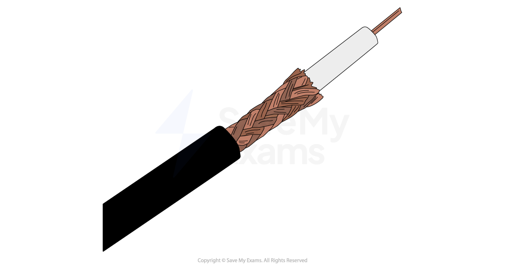

# Factors Influencing Digital Communication

## Bandwidth & latency

> **Spec point** — `spcpt_8jgDC388shK6gc5k`

## Bandwidth & latency

### What is bandwidth?

- Bandwidth is the **amount of data that can be carried **by a connection** in one second**
- Measured in **bits per second** (bit rate)
- A smaller bandwidth means that less data can be sent and the network can slow down, potentially to the point of becoming unusable

#### Impact on user experience

- A higher bandwidth means **more data can be sent and received in one second**
- Higher bandwidth can improve:

  - **Upload and download speeds**
  - **Online gaming**
  - **Streaming high definition video**
- To stream content, enough data **to play a few seconds** is downloaded and stored in a **temporary area of memory** called a **buffer**
- As the contents of the buffer are played, **more data is downloaded at the same time** to keep the buffer full
- If the buffer ever becomes empty** playback will pause**
- To stream successfully, data must be downloaded to the buffer** at a faster rate than it is being emptied **

### What is latency?

- Latency is the **delay** between data being **sent and received**
- If there is a big delay between the two, **more data will be on the network causing collisions**
- This can lead to even more packets of data being sent as the** error rate will increase**

#### Impact on user experience

- Playing games online smoothly, **requires a high bandwidth**
- A **high latency** can cause *lag *and the game will not** respond as quickly** as a users commands
- This can cause big issues when users are** playing fast paced games** or playing against** other users with a lower latenc**y (have an advantage due to** **quicker response times)
- Streaming sport content with a high latency** can cause micro-stutters** and **ruin a users watching experience**

## Speed & volume of data transfer

> **Spec point** — `spcpt_CWxkpmQ3pKbmJ2rj`

## Speed & volume of data transfer

### What else can affect the speed & volume of data transfer?

| Factor | Description |
|---|---|
| **Interference** | Devices that emit electromagnetic signals such as microwaves and fridges can disrupt wireless signals |
| **Transfer method** | Wired connections can carry more frequencies, meaning a higher bandwidth compared to wireless connections |
| **Blockages** | Walls and furniture can block wireless signals, lowering the bandwidth available |
| **Distance** | The strength of a wired and wireless signals reduces as data has to travel further |

## Wired & wireless communication

> **Spec point** — `spcpt_BZ7RH9zPpDZCWCP9`

## Wired & wireless communication

### What are the advantages and disadvantages of wired & wireless communication?

|   | Wired | Wireless |
|---|---|---|
| Speed | Fast data transfer | Slower than wired |
| Portability | Location is limited by physical cable | Location only limited by range |
| Security | Better physical security | Less secure, easier to intercept data |
| Range | Less affected by interference | Affected by interference |
| Safety | Cables can be trip hazards, need routing along walls, under floors | None |
| Cost | Cables are cheap, more devices means more cables needed | No cables required, may require a wireless access point to be purchased |

## Broadband, mobile broadband & cellular networks

> **Spec point** — `spcpt_gmnGrdRsfntWyPg3`

## Broadband, mobile broadband & cellular networks

- Internet Service Providers (**ISP**) provide access to high speed internet (**broadband**)
- ISPs use **fibre optic** or** copper cable** to create a wide area network (**WAN**)

### What is fibre optic?

- Fibre optic is a type of cable that uses **light to transmit data** on a wide area network (**WAN**)
- Fibre **transmits data** at a much** higher speed** and has a much **higher bandwidth** compared to copper cables
- Fibre optic cable **does not suffer from interference** which makes them the **most secure option** to send **sensitive data**
- Fibre optic cables can **cover a long distance** without any ***degradation***, they can span cities and countries

#### What is copper cable?

- Copper is a type of cable originally** used in telecommunication to transmit voice signals**, forming the traditional landline phone network
- The ability to use copper to deliver network traffic on a wide area network (**WAN**) made the **internet possible**
- Copper cables **degrade over time** which **limits their range** compared to fibre optic
- Copper cable **suffers from interference** which can **disrupt data quality**
- Copper transmits data at a much **slower rate**, and has a much **lower bandwidth** compared to fibre optic

> **Worked Example**
> Describe how high latency can affect the experience of making a video call from a smartphone
> 
> **[2]**
> 
> **Answer**
> 
> - It increases the time it takes for data to be transferred between devices **[1]** meaning his voice/video is out of sync / lagging / delayed **[1]**
